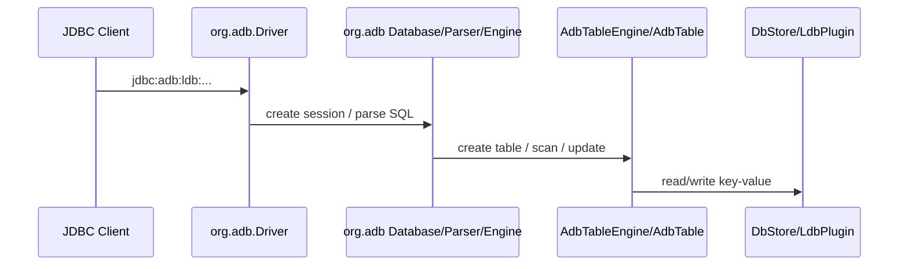

# ADB Migration Boundary Assessment for H2 Plugin Integration

## Background

The current `vexra-adb` module carries two different responsibilities:

1. ADB business logic as a Vexra state machine plugin, such as `AdbSMPlugin`, `DbStore`, `AdbLdbPlugin`, and Raft/LDB integration.
2. A full H2-derived database distribution renamed into the `org.adb.*` namespace.

Repository scanning shows `909` source files under `vexra-adb/src/main/java/org/adb`, covering `engine`, `table`, `index`, `command`, `expression`, `jdbc`, `server`, `mvstore`, `tools`, and `store`. `docs/open-source-compliance.md` also treats this area as an H2-derived code boundary.

At the same time, the external H2 plugin guide exposes `H2Plugin`, `TableEngineProvider`, `StorageEngineProvider`, and `StorageMaintenance`. That makes it feasible in principle to move ADB toward a model of "depend on h2db jar + register ADB through plugin providers", which would significantly reduce the cost of maintaining an H2 fork inside the Vexra repository.

## Goals

- Identify the real dependency boundary between `vexra-adb` and the H2-derived code.
- Separate what can move to the H2 plugin mechanism from what still depends on H2 core internals.
- Provide an execution path from the current "bundled H2 fork" model to a future "h2db dependency + ADB plugin" model.

## Non-Goals

- This document does not directly modify Java code, protocols, or disk formats.
- This document does not replace the official H2 plugin guide.
- This document does not design new SQL grammar, optimizer behavior, or JDBC protocol changes.

## Current State

### Existing module split

- `net.xdob.vexra.adb.*`: Vexra/ADB-owned logic, including the state machine plugin, transaction encoding, key encoding, LDB/Rocks integration, and Raft integration.
- `org.adb.*`: H2-derived code currently consumed directly by ADB logic.
- `net.xdob.vexra.ldb.*`: the independently released LDB dependency, extended through `AdbLdbPlugin`.

### Confirmed direct coupling

1. Table engine entry
   `org.adb.AdbTableEngine` currently implements `org.adb.api.TableEngine` and creates `AdbTable` during table creation.

2. ADB table and index logic depends directly on H2 internal model types
   `AdbTable`, `AdbPrimaryIndex`, `AdbSecondaryIndex`, and `AdbDelegateIndex` import:
   - `org.adb.engine.*`
   - `org.adb.table.*`
   - `org.adb.index.*`
   - `org.adb.result.*`
   - `org.adb.value.*`
   - `org.adb.mvstore.*`

3. Runtime and tests depend on `org.adb.Driver` and `jdbc:adb:`
   Existing tests and samples still load `org.adb.Driver` and connect through `jdbc:adb:ldb:`.

4. Tooling depends directly on the H2 server layer
   `net.xdob.vexra.adb.DBServer` directly uses `org.adb.tools.Server`.

### H2-derived code scope

`org.adb.*` is not only a thin plugin surface. It is a full database core:

| Directory | Role |
| --- | --- |
| `command` / `expression` / `bnf` | SQL parser, DDL/DML, optimizer, expressions |
| `engine` / `schema` / `table` / `index` / `result` / `value` | Core metadata, table/index/row model, type system |
| `jdbc` / `jdbcx` | JDBC driver and JDBC extensions |
| `server` / `server.web` / `tools` | TCP/PG/Web Console and command-line tools |
| `mvstore` / `store` / `store.fs` | MVStore, storage, and file-system abstractions |

## Key Constraints

- `vexra-adb` is currently not just a plugin implementation. It is an ADB logic module plus an embedded H2 fork.
- The currently documented H2 plugin points focus on table, storage, and maintenance providers. Parser, optimizer, and wire protocol extensions are not exposed.
- ADB logic is not isolated at the SPI boundary today. It directly imports many H2 internal model types.
- Vexra requires JDK 8, UTF-8, and paired Chinese/English design documentation.

## Interface Design

### Recommended target shape

The migration target should not be a continued `org.adb.Driver` distribution. It should converge to:

| Component | Responsibility |
| --- | --- |
| `h2db` dependency | SQL parser, JDBC, protocol, server, metadata, and base engine |
| `vexra-adb` | ADB table/storage providers, storage maintenance, and LDB/Raft integration |
| `vexra-ldb` | Local KV storage and LDB plugin hooks |

### Recommended plugin registration

Based on the current H2 plugin guide, ADB should eventually expose only:

- one plugin descriptor implementing `H2Plugin`
- one `TableEngineProvider`
- optionally `StorageEngineProvider` and `StorageMaintenance`

`vexra-adb` should stop owning:

- a full custom JDBC Driver; `jdbc:adb:*` remains only as a `JdbcUrlPrefixProvider` mapping entry point
- a custom `org.adb.tools.Server`
- a custom web console or PG/TCP server stack

## Data Structures

### Structures that should remain in ADB

These structures encode ADB-specific semantics and should stay under `net.xdob.vexra.adb.*`:

| Structure | Role |
| --- | --- |
| `CF` | ADB column-family definition |
| `KeyCodec` / `RowCodec` / `SearchRowCodec` | ADB key and row encoding |
| `TxnManager` / `TxnMap2` / `Transaction2` | ADB transaction visibility and commit management |
| `Meta` / `IndexBuildState` and related key/meta types | ADB metadata and index lifecycle |
| `AdbLdbPlugin` | ADB/LDB plugin boundary |

### Structures that should come from h2db

These should no longer be maintained inside Vexra as `org.adb.*` copies:

- `Database`, `SessionLocal`, `TableBase`, `Index`, `Row`, `Value`
- parser / command / expression / optimizer objects
- JDBC metadata, exceptions, and result-set wrappers
- TCP/Web/PG server and utility classes

## State Machine

The Vexra state machine flow itself does not depend on the H2 fork and should remain structurally unchanged:

1. `AdbSMPlugin.initialize` opens `DbStore`.
2. `query` and `applyTransaction` continue to use ADB encoding and LDB capabilities.
3. Snapshot and restore remain coordinated by the Vexra state machine and ADB/LDB storage layers.

The migration target is therefore an engine integration change, not a Raft state machine redesign.

## Sequence

### Current flow



### Target flow

```mermaid
sequenceDiagram
  participant Client as JDBC Client
  participant H2 as org.h2 Driver/Engine
  participant UrlProvider as ADB JdbcUrlPrefixProvider
  participant Plugin as vexra-adb H2Plugin
  participant ADB as AdbTable/AdbIndex/DbStore
  participant LDB as DbStore/LdbPlugin

  Client->>H2: jdbc:adb:ldb:...
  H2->>UrlProvider: map to jdbc:h2:...;DEFAULT_TABLE_ENGINE=adb_table
  H2->>Plugin: load provider through ServiceLoader
  H2->>ADB: create table / scan / update
  ADB->>LDB: read/write key-value
```

## Exception Handling

- After migration, SQL, JDBC, and server-layer errors should come from native `h2db` behavior instead of an `org.adb` parallel copy.
- ADB-specific transaction, encoding, and storage errors should still be translated by `vexra-adb`.
- The exact provider failure model for plugin load errors, missing storage providers, and read-only downgrade cases still needs confirmation with implementation tests.

## Idempotency

- Vexra state machine idempotency is unaffected by this migration.
- JDBC retry, SQL parse, and session recovery behavior should move back to native `h2db` handling.

## Rollback Strategy

- Rollback should be implemented as "switch back to the old `vexra-adb` forked distribution" or "disable the H2 plugin path", not by permanently carrying two parser/JDBC stacks in one artifact.
- During migration, temporary coexistence is acceptable, but packaging boundaries must be explicit.

## Compatibility

### Areas that align with H2 pluginization

| Capability | Current implementation | Assessment |
| --- | --- | --- |
| ADB table engine entry | `org.adb.AdbTableEngine` | Can move to H2 provider |
| ADB table/index storage logic | `AdbTable`, `AdbPrimaryIndex`, `AdbSecondaryIndex` | Can remain, but must depend on `org.h2.*` |
| ADB storage maintenance | `DbStoreEngine`, LDB/Rocks wrappers | Can be mapped to storage/maintenance SPI |
| ADB/LDB plugin boundary | `AdbLdbPlugin` | Compatible with the H2 plugin direction |

### Areas that should not remain in `vexra-adb`

| Capability | Current location | Assessment |
| --- | --- | --- |
| SQL parser / optimizer / DDL/DML | `org.adb.command`, `expression`, `bnf` | Should return to h2db |
| JDBC driver / JDBCX / metadata | `org.adb.jdbc`, `jdbcx` | Should return to h2db |
| TCP/PG/Web server and tools | `org.adb.server`, `server.web`, `tools` | Should return to h2db |
| MVStore / storage / file-system layer | `org.adb.mvstore`, `store`, `store.fs` | Should return to h2db in principle |

### Remaining high-risk coupling

Even after removing copied H2 source, ADB may still depend on H2 internal classes rather than only public SPI:

- `AdbTable` extends `TableBase`
- the `AdbIndex` hierarchy depends on `Index`, `SearchRow`, and `Value`
- lock, constraint, and visibility logic reads `SessionLocal`, `Database`, and `TransactionStore`

That means "remove embedded H2 source" and "depend only on public H2 API" are not the same milestone. The first may be achievable earlier than the second.

### What the current SPI already provides

With `h2db 2.3.0`, the following parts are already in place:

| Capability | Current state |
| --- | --- |
| Static plugin registration | Plugins are now discovered automatically through ServiceLoader via `META-INF/services/org.h2.api.H2Plugin`; plugin jars are no longer selected through JDBC URL parameters |
| Provider registration and diagnostics | Supported through `TableEngineProvider`, provider registry, and plugin information schema tables |
| JDBC URL prefix extension | `JdbcUrlPrefixProvider` can map `jdbc:adb:*` to `jdbc:h2:*` at the Driver layer |
| API stability layers | Stable SPI, managed migration APIs, and internal implementation details are now separated |
| Table creation context | `TableEngineContext` already exposes `Database`, `Schema`, `StorageEngine`, storage engine id, trace, `WITH` params, and persistence/read-only flags |
| Default provider routing | `Schema.createTable()` already resolves by provider id first and then falls back to the legacy `TableEngine` class-name path |
| System catalog pre-extension point | `SystemCatalogProvider`, diagnostics, and the `system.catalog` capability are now supported |
| Table/Index migration boundary | `Table`, `Index`, `Row`, `SearchRow`, `Value`, and `SessionLocal` are explicitly classified as managed migration APIs |
| Contract testing direction | `TableSpiContractTest` is available as a minimum baseline for plugin prototypes |

So for ADB, plugin loading and migration-time use of H2 table/index internals are no longer the primary blockers. The main remaining task is to move ADB-owned table, index, row encoding, and visibility logic from `org.adb.*` to `org.h2.*`.

### JDBC URL prefix compatibility assessment

The updated h2db Driver supports `JdbcUrlPrefixProvider`, so `jdbc:adb:*` can remain as a compatibility entry point. It no longer means `vexra-adb` needs to maintain `org.adb.Driver`, `org.adb.jdbc`, or a separate JDBC protocol stack.

The current ADB-side compatibility mapping is:

| Old URL | Mapped URL | Notes |
| --- | --- | --- |
| `jdbc:adb:ldb:/path/db` | `jdbc:h2:/path/db;DEFAULT_TABLE_ENGINE=adb_table` | Removes the historical LDB storage prefix and routes table creation to the ADB provider by default |
| `jdbc:adb:rocksdb:/path/db` | `jdbc:h2:/path/db;DEFAULT_TABLE_ENGINE=adb_table` | Parses the RocksDB prefix for compatibility; full storage semantics should move to provider parameters later |
| `jdbc:adb:mem:test` | `jdbc:h2:mem:test;DEFAULT_TABLE_ENGINE=adb_table` | Keeps native h2db in-memory URL semantics |

If the user already specifies `DEFAULT_TABLE_ENGINE`, the compatibility layer does not override it. This keeps the legacy entry point available while returning SQL parser, JDBC, Server, and tools behavior to native h2db.

### ADB migration assessment after the h2db update

The updated SPI turns part of the previous request list into executable assumptions:

| Item | Assessment | ADB-side action |
| --- | --- | --- |
| `TableBase` / `Index` migration | Usable as managed migration APIs | Migrate imports and construction paths first, pin the h2db minor version, and add contract tests |
| `SessionLocal` dependency | Still a high-risk internal API; transaction boundaries can now be observed through `TransactionEventProvider` | Keep it only where locks, permissions, and table/index operations require it; route commit / rollback through the transaction event provider |
| `SystemCatalogProvider` | Can be registered and validated, but does not own system tables yet | Do not move LDB/Rocks into the H2 primary storage path yet; keep the table provider prototype first |
| Non-MVStore primary path | Still not production-ready | Wait for system table, LOB, transaction log, and temporary result contracts |
| Parser / optimizer / JDBC server | Explicitly not open | Reuse native h2db behavior instead of requesting custom extensions here |
| `jdbc:adb:*` URL prefix | Registerable through `JdbcUrlPrefixProvider` | Keep the compatibility entry point without maintaining a custom JDBC Driver |

### Remaining feedback for h2db

The following are not blockers for the current prototype, but they still matter for turning the migration API into a long-term stable plugin API:

- A higher-level table storage adapter that reduces direct `TableBase` and `Index` implementation burden.
- A clearer contract for custom table engine integration with locks, constraints, secondary indexes, statistics, and analyze flows.
- A standard diagnostic format for `createTable()` failures, including provider id, table name, parameter summary, and original cause.
- Full system catalog, LOB, transaction log, and temporary result contracts for non-MVStore primary storage engines.

These do not block the current prototype, but they affect the path from "usable during migration" to "stable as a long-term plugin API".

## Migration Plan

| Phase | Action | Output |
| --- | --- | --- |
| Phase 1 | Boundary assessment only | Design doc, coupling list, test baseline |
| Phase 2 | Introduce `h2db` and a minimal H2 plugin entry | Loadable ADB H2 plugin prototype |
| Phase 3 | Rebind `AdbTableEngine`, `AdbTable`, and index logic to `org.h2.*` | ADB engine running on h2db |
| Phase 4 | Remove non-ADB H2-derived code such as JDBC, server, tools, and parser | `vexra-adb` no longer distributes an H2 core copy |
| Phase 5 | Clean compatibility layers and finalize release/rollback model | Official plugin-based distribution |

### Implementation Tracking Checklist

| ID | Status | Task | Deliverable | Acceptance | Rollback Point |
| --- | --- | --- | --- | --- | --- |
| ADB-H2-01 | Done | Add the `h2db 2.3.0` dependency while keeping the old implementation | `h2db` dependency in `vexra-adb/build.gradle` | `:vexra-adb:compileJava` passes | Remove the dependency and return to the old `org.adb.*` compile path |
| ADB-H2-02 | Done | Add the H2 plugin ServiceLoader entry | `AdbH2Plugin`, `META-INF/services/org.h2.api.H2Plugin` | H2 discovers the plugin through ServiceLoader | Remove the ServiceLoader file and plugin entry class |
| ADB-H2-03 | Done | Add the `jdbc:adb:*` URL prefix compatibility provider | `AdbJdbcUrlPrefixProvider` | `org.h2.Driver.acceptsURL("jdbc:adb:...")` and URL mapping tests pass | Remove the URL provider and require callers to use `jdbc:h2:*` |
| ADB-H2-04 | Done | Add the ADB table provider prototype | `AdbTableProvider` | Provider is registered through ServiceLoader and exposes `adb_table` | Remove the provider prototype and stop exposing `adb_table` |
| ADB-H2-05 | Done | Move `AdbTableEngine` to `TableEngineProvider` | `AdbTableProvider.createTable()` creates a real `AdbTable`; old `org.adb.AdbTableEngine` remains only as a deprecated compatibility error entry | `jdbc:adb:ldb:*` maps through the h2db Driver and can execute `CREATE TABLE` | Revert the provider table creation path and restore the old `org.adb.AdbTableEngine` route |
| ADB-H2-06 | Done | Rebind `AdbTable` imports from `org.adb.*` to `org.h2.*` | `AdbTable` and its construction path depend on h2db types | Minimal create table, reopen, and row count tests pass | Revert `AdbTable` imports and construction path |
| ADB-H2-07 | Done | Rebind primary and secondary index implementations | `AdbPrimaryIndex`, `AdbSecondaryIndex`, and `AdbDelegateIndex` depend on h2db types | Primary lookup, range scan, secondary index query, and delete regressions pass | Revert the index implementation while keeping the old engine path |
| ADB-H2-08 | Done | Contain transaction, lock, and visibility dependencies on `SessionLocal` / `Database` | `TransactionEventProvider` commits / rolls back ADB transactions; primary-key writes acquire ADB row locks first | Concurrent write, rollback, commit, checkpoint, and reopen tests pass | Disable the new provider and keep the old fork path |
| ADB-H2-09 | Done | Replace `DBServer` dependency on `org.adb.tools.Server` | `DBServer` starts and stops TCP service through `org.h2.tools.Server` | TCP start/stop test passes; start failures throw explicit exceptions | Keep the old `DBServer` distribution path |
| ADB-H2-10 | Done | Remove non-ADB-differentiating `org.adb.*` directories | The old `org.adb` parser, JDBC, server, tools, mvstore, help/resource files, and `java.sql.Driver` service entry were removed; `jdbc:adb:*` is now handled by the h2db Driver/provider path | `:vexra-adb:compileJava` and key integration tests pass; open-source compliance boundaries are updated | Revert the ADB-H2-10 deletion commit |

### Next Execution Order

1. ADB-H2-01 through ADB-H2-10 are complete. `vexra-adb` now uses the h2db 2.3.0 dependency and plugin providers as the SQL / JDBC / Server main path.
2. `jdbc:adb:*` remains as a compatibility URL prefix, but it is no longer handled by the old `org.adb.Driver`.
3. ADB-H2-08 uses h2db `TransactionEventProvider` for commit / rollback. ADB-H2-10 additionally bridges H2 `DATABASE_EVENT_LISTENER` to release cached `DbStoreEngine` stores on database close.
4. If h2db later adds an official `DatabaseLifecycleProvider`, migrate the current listener bridge to that plugin SPI to reduce dependence on H2 URL settings.

### Phase Acceptance Gates

| Phase | Minimum Acceptance Gate |
| --- | --- |
| Phase 2 | `org.h2.Driver.acceptsURL("jdbc:adb:...")` returns true; `jdbc:adb:ldb:*` maps to `jdbc:h2:*;DEFAULT_TABLE_ENGINE=adb_table`; plugin is discovered automatically through ServiceLoader |
| Phase 3 | Create, insert, query, delete, and reopen work through the h2db Driver; ADB table and index code no longer imports `org.adb.table`, `org.adb.index`, or `org.adb.value` |
| Phase 4 | `vexra-adb` no longer needs `org.adb.jdbc`, `org.adb.command`, `org.adb.server`, or `org.adb.tools`; `DBServer` uses h2db Server or is explicitly deprecated |
| Phase 5 | Release notes, rollback notes, and open-source compliance docs are updated; the old `org.adb.Driver` entry point has a clear deprecation or removal decision |

## Test Plan

- Connectivity tests using native H2 URLs or the `jdbc:adb:*` compatibility prefix.
- URL prefix compatibility tests for `org.h2.Driver.acceptsURL("jdbc:adb:...")`, `JdbcUrlPrefixProvider.toH2Url()`, and automatic `DEFAULT_TABLE_ENGINE=adb_table` appending.
- DDL/DML regression for create table, primary key, secondary index, scan, count, update, delete, and reopen.
- Plugin loading tests for ServiceLoader discovery through `META-INF/services/org.h2.api.H2Plugin`.
- Recovery tests for checkpoint, reopen, snapshot, and restore.
- Compatibility tests ensure `jdbc:adb:*` is handled by `org.h2.Driver`; the old `org.adb.Driver` entry point was removed in ADB-H2-10.

## Risks

| Risk | Severity | Description | Mitigation |
| --- | --- | --- | --- |
| Heavy dependency on H2 internals | P0 | ADB may still break on H2 upgrades even without copying source | Pin H2 version and reduce coupling first |
| JDBC URL and driver compatibility changes | P1 | Old callers may still explicitly load `org.adb.Driver` | Keep `jdbc:adb:*` through the h2db URL provider; callers should load `org.h2.Driver` or rely on DriverManager / ServiceLoader |
| Loss of DBServer / console behavior | P1 | The old `org.adb.tools.Server` has been removed | `DBServer` now uses the native H2 Server; console/tool behavior should be validated separately through h2db native tools |
| Incomplete database lifecycle SPI | P1 | h2db plugin SPI does not yet expose an official database close provider | The current implementation bridges H2 `DATABASE_EVENT_LISTENER` to release ADB stores; request `DatabaseLifecycleProvider` support from h2db later |
| Accidental removal of ADB-specific transaction logic | P0 | Classes such as `TxnManager` and `RowCodec` are ADB core, not generic H2 code | Establish a keep/remove whitelist before cleanup |

## Conclusion

The conclusion has two layers:

1. From the target architecture perspective, `vexra-adb` now uses the h2db dependency and plugin mechanism for the SQL parser, JDBC, Server, transaction-event, and table-provider main paths. It no longer needs to carry a full H2 fork inside the repository.
2. From the implementation perspective, ADB-owned table, index, lock, transaction-visibility, and low-level store logic remain Vexra-specific capabilities and should stay under the `net.xdob.vexra.adb.*` namespace.

Therefore the ADB-H2-01 through ADB-H2-10 migration baseline is complete: detach ADB from the old fork type system, run it on h2db, and then remove the forked code. Future work should reduce coupling to h2db internal table/index types and push h2db toward an official database lifecycle plugin SPI.

## Follow-Up Closeout

### Completed and confirmed
- ADB-H2-01 through ADB-H2-10 migration checkpoints are closed in-code and reflected in test coverage and docs.
- `jdbc:adb:*` remains a compatibility entry point by way of `JdbcUrlPrefixProvider`; callers should rely on `org.h2.Driver` and plugin auto-registration.
- Database close lifecycle is currently bridged via `DATABASE_EVENT_LISTENER` with `AdbDatabaseEventListener`, and that path is documented for later replacement.

### Still missing before long-term stability
- Add full regression and publish-ready validation:
  - restart/reopen matrix for all supported store types
  - rollback + checkpoint + restore scenario coverage with long-running locks
  - CLI/console/tooling smoke checks after migration to native h2db Server
- Remove one remaining gap: official `DatabaseLifecycleProvider` support upstream in h2db, then replace the current listener bridge.
- Complete an API-level migration checklist for remaining internal table/index/lock dependency touch points before the next major version of h2db upgrade.

### Upstream request draft
Issue title: `Provide official DatabaseLifecycleProvider SPI for plugin-managed DB close`
Key request details:
- Add plugin SPI invoked on physical DB close to replace URL-level `DATABASE_EVENT_LISTENER` shims.
- Define deterministic close ordering contract and listener registration flow for non-default engines.
- Provide failure reporting for close listeners and a migration path for existing listener-based integrations.

Tracking doc for follow-up tasks:
- `docs/h2db-plugin-upstream-request.md`
