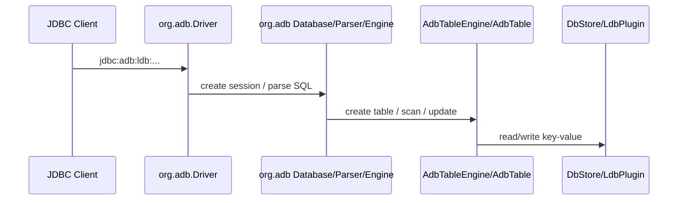

# ADB 基于 H2 插件机制迁移边界评估

## 背景

当前 `vexra-adb` 模块同时承担两类职责：

1. ADB 作为 Vexra 状态机插件的业务能力，例如 `AdbSMPlugin`、`DbStore`、`AdbLdbPlugin`、Raft/LDB 集成逻辑。
2. 一整套从 H2 衍生并改包名到 `org.adb.*` 的数据库内核、JDBC、工具和资源。

仓库扫描结果显示，`vexra-adb/src/main/java/org/adb` 下当前共有 `909` 个源码文件，覆盖 `engine`、`table`、`index`、`command`、`expression`、`jdbc`、`server`、`mvstore`、`tools`、`store` 等完整 H2 衍生实现。`docs/open-source-compliance.md` 也明确将其视为 H2 衍生代码边界。

同时，外部 H2 插件开发说明已经引入 `H2Plugin`、`TableEngineProvider`、`StorageEngineProvider`、`StorageMaintenance` 等扩展点。这意味着 ADB 理论上可以改造成“依赖 h2db jar + 通过插件注册扩展能力”的形态，从而减少在 Vexra 仓库内维护 H2 分叉代码的成本。

## 目标

- 明确 `vexra-adb` 当前对 H2 衍生代码的真实耦合边界。
- 判断哪些能力可以迁移到 H2 插件机制上，哪些能力仍依赖 H2 内核实现。
- 给出从“内置 H2 分叉”迁移到“依赖 h2db + ADB 插件”的分阶段落地路径。

## 非目标

- 本文不直接修改现有 Java 代码、协议或磁盘格式。
- 本文不替代 H2 官方插件文档，也不承诺当前所有 H2 内部 API 在未来版本中保持稳定。
- 本文不设计新的 SQL 语法、优化器行为或 JDBC 协议扩展。

## 现状/已有流程

### 现有模块边界

- `net.xdob.vexra.adb.*`：Vexra/ADB 自有逻辑，包括状态机插件、事务编码、键编码、LDB/Rocks 封装、Raft 集成。
- `org.adb.*`：H2 衍生代码，当前被 ADB 业务代码直接依赖。
- `net.xdob.vexra.ldb.*`：独立发布的 LDB 依赖，通过 `AdbLdbPlugin` 注册 ADB 需要的列族。

### 已确认的直接耦合点

1. 表引擎接入
   `org.adb.AdbTableEngine` 当前实现 `org.adb.api.TableEngine`，在建表时创建 `AdbTable`。

2. ADB 表/索引实现直接依赖 H2 内核类型
   `net.xdob.vexra.adb.db.AdbTable`、`AdbPrimaryIndex`、`AdbSecondaryIndex`、`AdbDelegateIndex` 等直接依赖：
   - `org.adb.engine.*`
   - `org.adb.table.*`
   - `org.adb.index.*`
   - `org.adb.result.*`
   - `org.adb.value.*`
   - `org.adb.mvstore.*`

3. ADB 运行和测试依赖 `org.adb.Driver` / `jdbc:adb:`
   当前测试和示例代码通过 `Class.forName("org.adb.Driver")` 和 `jdbc:adb:ldb:` 连接数据库。

4. ADB 工具层直接依赖 H2 Server
   `net.xdob.vexra.adb.DBServer` 直接使用 `org.adb.tools.Server` 启动 TCP 服务。

### H2 衍生代码职责分布

按包统计，`org.adb.*` 不只是插件入口，而是完整数据库内核：

| 目录 | 说明 |
| --- | --- |
| `command` / `expression` / `bnf` | SQL parser、DDL/DML、优化器和表达式体系 |
| `engine` / `schema` / `table` / `index` / `result` / `value` | 数据库核心元数据、表/索引/行模型、类型系统 |
| `jdbc` / `jdbcx` | JDBC 驱动和 JDBC 扩展 |
| `server` / `server.web` / `tools` | TCP/PG/Web Console、命令行工具 |
| `mvstore` / `store` / `store.fs` | MVStore、文件存储和底层文件系统抽象 |

## 核心约束

- `vexra-adb` 当前不是单纯“插件实现”，而是“ADB 业务代码 + H2 分叉发行版”。
- H2 当前已开放的插件点集中在 table/storage/maintenance provider；SQL parser、optimizer、wire protocol 等核心扩展点未开放。
- ADB 现有实现虽然目标上属于表引擎/存储引擎扩展，但其代码并未停留在 SPI 边界，而是直接引用大量 H2 内部模型对象。
- Vexra 项目要求 JDK 8、UTF-8，并且设计文档需要中英文双份维护。

## 接口设计

### 建议的目标接口形态

迁移目标不是继续发布一套 `org.adb.Driver`，而是收敛到以下拓扑：

| 组件 | 建议职责 |
| --- | --- |
| `h2db` 依赖 | 提供 SQL parser、JDBC、协议、Server、元数据和基础引擎 |
| `vexra-adb` | 提供 ADB 的 table/storage provider、存储维护能力、LDB/Raft 适配逻辑 |
| `vexra-ldb` | 提供本地 KV 存储能力及 LDB 插件机制 |

### 插件注册建议

基于当前 H2 插件文档，ADB 目标上应只保留下列对外入口：

- 一个实现 `H2Plugin` 的插件描述类。
- 一个 `TableEngineProvider`，负责把 ADB 表引擎注册给 H2。
- 如确有需要，再增加 `StorageEngineProvider` / `StorageMaintenance`。

`vexra-adb` 不再承担以下对外入口：

- 自有完整 JDBC Driver；`jdbc:adb:*` 仅作为 `JdbcUrlPrefixProvider` 映射入口保留
- 自有 `org.adb.tools.Server`
- 自有 Web Console / PG/TCP 服务实现

## 数据结构

### 迁移后建议保留的数据结构

以下结构属于 ADB 业务语义，应继续保留在 `net.xdob.vexra.adb.*`：

| 结构 | 说明 |
| --- | --- |
| `CF` | ADB 列族定义 |
| `KeyCodec` / `RowCodec` / `SearchRowCodec` | ADB 行键和值编码 |
| `TxnManager` / `TxnMap2` / `Transaction2` | ADB 事务可见性与提交管理 |
| `Meta` / `IndexBuildState` 等 key/meta 类型 | ADB 元数据和索引状态 |
| `AdbLdbPlugin` | ADB 与 LDB 的插件化边界 |

### 迁移后不应继续在 Vexra 仓库内维护的数据结构

以下结构原则上应来自 `h2db` 依赖，而不是保留在 `org.adb.*` 分叉中：

- `Database`、`SessionLocal`、`TableBase`、`Index`、`Row`、`Value`
- SQL parser / command / expression / optimizer 相关对象
- JDBC 元数据、异常、结果集适配对象
- H2 的 TCP/Web/PG 服务、工具类和 Web 资源

## 状态机

Vexra 侧状态机插件流程本身不依赖 H2 分叉，核心路径仍应保持不变：

1. `AdbSMPlugin.initialize` 打开 `DbStore`。
2. `query` / `applyTransaction` 通过 ADB 编码和 LDB 能力处理读写。
3. 快照与恢复继续由 Vexra 状态机和 LDB/ADB 存储协同完成。

因此，本次迁移的核心不是 Raft 状态机改造，而是数据库内核接入方式改造。

## 时序流程

### 当前流程



### 目标流程

```mermaid
sequenceDiagram
  participant Client as JDBC Client
  participant H2 as org.h2 Driver/Engine
  participant UrlProvider as ADB JdbcUrlPrefixProvider
  participant Plugin as vexra-adb H2Plugin
  participant ADB as AdbTable/AdbIndex/DbStore
  participant LDB as DbStore/LdbPlugin

  Client->>H2: jdbc:adb:ldb:...
  H2->>UrlProvider: map to jdbc:h2:...;DEFAULT_TABLE_ENGINE=adb_table
  H2->>Plugin: load provider through ServiceLoader
  H2->>ADB: create table / scan / update
  ADB->>LDB: read/write key-value
```

## 异常处理

- 迁移后 SQL、JDBC、Server 层异常应优先复用 `h2db` 原生错误模型，不再维持 `org.adb` 的平行副本。
- ADB 自有事务、编码和存储异常仍由 `vexra-adb` 负责转换。
- 待确认：H2 插件 SPI 对 provider 初始化失败、缺失 storage provider、只读降级等场景的异常透出方式，需在接入实现时补充测试。

## 幂等性

- Vexra 状态机层面的幂等性机制不受本次迁移影响。
- JDBC 重试、SQL 解析和会话重建逻辑迁移后应交由 `h2db` 原生实现承担。

## 回滚策略

- 回滚方式应以“切回旧版 `vexra-adb` 分叉发行包”或“禁用 H2 插件入口”实现，而不是混合保留两套 parser/JDBC 实现。
- 在迁移阶段，允许短期并行维护旧发行路径和新插件路径，但必须明确打包边界，避免一个构件同时携带两套数据库内核。

## 兼容性

### 可以通过插件机制承接的部分

以下能力与 H2 文档开放的扩展点方向一致，具备插件化基础：

| 能力 | 当前实现 | 判断 |
| --- | --- | --- |
| ADB 表引擎入口 | `org.adb.AdbTableEngine` | 可以迁移到 H2 provider |
| ADB 表/索引存储逻辑 | `AdbTable`、`AdbPrimaryIndex`、`AdbSecondaryIndex` | 可以保留，但需改为依赖 `org.h2.*` |
| ADB 存储维护能力 | `DbStoreEngine`、LDB/Rocks 封装 | 可评估映射到 storage/maintenance SPI |
| ADB 与 LDB 的列族和写入扩展 | `AdbLdbPlugin` | 与 H2 插件化方向不冲突 |

### 当前不适合继续留在 `vexra-adb` 的部分

以下能力不属于 ADB 业务差异化，继续分叉维护成本高，且与“依赖 h2db”目标冲突：

| 能力 | 当前位置 | 判断 |
| --- | --- | --- |
| SQL parser / optimizer / DDL/DML | `org.adb.command`、`expression`、`bnf` | 应回归 h2db |
| JDBC Driver / JDBCX / 元数据 | `org.adb.jdbc`、`jdbcx` | 应回归 h2db |
| TCP/PG/Web Server 与工具 | `org.adb.server`、`server.web`、`tools` | 应回归 h2db |
| MVStore / store.fs / 文件系统抽象 | `org.adb.mvstore`、`store`、`store.fs` | 原则上应回归 h2db |

### 仍然存在的高风险耦合

即使不再拷贝 H2 源码，ADB 仍可能短期依赖 H2 内部类，而不只是公开 SPI：

- `AdbTable` 继承 `TableBase`
- `AdbIndex` 体系依赖 `Index`、`SearchRow`、`Value`
- 锁、约束、事务可见性逻辑直接读取 `SessionLocal`、`Database`、`TransactionStore`

这意味着“去掉 H2 源码内置”与“只依赖 H2 公开 API”不是同一件事。第一步可以做到前者，第二步未必能立刻做到。

### 当前 SPI 已满足的部分

结合 `h2db 2.3.0` 当前实现，可以确认以下能力已经具备：

| 能力 | 现状 |
| --- | --- |
| 静态插件注册 | 已改为通过 `META-INF/services/org.h2.api.H2Plugin` 的 ServiceLoader 自动发现插件，不再依赖 JDBC URL 指定插件 jar |
| provider 注册与诊断 | 已支持 `TableEngineProvider`、provider registry 和 `INFORMATION_SCHEMA.PLUGINS` 等诊断表 |
| JDBC URL 前缀扩展 | 已支持 `JdbcUrlPrefixProvider`，可以把 `jdbc:adb:*` 在 Driver 层映射到 `jdbc:h2:*` |
| API 稳定性分层 | 已区分稳定 SPI、受管迁移 API 和内部实现 |
| 建表上下文 | `TableEngineContext` 已提供 `Database`、`Schema`、`StorageEngine`、storage engine id、trace、`WITH` 参数、持久化/只读标志 |
| 默认 provider 路由 | `Schema.createTable()` 已优先按 provider id 路由，再兼容旧 `TableEngine` class-name 路径 |
| 系统元数据前置扩展点 | 已支持 `SystemCatalogProvider` 注册、诊断和 `system.catalog` capability |
| Table/Index 迁移边界 | 已明确 `Table`、`Index`、`Row`、`SearchRow`、`Value`、`SessionLocal` 属于迁移期受管 API，不承诺长期二进制兼容 |
| 契约测试方向 | 已提供 `TableSpiContractTest` 作为插件原型的最小对齐基线 |

这说明对 ADB 来说，“插件是否能装载”和“是否允许迁移期依赖 H2 表/索引内部类型”已经不是主要阻塞点。当前更关键的是把 ADB 自有表、索引、行编码和事务可见性实现从 `org.adb.*` 改到 `org.h2.*`。

### JDBC URL 前缀兼容判断

新版 h2db 已经支持在 Driver 层注册 `JdbcUrlPrefixProvider`，因此 `jdbc:adb:*` 可以作为兼容入口保留，但它不再意味着 `vexra-adb` 需要继续维护 `org.adb.Driver`、`org.adb.jdbc` 或独立 JDBC 协议栈。

当前 ADB 侧的兼容映射策略如下：

| 旧 URL | 映射结果 | 说明 |
| --- | --- | --- |
| `jdbc:adb:ldb:/path/db` | `jdbc:h2:/path/db;DEFAULT_TABLE_ENGINE=adb_table` | 去掉历史 LDB 存储前缀，默认进入 ADB 表 provider |
| `jdbc:adb:rocksdb:/path/db` | `jdbc:h2:/path/db;DEFAULT_TABLE_ENGINE=adb_table` | RocksDB 前缀先作为兼容解析，完整存储语义后续迁移到 provider 参数 |
| `jdbc:adb:mem:test` | `jdbc:h2:mem:test;DEFAULT_TABLE_ENGINE=adb_table` | 内存库仍走 h2db 原生 URL 语义 |

如果用户已经显式指定 `DEFAULT_TABLE_ENGINE`，兼容层不覆盖该设置。这个设计保证旧入口可迁移，同时让 SQL parser、JDBC、Server 和 tools 全部回归 h2db 原生实现。

### 新版 h2db 支持后的 ADB 迁移判断

新版插件 SPI 把我们之前的一部分要求转成了可执行前提：

| 事项 | 判断 | ADB 侧动作 |
| --- | --- | --- |
| `TableBase` / `Index` 迁移 | 可作为受管迁移 API 使用 | 先迁移 import 和构造路径，固定 h2db 小版本并补契约测试 |
| `SessionLocal` 依赖 | 仍是高风险内部 API；事务边界已可通过 `TransactionEventProvider` 监听 | 只在锁、权限和表/索引操作必须使用处保留；commit / rollback 交给事务事件 provider |
| `SystemCatalogProvider` | 已可注册和校验，但尚不接管系统表 | 暂不把 LDB/Rocks 作为 H2 主 storage engine，先保持 table provider 原型 |
| 非 MVStore 主路径 | 仍未生产可用 | 等 system catalog 的系统表、LOB、事务日志和临时结果契约补齐后再推进 |
| parser / optimizer / JDBC server | 明确不开放 | ADB 不再要求自定义这些层，目标是复用 h2db 原生实现 |
| `jdbc:adb:*` URL 前缀 | 已可通过 `JdbcUrlPrefixProvider` 注册 | 保留兼容入口，但不再维护自有 JDBC Driver |

### 仍建议继续向 h2db 反馈的能力

以下能力还没有变成稳定 SPI，后续可以作为 ADB 迁移过程中的反馈项：

- 更高层的表存储适配层，减少插件直接继承 `TableBase`、实现 `Index` 的代码量。
- 自定义表引擎在锁、约束、二级索引、统计信息、analyze 流程上的更细契约。
- `createTable()` 失败时 provider id、table name、参数摘要和原始 cause 的统一诊断格式。
- 非 MVStore 主路径的 system catalog、LOB、事务日志、临时结果完整契约。

这些不是当前原型的阻塞项，但会影响后续从“迁移期可用”走向“长期稳定插件 API”。

## 灰度/迁移

建议按以下阶段推进：

| 阶段 | 动作 | 产出 |
| --- | --- | --- |
| Phase 1 | 仅做边界收敛，不改业务行为 | 新设计文档、耦合清单、测试基线 |
| Phase 2 | 引入 `h2db` 依赖，建立最小 H2 插件入口 | 可加载的 ADB H2 plugin 原型 |
| Phase 3 | 将 `AdbTableEngine`、`AdbTable`、索引实现改为依赖 `org.h2.*` | ADB 表引擎在 h2db 上跑通 |
| Phase 4 | 移除 `org.adb.jdbc`、`server`、`tools`、`command` 等非 ADB 差异代码 | `vexra-adb` 不再分发 H2 内核副本 |
| Phase 5 | 清理兼容层、补充发布和回滚策略 | 正式切换到插件发行模型 |

### 实施追踪清单

| 编号 | 状态 | 任务 | 交付物 | 验收方式 | 回滚点 |
| --- | --- | --- | --- | --- | --- |
| ADB-H2-01 | 已完成 | 引入 `h2db 2.3.0` 依赖并保留当前旧实现 | `vexra-adb/build.gradle` 中的 `h2db` 依赖 | `:vexra-adb:compileJava` 通过 | 删除依赖并回到旧 `org.adb.*` 编译路径 |
| ADB-H2-02 | 已完成 | 建立 H2 插件 ServiceLoader 入口 | `AdbH2Plugin`、`META-INF/services/org.h2.api.H2Plugin` | H2 通过 ServiceLoader 发现插件 | 移除 ServiceLoader 文件和插件入口类 |
| ADB-H2-03 | 已完成 | 建立 `jdbc:adb:*` URL 前缀兼容 provider | `AdbJdbcUrlPrefixProvider` | `org.h2.Driver.acceptsURL("jdbc:adb:...")` 和 URL 映射单测通过 | 移除 URL provider，要求调用方改用 `jdbc:h2:*` |
| ADB-H2-04 | 已完成 | 建立 ADB table provider 原型 | `AdbTableProvider` | provider 可通过 ServiceLoader 注册并暴露 `adb_table` | 移除 provider 原型，不暴露 `adb_table` |
| ADB-H2-05 | 已完成 | 迁移 `AdbTableEngine` 到 `TableEngineProvider` | `AdbTableProvider.createTable()` 创建真实 `AdbTable`；旧 `org.adb.AdbTableEngine` 保留为 deprecated 兼容错误入口 | `jdbc:adb:ldb:*` 经 h2db Driver 映射后可执行 `CREATE TABLE` | 回退 provider 建表实现，恢复旧 `org.adb.AdbTableEngine` 路径 |
| ADB-H2-06 | 已完成 | 将 `AdbTable` 从 `org.adb.*` import 迁移到 `org.h2.*` | `AdbTable` 及构造路径依赖 h2db 类型 | 最小建表、重启 reopen、行计数测试通过 | 回退 `AdbTable` import 与构造路径 |
| ADB-H2-07 | 已完成 | 迁移主键和二级索引实现 | `AdbPrimaryIndex`、`AdbSecondaryIndex`、`AdbDelegateIndex` 依赖 h2db 类型 | 主键查找、范围扫描、二级索引查询、删除回归通过 | 单独回退索引实现，保留旧引擎路径 |
| ADB-H2-08 | 待开始 | 收敛事务、锁和可见性对 `SessionLocal` / `Database` 的依赖 | ADB 内部适配层或明确的受管 h2db API 使用点 | 并发写、读写冲突、回滚、checkpoint/reopen 测试通过 | 禁用新 provider，保留旧分叉路径 |
| ADB-H2-09 | 待开始 | 替换 `DBServer` 对 `org.adb.tools.Server` 的依赖 | 基于 `org.h2.tools.Server` 的封装或删除自定义封装 | TCP 启停、端口冲突、关闭恢复测试通过 | 保留旧 `DBServer` 发行路径 |
| ADB-H2-10 | 待开始 | 删除非 ADB 差异化 `org.adb.*` 目录 | parser、JDBC、server、tools、mvstore 等删除清单 | 全量编译、关键集成测试和开源合规文档通过 | 分阶段 revert 删除提交 |

### 下一阶段执行顺序

1. 先做 ADB-H2-05，把 `AdbTableProvider.createTable()` 从原型错误改成真实建表入口，但仍保留旧 `org.adb.*` 代码不删。
2. ADB-H2-06 和 ADB-H2-07 已完成；下一步做 ADB-H2-08，继续收敛事务、锁和可见性边界。
3. 然后做 ADB-H2-08，继续收敛锁和可见性里的高风险内部 API 依赖；commit / rollback 已优先使用 h2db `TransactionEventProvider`。
4. 最后做 ADB-H2-09 和 ADB-H2-10，清理工具层和非差异化 H2 衍生代码。

### 阶段验收门槛

| 阶段 | 最低验收门槛 |
| --- | --- |
| Phase 2 | `org.h2.Driver.acceptsURL("jdbc:adb:...")` 返回 true；`jdbc:adb:ldb:*` 可映射到 `jdbc:h2:*;DEFAULT_TABLE_ENGINE=adb_table`；插件通过 ServiceLoader 自动发现 |
| Phase 3 | 使用 h2db Driver 建表、插入、查询、删除、reopen 通过；ADB 表和索引不再 import `org.adb.table`、`org.adb.index`、`org.adb.value` |
| Phase 4 | `vexra-adb` 中不再需要 `org.adb.jdbc`、`org.adb.command`、`org.adb.server`、`org.adb.tools`；`DBServer` 走 h2db Server 或明确废弃 |
| Phase 5 | 发布说明、回滚说明、开源合规说明同步更新；旧 `org.adb.Driver` 入口有明确弃用或删除结论 |

## 测试方案

- 连接兼容测试：使用 `h2db` 原生连接串或 `jdbc:adb:*` 兼容前缀打开 ADB 数据库。
- URL 前缀兼容测试：验证 `org.h2.Driver.acceptsURL("jdbc:adb:...")`、`JdbcUrlPrefixProvider.toH2Url()` 和 `DEFAULT_TABLE_ENGINE=adb_table` 默认追加逻辑。
- DDL/DML 回归：覆盖建表、主键、二级索引、扫描、计数、更新、删除、重启恢复。
- 插件装载测试：验证 `META-INF/services/org.h2.api.H2Plugin` 通过 ServiceLoader 自动发现成功与失败路径。
- 数据恢复测试：验证 checkpoint、reopen、snapshot/restore 不受迁移影响。
- 兼容性测试：验证旧版 `org.adb.Driver` 入口在迁移阶段是否保留，若保留则需单独声明弃用计划。

## 风险点

| 风险 | 等级 | 说明 | 缓解方式 |
| --- | --- | --- | --- |
| ADB 代码大量依赖 H2 内部类 | P0 | 即使不拷贝源码，也可能被 H2 升级破坏 | 固定 H2 版本，先完成边界收敛再升级 |
| JDBC URL 和 Driver 兼容性变化 | P1 | 现有测试和示例依赖 `org.adb.Driver`、`jdbc:adb:` | `jdbc:adb:*` 通过 h2db URL provider 保留，`org.adb.Driver` 单独声明弃用窗口 |
| DBServer 与控制台能力丢失 | P1 | 当前 `DBServer` 直接依赖 `org.adb.tools.Server` | 改用 H2 原生 Server 或删除自定义封装 |
| 误把 ADB 事务逻辑当作 H2 通用能力删除 | P0 | `TxnManager`、`RowCodec` 等是 ADB 核心 | 在 Phase 2 先完成保留/删除白名单 |

## 分阶段实施计划

1. 建立保留白名单
   明确 `net.xdob.vexra.adb.*` 中哪些类属于 ADB 核心，哪些只是为 `org.adb` 分叉服务。

2. 建立 H2 插件原型
   先不删旧代码，只引入 `h2db` 并实现最小 `H2Plugin` + table provider，先验证 H2 能识别 ADB 插件，再推进 `AdbTable` 类型迁移。

3. 切换 ADB 编译依赖
   将 `AdbTable`、`AdbIndex` 等实现从 `org.adb.*` import 改为 `org.h2.*`，逐步去掉对分叉包的编译依赖。

4. 清理非差异化 H2 衍生目录
   删除 parser、JDBC、Server、tools、Web 资源、MVStore 等不再由 Vexra 维护的 `org.adb.*` 代码。

5. 收口发行模型
   将 `vexra-adb` 定位成 ADB 插件包，不再定位成带私有 JDBC 驱动的数据库发行包。

## 结论

结论分两层：

1. 从目标架构上看，`vexra-adb` 引用 `h2db` 并通过插件机制扩展后，确实没有必要继续在仓库中包含并维护完整的 H2 分叉代码。
2. 从当前实现上看，还不能直接删除 H2 衍生代码，因为 ADB 的表、索引、锁、事务可见性和测试入口仍直接建立在 `org.adb.*` 类型体系之上。

因此，正确的迁移顺序不是“先删 H2 代码”，而是“先把 ADB 从 `org.adb` 分叉里剥出来，改成依赖 `h2db` 运行，再删除分叉代码”。
