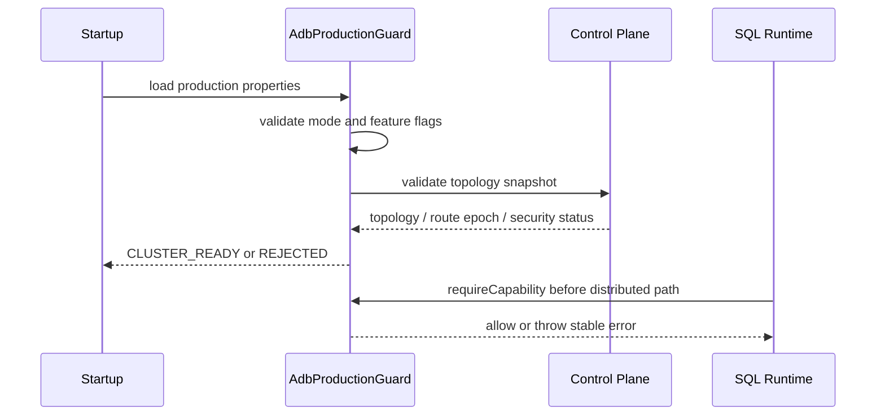
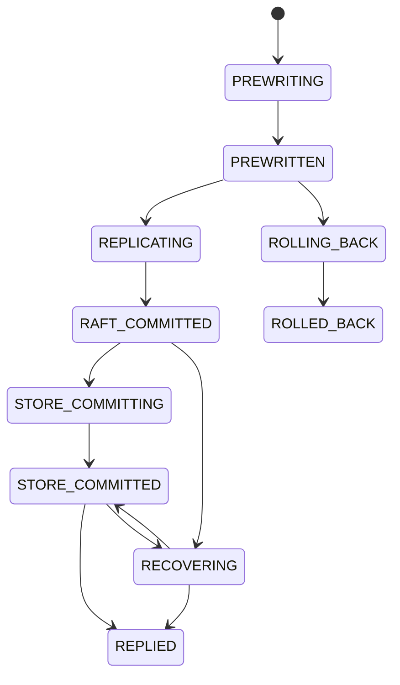
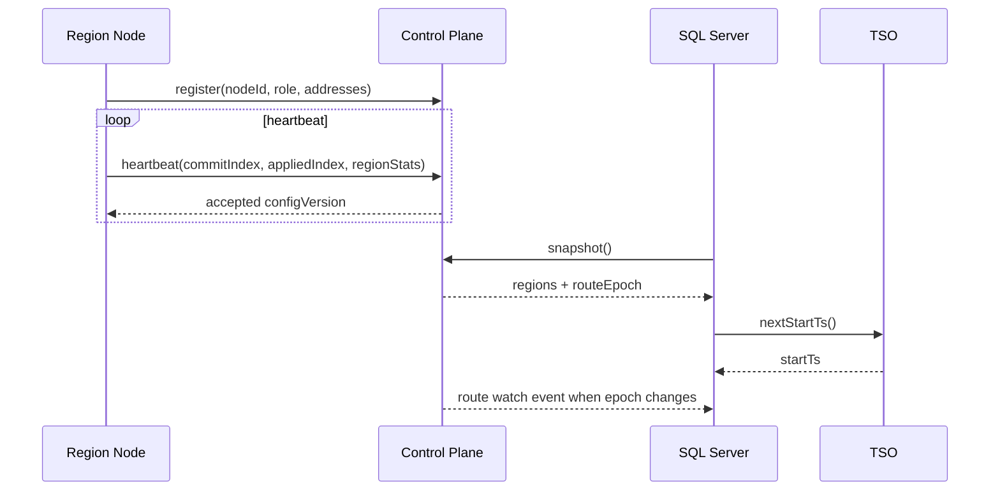
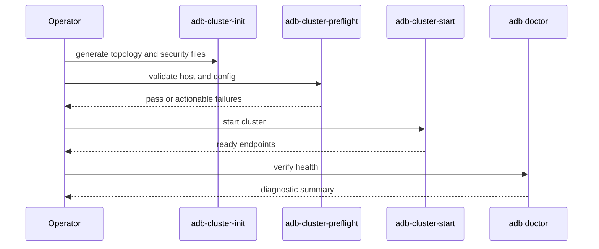

# ADB Production MVP Hardening Plan

## Background

`vexra-adb` has completed the h2db plugin migration, remote-region SQL reads and writes, a shared catalog / TSO prototype, cluster orchestration planning, secure install templates, and an end-to-end stress-gate model. These capabilities prove that ADB can keep evolving toward a TiDB-like architecture, but most of them are still prototypes, models, or smoke-level validation rather than production-ready behavior.

This plan does not try to fully replicate TiDB. It narrows the project into a production MVP that can be delivered faster: limited SQL, limited topology, and limited transaction scope, but with hard requirements for data safety, clear failure boundaries, deployment, recovery, observability, and release gates.

## Goals

- Define the feature, deployment, and failure boundaries of the first production MVP.
- Split the work into implementation-ready phases that another model can pick up directly.
- Prioritize "no data loss" and "no unsafe writes under uncertainty" before automation, performance, or broad compatibility.
- Keep the existing single-node ADB/H2 plugin mode as the default rollback path.
- Make 2 data nodes + 1 lightweight witness the recommended HA topology; keep shared storage as an explicit compatibility mode rather than the default production shape.

## Non-Goals

- Do not promise full TiDB, MySQL, or PostgreSQL compatibility.
- Do not implement full MPP, complex CBO, automatic hotspot scheduling, automatic split/merge, or large cross-region transactions in the first release.
- Do not support automatic strong-consistency failover with only 2 data nodes and no witness or shared-storage fencing.
- Do not treat existing prototypes as production-complete without independent GA validation.
- Do not claim production readiness before release gates and recovery drills pass.

## Production MVP Scope

### Supported Scope

| Area | First Release Support | Explicit Limit |
| --- | --- | --- |
| Topology | 2 data nodes + 1 lightweight witness; single-node mode remains | No pure 2-data automatic failover |
| SQL access | h2db JDBC / Server / parser, ADB table engine | No full MySQL compatibility promise |
| Sharding | Fixed regions or manually configured regions | No automatic split/merge |
| Writes | Single-region strongly consistent writes; cross-region writes rejected by default or behind an experimental flag | Cross-region 2PC is not enabled by default |
| Reads | Leader read or read-index consistent read; unsafe follower read is disabled in the first release | Follower read is a later design |
| DDL | Create/drop table and basic index features; only validated online DDL subsets | No complex online schema change |
| Backup/restore | Full backup, full restore, restore verification | PITR / CDC are later phases |
| Security | TLS, token/auth, least-privilege service templates | No complex multi-tenant RBAC |
| Operations | Install, start, stop, doctor, status check, rolling-upgrade skeleton | No automatic capacity scheduling promise |

### Forbidden Scope

- Automatic write HA must be rejected when the topology has two data nodes without a witness or shared-storage fencing.
- Writes must fail when region routing is missing, epoch is stale, leader is uncertain, or quorum cannot be proven.
- Commits must fail when a transaction touches multiple regions unless a validated cross-region protocol is explicitly enabled.
- Background cleanup must not delete data that may still be visible to snapshot reads when the safe point, lock resolve, or recovery state is uncertain.

## Current State / Existing Flow

| Component | Existing Capability | Production Gap |
| --- | --- | --- |
| `TxnManager` | Local ADB transactions, region write gate, read router, commit coordinator, TSO provider hook | Commit success semantics, crash recovery, and cross-region limits need production gates |
| `AdbControlPlaneClient` / `InMemoryAdbControlPlaneClient` | Control-plane snapshot and in-memory TSO prototype | Needs persistence, HA, heartbeat, leases, and versioned metadata |
| `RegionRouter` / `RegionMetadata` | Region metadata and routing model | Needs runtime metadata source, epoch changes, route refresh, and system tables |
| `RegionWitnessBinding` / HA model | Witness quorum and failover model | Needs real deployment integration, failure injection, and recovery drills |
| Remote-region SQL | SQL Server to region-node smoke path | Needs real soak, error codes, timeouts, retries, and observability |
| Install templates | systemd / Windows service templates and secure-default planning | Needs one-command generation, preflight, certificate/permission validation, and upgrade strategy |
| Stress gate | End-to-end stress report and gate model | Needs runnable cluster stress jobs and release pipeline integration |

## Core Constraints

- Java code must remain JDK 8 compatible.
- Production defaults must be safe: fail on unknown state, missing quorum, missing authentication, or missing TLS in distributed production mode.
- All persisted metadata must carry a version or epoch; unversioned overwrite is forbidden.
- All background jobs must be idempotently retryable and expose their latest success, failure, or skip reason.
- All new network/RPC calls must have explicit timeout, error classification, and caller-visible errors.
- Every phase must preserve rollback to `single` mode and must not break old `jdbc:adb:*` single-node behavior.
- Project explanations, source comments, and commit messages default to Chinese; design documents must keep an English copy.

## Phase Overview

| Phase | Name | Goal | Main Deliverables | Acceptance Gate |
| --- | --- | --- | --- | --- |
| ADB-GA-01 | Production MVP Scope Freeze | Explicitly limit capability boundaries and prevent misuse of immature features | Config validation, capability matrix, errors, docs | Every unsupported scenario is rejected and tested |
| ADB-GA-02 | Data Safety Closure | Prove commit, durability, recovery, and leader switch do not lose data | Commit semantics, recovery verifier, crash tests | Data is consistent after kill/restart/leader transfer |
| ADB-GA-03 | Lightweight Control Plane | Replace static shared catalog with persistent runtime control plane | Node heartbeat, region metadata, TSO, lease, system tables | SQL layer dynamically refreshes routes and TSO |
| ADB-GA-04 | Minimum Production Transactions | Solidify single-region transactions and guard or experiment-gate cross-region work | Single-region SI, lock resolve, GC safe point, cross-region guard | Conflict, timeout, and recovery tests pass |
| ADB-GA-05 | Install and Operations Productization | Reliably deploy and upgrade 2 data + 1 witness | Installer, doctor, backup/restore, rolling-upgrade scripts | A fresh environment can deploy, recover, and upgrade by runbook |
| ADB-GA-06 | Observability and Diagnostics | Make production issues diagnosable | Metrics, slow SQL, system tables, diagnostic bundle | Failure scenarios produce actionable evidence |
| ADB-GA-07 | Release Gate and Trial Production | Put soak, failure injection, and recovery drills into release | Release checklist, stress pipeline, trial-production criteria | Release only after all GA gates pass |

## ADB-GA-01: Production MVP Scope Freeze

### Goals

- Encode first-release production scope in configuration, documentation, and runtime validation.
- Reject unfinished capabilities explicitly instead of silently taking unsafe paths.
- Provide common capability probing and stable error codes for later phases.

### Interface Design

| Interface/Class | Suggested Package | Responsibility |
| --- | --- | --- |
| `AdbProductionMode` | `net.xdob.vexra.adb.db` | Enum: `SINGLE`, `MVP_CLUSTER`, `EXPERIMENTAL` |
| `AdbProductionCapability` | `net.xdob.vexra.adb.db` | Enum for SQL, transactions, HA, DDL, backup, and related capabilities |
| `AdbProductionGuard` | `net.xdob.vexra.adb.db` | Reject unsupported paths based on config, topology, and request context |
| `AdbUnsupportedProductionFeatureException` | `net.xdob.vexra.adb.db` | Stable SQLState / error code for callers |
| `adb.production.mode` | Config | Defaults to `single`; production cluster explicitly sets `mvp-cluster` |
| `adb.production.allowExperimental` | Config | Defaults to `false`; test-only experimental capability switch |

Suggested method shape:

```java
public final class AdbProductionGuard {
  public void requireCapability(AdbProductionCapability capability,
      AdbRequestContext context) throws SQLException;

  public void validateClusterTopology(AdbClusterTopology topology)
      throws SQLException;

  public void validateTransactionRegions(Collection<Long> regionIds,
      AdbRequestContext context) throws SQLException;
}
```

### Data Structures

| Field | Meaning | Constraint |
| --- | --- | --- |
| `mode` | Current runtime mode | `single` is conservative by default; `mvp-cluster` requires secure config |
| `topologyKind` | `single` / `2data1witness` / `shared-storage` | Pure 2-data automatic writes are illegal |
| `enabledCapabilities` | Enabled capability set | Derived from mode and feature flags; cannot be opened arbitrarily |
| `experimentalCapabilities` | Experimental capability set | Usable only when `allowExperimental=true` |
| `reason` | Rejection reason | Must appear in logs, system tables, and exception messages |

### State Machine

| State | Meaning | Allows Writes |
| --- | --- | --- |
| `UNVERIFIED` | Config is not validated yet | No |
| `SINGLE_READY` | Single-node capability is available | Yes, single-node scope |
| `CLUSTER_READY` | 2 data + witness, secure config, and routes are available | Yes, MVP scope |
| `DEGRADED_READONLY` | Quorum or control-plane certainty is missing | No, optionally read-only |
| `REJECTED` | Config is illegal | No |

Illegal transition: `REJECTED` must not automatically become `CLUSTER_READY`; config must be fixed and the node restarted or explicitly reloaded.

### Sequence



### Failure Handling

| Scenario | Behavior |
| --- | --- |
| Pure 2-data automatic HA | Startup fails; message requires witness or shared-storage fencing |
| Cross-region write | Commit fails by default and reports the required experimental or GA capability |
| Missing TLS/auth | `mvp-cluster` startup fails |
| Unknown capability | Reject and log as P0 |

### Idempotency

Validation reads config and control-plane snapshots only. It must not modify business data. Repeated validation must be stable; reload creates a new state using the new `routeEpoch` and `configVersion`.

### Rollback

- Set `adb.production.mode` back to `single`.
- Remove `mvp-cluster` feature flags.
- Keep existing data directories unchanged; no disk-format change is introduced.

### Tests

- Unit tests: capability matrix, illegal topology, experimental capability switch.
- Integration tests: SQL table creation, commit, and remote reads/writes are rejected when capability is disabled.
- Compatibility tests: old `jdbc:adb:*` single-node URL remains unchanged.
- Documentation tests: production-mode quickstart config can be parsed.

### Current Implementation Status

`ADB-GA-01` has completed its first runtime-boundary increment:

- `AdbProductionMode` defines the `single`, `mvp-cluster`, and `experimental` runtime modes.
- `AdbProductionTopologyKind` defines the `single`, `2data1witness`, `shared-storage`, and `pure-2data` topology categories.
- `AdbProductionCapability` separates local SQL, distributed SQL, single-region transactions, backup/restore, and rolling upgrade from experimental capabilities such as cross-region transactions, follower read, and automatic split/merge.
- `AdbProductionGuard` rejects requests based on production mode, topology, security switches, and experimental opt-in. Its default single-node guard keeps old `jdbc:adb:*` local behavior.
- `AdbUnsupportedProductionFeatureException` provides stable SQLState `ADB01` and error code `7101` for later SQL/transaction mapping.
- `AdbProductionGuardTest` covers single-node compatibility, 2 data + witness production allow, missing secure-default rejection, pure 2-data rejection, default cross-region rejection, and experimental opt-in.

This phase has not yet wired the guard into every real SQL/transaction entrypoint. Later phases must call this guard when changing those paths and must not bypass the production scope freeze.

## ADB-GA-02: Data Safety Closure

### Goals

- Define the durability and replication conditions required before SQL commit returns success.
- Cover crash, restart, leader switch, duplicate commit, and recovery scenarios.
- Produce evidence for no data loss, no duplicate apply, and no unsafe writes.

### Commit Semantics

In production mode, SQL commit may return success only after:

1. The transaction has a monotonic `commitTs`.
2. The write set passes region routing and epoch validation.
3. Each touched region passes leader fencing and quorum commit.
4. The local or remote store has persisted durable intents / committed versions.
5. The commit result is recorded idempotently so client retry does not apply twice.

If the first release allows only single-region transactions, step 3 allows exactly one region; multiple regions fail.

### Interface Design

| Interface/Class | Responsibility |
| --- | --- |
| `AdbDurableCommitMarker` | Record txnId, startTs, commitTs, regionId, and commitState |
| `AdbCommitRecoveryScanner` | Scan in-doubt transactions during startup and recover them |
| `AdbCommitIdempotencyStore` | Deduplicate by txnId/client request id |
| `AdbCrashInjectionHook` | Test-only injection at prewrite, raft commit, store commit, and before reply |
| `AdbCommitCrashInjectionGate` | Aggregate recovery evidence for each commit crash-injection point and feed the release-gate data-safety check |
| `AdbRecoveryDrillGate` | Aggregate process-level kill/restart recovery evidence and feed the release-gate recovery check |
| `AdbDataSafetyVerifier` | Validate commit marker, visible version, lock record, and region commit index consistency |

### Data Structures

| Field | Meaning |
| --- | --- |
| `txnId` | Internal ADB transaction id |
| `clientRequestId` | Client idempotency key; optional but recommended for production |
| `startTs` | Transaction start timestamp |
| `commitTs` | Commit timestamp |
| `regionIds` | Touched region set; MVP allows one |
| `state` | `PREWRITTEN` / `RAFT_COMMITTED` / `STORE_COMMITTED` / `REPLIED` / `ROLLED_BACK` |
| `lastError` | Last recovery error |

`AdbCommitCrashInjectionGate` reports must record at least these fields:

| Field | Meaning |
| --- | --- |
| `injectionPoint` | Crash point: before prewrite, after prewrite before raft, after raft before store, or after store before reply |
| `recovered` | Whether kill/reopen or client retry reached the expected recovery outcome |
| `finalState` | Durable marker state after recovery; nullable, but passing scenarios must match the expected state |
| `notes` | Failure reason, log path, or manual diagnostic summary |

`AdbRecoveryDrillGate` reports must record at least these fields:

| Field | Meaning |
| --- | --- |
| `scenario` | Recovery drill scenario: kill leader, kill follower, kill witness, or full-cluster restart |
| `attempted` | Whether the drill was actually executed |
| `recovered` | Whether reads, writes, routing, and Raft quorum recovered after the drill |
| `checksumMatched` | Whether data checksums match before and after the drill |
| `notes` | Log path, command, failure reason, or manual diagnostic summary |

### State Machine



Illegal transitions:

- `RAFT_COMMITTED` must not roll business data back; it can only roll forward.
- `STORE_COMMITTED` retry must not create another version.
- `REPLIED` must never move back to an unfinished state.

### Failure Handling

| Injection Point | Recovery Behavior |
| --- | --- |
| Crash before prewrite | No durable intent; transaction can be discarded |
| Crash after prewrite and before raft commit | Roll back by lock TTL and primary status |
| Crash after raft commit and before store commit | Startup recovery must roll forward |
| Crash after store commit and before reply | Client retry returns the committed result |
| Duplicate commit during leader switch | Idempotency store returns the same commitTs |

### Tests

- JUnit crash-injection: verify each injection point after kill/reopen.
- Process-level smoke: start 2 data + witness, kill leader during commit, then let data + witness take over.
- Data verifier: validate committed version, lock record, and commit marker by txnId.
- Concurrency tests: duplicate client request id, repeated commit, rollback/commit race.
- Suggested command: `.\gradlew.bat :vexra-adb:test --tests *DataSafety*`.

### Current Implementation Status

`ADB-GA-02` has completed its second durable-commit recording increment:

- `AdbDurableCommitState` defines `PREWRITTEN`, `RAFT_COMMITTED`, `STORE_COMMITTED`, `REPLIED`, and `ROLLED_BACK`.
- `AdbDurableCommitMarker` records txnId, clientRequestId, startTs, commitTs, regionId, state, and last error, and only allows data-safe state transitions.
- `AdbCommitRecoveryScanner` maps markers to `ROLLBACK`, `ROLL_FORWARD`, `RETURN_COMMITTED`, or `DISCARD` recovery actions.
- `AdbCommitIdempotencyStore` provides an in-memory idempotency model, proving that duplicate commits with the same client idempotency key do not create a new commitTs, while allowing one transaction to track recovery state per region.
- `AdbDurableCommitRecorder` defines the status recording hook for the real commit path; the default no-op keeps the old single-node path compatible, and `AdbInMemoryDurableCommitRecorder` is the semantic template for tests and later persistent implementations.
- `AdbPersistentDurableCommitRecorder` now writes markers under a dedicated `CF.TXN` prefix and can scan marker snapshots after store reopen.
- `AdbCommitRecoveryExecutor` now connects `ROLLBACK`, `ROLL_FORWARD`, and `RETURN_COMMITTED` decisions to `DbStore.rollbackAsync/commitAsync` and recorder state advancement, closing the post-scan recovery execution loop.
- `AdbStartupRecoveryService` now combines marker scanning, recovery decisions, and recovery execution into a synchronous startup recovery entrypoint; `DbStoreEngine` runs local marker recovery after opening a local LDB/Rocks store for the first time.
- `AdbRemoteCommitRecoveryExecutor` now reuses `AdbRegionCommitClient` to rollback or roll forward remote Raft regions while using the same marker state machine; this path does not introduce a new disk format.
- `AdbRegionCommitCoordinator` now advances marker state across single-region commit, 2PC prewrite, primary/secondary commit, and rollback paths, preserving recovery evidence such as `REPLIED`, `PREWRITTEN`, and `ROLLED_BACK`.
- `AdbDurableCommitRecoveryTest` covers marker transitions, rollback rejection after RAFT_COMMITTED, rollback before raft commit, recovery-decision mapping, and idempotency conflicts.
- `AdbDurableCommitRecoveryTest` also covers persistent marker scanning after reopen, duplicate commit idempotency, recovery-executor rollback / roll-forward / return-committed behavior, and the startup recovery service.
- `AdbStartupRecoveryServiceTest` covers automatic RAFT_COMMITTED marker recovery when `DbStoreEngine.getOrCreate()` opens a store for the first time.
- `AdbRemoteCommitRecoveryExecutorTest` covers remote marker rollback, roll-forward, and return-committed behavior through the region commit client.
- `AdbRegionCommitCoordinatorTest` covers single-region success markers, rollback markers after prewrite failure, and primary-committed/secondary-in-doubt markers on the real coordinator path.
- `AdbCommitCrashInjectionGate` now defines a structured release gate for commit crash-injection: every required injection point must appear, recover successfully, and end in the durable marker state required by the data-safety semantics.
- `AdbEndToEndClusterStressGate` now requires the end-to-end report to carry a passing commit crash-injection evaluation, preventing ordinary soak/recovery evidence from replacing commit-specific crash evidence.
- `AdbCommitCrashInjectionGateTest` covers full matrix pass, missing injection point failure, recovery failure, final-state mismatch, and end-to-end release-gate propagation.
- `AdbRecoveryDrillGate` now defines a structured release gate for process-level kill/restart recovery drills: leader, follower, witness, and full-cluster restart scenarios must all be executed, recovered, and checksum-consistent.
- `AdbEndToEndClusterStressGate` now requires the end-to-end report to carry a passing recovery-drill evaluation, preventing a single boolean from replacing per-scenario kill/restart evidence.
- `AdbRecoveryDrillGateTest` covers full drill pass, missing scenario, not attempted, not recovered, checksum mismatch, and end-to-end release-gate propagation.
- `RaftRClient` now makes the Raft retry budget used by remote SQL writes configurable by default, covering a longer leader-discovery and NotLeader retry window and reducing false PREWRITE failures during multi-process smoke startup/election windows.

This phase has not yet connected the structured crash gate / recovery gate to the real multi-process release profile and evidence directory. The next increment should add the release-profile script and evidence archiving.

## ADB-GA-03: Lightweight Control Plane

### Goals

- Replace the static shared catalog file with a persistent, highly available control plane.
- Let the control plane own node registration, heartbeat, region metadata, TSO, leases, route versioning, and system tables.
- Keep the first control plane lightweight, but make it the shared source of truth for the SQL and region layers.

### Interface Design

| Interface/Class | Responsibility |
| --- | --- |
| `AdbControlPlaneServer` | Control-plane service entry |
| `AdbControlPlaneStore` | Persist nodes, regions, leases, and TSO |
| `AdbNodeHeartbeatService` | Node heartbeat and node state machine |
| `AdbRegionCatalogService` | Region metadata CRUD and epoch advance |
| `AdbTsoService` | Allocate global monotonic timestamps |
| `AdbRouteWatch` | SQL Server subscription for routeEpoch changes |
| `AdbSystemTableProvider` | Expose nodes, regions, leases, TSO, and capabilities |

Core method shape:

```java
public interface AdbControlPlaneClient {
  AdbControlPlaneSnapshot snapshot() throws SQLException;
  long nextStartTs() throws SQLException;
  long nextCommitTs(long startTs) throws SQLException;
  void heartbeat(AdbNodeHeartbeat heartbeat) throws SQLException;
  AdbRouteWatch watchRoutes(long lastSeenEpoch);
}
```

### Data Structures

| Table/Record | Primary Key | Fields |
| --- | --- | --- |
| `adb_cp_node` | `nodeId` | role, host, ports, status, lastHeartbeat, failureDomain |
| `adb_cp_region` | `regionId` | startKey, endKey, epoch, leaderId, replicas, state |
| `adb_cp_tso` | `scope` | physical, logical, lastIssuedTs, leaseOwner |
| `adb_cp_lease` | `leaseName` | owner, epoch, expireAt, fencingToken |
| `adb_cp_config` | `configKey` | value, version, updatedAt |

### State Machine

| Node State | Trigger | Behavior |
| --- | --- | --- |
| `JOINING` | First registration | Does not participate in writes |
| `UP` | Healthy heartbeat | Can participate in routes and quorum |
| `SUSPECT` | One or a few missed heartbeats | Pause new leader assignment |
| `DOWN` | Past failure threshold | Removed from available replica set |
| `RECOVERING` | Node restarted and is catching up | Catch-up only, no leader assignment |
| `DECOMMISSIONED` | Explicit removal | Never auto-join |

### Sequence



### Failure Handling

- Control plane unreachable: existing SQL sessions may read cached routes, but writes must obey route TTL and lease rules; after TTL, writes fail.
- TSO lease expired: stop timestamp allocation until a new owner takes over.
- Region epoch conflict: new writes fail and require route refresh.
- Heartbeat flapping: move to `SUSPECT` before migration to avoid churn.

### Rollback

- `adb.controlPlane.mode=static-catalog` falls back to the current shared catalog prototype.
- Control-plane metadata uses a separate namespace and does not change ADB table data format.
- SQL Server keeps the startup static-catalog compatibility path.

### Tests

- Control-plane store reopen never rolls TSO back.
- SQL layer refreshes routes after routeEpoch changes.
- Heartbeat timeout moves node from `UP` to `SUSPECT` / `DOWN`.
- Writes are rejected after control-plane TTL expires.
- System tables expose nodes, regions, TSO, and leases.

### Current Implementation Increment

- The first GA-03 increment adds `AdbPersistentControlPlaneStore`, using an isolated `adb.cp.*` namespace in `CF.META` for control-plane metadata. It does not change ADB table data, transaction data, or the existing shared-catalog compatibility path.
- This increment covers node heartbeat records, region snapshots, route epoch, and monotonic TSO. Leases, replicated control-plane service, route watch, system-table provider, and control-plane TTL remain later GA-03 subtasks.
- `AdbNodeHeartbeat` writes produce `AdbControlPlaneNodeRecord` entries and mark healthy heartbeat nodes as `UP`; `AdbNodeHeartbeatService` advances timed-out nodes to `SUSPECT` / `DOWN`, and a fresh heartbeat can recover them to `UP`. `RECOVERING` and `DECOMMISSIONED` still remain later explicit operations-state subtasks.
- Region snapshots are published as whole-snapshot replacements and advance route epoch, matching the current split/merge manager boundary. A later service increment can split this into version-checked region CRUD.
- TSO advances through the store atomic `addLong` path and must not roll back after reopen; first allocation initializes the persisted value to at least the configured initial timestamp.

## ADB-GA-04: Minimum Production Transactions

### Goals

- Make single-region Snapshot Isolation the first production transaction path.
- Reject cross-region transactions by default; allow 2PC only in experimental mode with separate validation.
- Keep lock resolve, safe point, and GC conservative so long transactions and backups are not broken.

### Interface Design

| Interface/Class | Responsibility |
| --- | --- |
| `AdbTxnRegionClassifier` | Classify touched regions from write/read sets |
| `AdbSingleRegionTxnCoordinator` | Single-region prewrite/commit/rollback |
| `AdbCrossRegionTxnGuard` | Reject cross-region commits by default |
| `AdbLockResolveWorker` | Periodically resolve expired locks |
| `AdbGlobalSafePointAdvancer` | Advance safe point while protecting active transactions |
| `AdbBackupSafePointRegistry` | Prevent GC from deleting history during backup |

### Data Structures

| Field | Meaning | Constraint |
| --- | --- | --- |
| `primaryRegionId` | Region containing the primary key | All writes must match in single-region mode |
| `participantRegionIds` | Transaction participant regions | Size must be 1 in MVP production mode |
| `lockTtlMillis` | Lock TTL | Resolver checks primary status after expiry |
| `safePoint` | Maximum historical timestamp eligible for GC | Must not pass active transactions or backup protection |
| `backupSafePoint` | Backup protection timestamp | GC must not cross it while present |

### Failure Handling

| Scenario | Behavior |
| --- | --- |
| Single-region write conflict | Return stable SQLState and allow caller retry |
| Cross-region commit | Reject by default and include region list |
| Primary committed with secondary lock left | Resolver rolls forward |
| Primary not committed and lock expired | Resolver rolls back |
| Long transaction blocks GC | Stop safe-point advance and expose blocking transaction |

### Tests

- Single-region SI: write conflict, snapshot read, commit visibility.
- Cross-region guard: multi-region write set must fail.
- Resolver: rollback, roll-forward, repeated resolve idempotency.
- GC: keep the latest committed version for each logical key and protect long transactions/backups.
- Combined failure: partial commit + restart + resolve + GC.

## ADB-GA-05: Install and Operations Productization

### Goals

- Let users deploy 2 data + 1 witness reliably without hand-copying commands.
- Enable secure defaults for all production installs and run preflight before startup.
- Provide minimum runbooks for backup, restore, rolling upgrade, and node replacement.

### Command Design

| Command | Responsibility |
| --- | --- |
| `adb-cluster-init` | Generate 2 data + 1 witness config, certificate directories, service templates |
| `adb-cluster-preflight` | Check ports, directories, permissions, TLS/auth, disk space, clock skew |
| `adb-cluster-start` | Start services by topology and wait for ready |
| `adb-cluster-stop` | Stop SQL, region, and witness in order |
| `adb-cluster-status` | Output nodes, regions, leader, quorum, and version |
| `adb-backup` | Create full backup and checksum |
| `adb-restore` | Restore from full backup and verify |
| `adb-upgrade-plan` | Generate rolling-upgrade order and rollback steps |

### Config Structure

| Config | Example | Meaning |
| --- | --- | --- |
| `adb.install.topology` | `2data1witness` | Recommended production topology |
| `adb.install.failureDomain.node-a` | `rack-a` | Failure domain |
| `adb.security.tls.enabled` | `true` | Required for distributed production |
| `adb.security.auth.enabled` | `true` | Required for distributed production |
| `adb.backup.dir` | `D:/adb/backup` | Backup directory |
| `adb.upgrade.maxUnavailable` | `1` | Rolling-upgrade constraint |

### Operational Flow



### Rollback

- The installer only generates files and does not overwrite existing config unless `--force` is provided.
- Rolling upgrade upgrades only one data node or witness at a time.
- On upgrade failure, stop further upgrade first, then roll back the current node by `adb-upgrade-plan`.
- Restore must first happen in an isolated directory and pass checksum before replacing a production directory.

### Tests

- Temporary-directory install smoke: config is generated, preflight passes, startup scripts exist.
- Secure default tests: missing TLS/auth makes preflight fail.
- Backup/restore test: write sample data, backup, restore, checksum matches.
- Rolling-upgrade plan test: any single data-node upgrade still keeps data+witness quorum.

## ADB-GA-06: Observability and Diagnostics

### Goals

- Production failures must be diagnosable from metrics, logs, system tables, and diagnostic bundles.
- Every critical background job exposes its latest state.
- SQL users can see slow SQL, region routes, and distributed execution summaries.

### Metrics

| Metric | Type | Labels | Meaning |
| --- | --- | --- | --- |
| `adb_sql_request_latency_ms` | timer | sqlType, table | SQL request latency |
| `adb_sql_slow_total` | counter | table, reason | Slow SQL count |
| `adb_region_commit_latency_ms` | timer | regionId, leaderId | Region commit latency |
| `adb_region_route_miss_total` | counter | table | Route failures |
| `adb_raft_commit_lag` | gauge | regionId, replicaId | Replica commit lag |
| `adb_lock_resolve_total` | counter | action | Lock resolve count |
| `adb_gc_safe_point` | gauge | scope | Current safe point |
| `adb_control_plane_heartbeat_lag_ms` | gauge | nodeId | Heartbeat lag |

### System Tables

| Table | Fields |
| --- | --- |
| `ADB_NODES` | nodeId, role, status, lastHeartbeat, failureDomain |
| `ADB_REGIONS` | regionId, range, epoch, leaderId, replicas, state |
| `ADB_TRANSACTIONS` | txnId, startTs, state, regionIds, ageMillis |
| `ADB_LOCKS` | key, primaryKey, startTs, ttl, regionId |
| `ADB_GC` | safePoint, owner, leaseExpireAt, lastRunStatus |
| `ADB_CAPABILITIES` | capability, enabled, mode, reason |

### Diagnostic Bundle

`adb doctor --bundle` should output:

- Redacted cluster config.
- Node state, region routing, leader, and quorum.
- Recent slow and failed SQL summaries.
- Latest lock resolve, GC, backup, restore, and upgrade results.
- Tail of key logs.
- Project version, dependency versions, h2db version, and ldb version.

### Tests

- Metrics registration and label tests.
- System-table query smoke.
- Inject route miss, lock resolve, and GC skip; verify diagnostic output.
- Bundle redaction test; tokens, private keys, and passwords must not be printed.

## ADB-GA-07: Release Gate and Trial Production

### Goals

- Establish hard standards that must pass before release.
- Combine automation and manual runbooks for trial-production entry.

### Release Gate

| Gate | Minimum Requirement |
| --- | --- |
| Unit tests | `:vexra-adb:test` passes |
| Compatibility tests | Old `jdbc:adb:*` single-node path passes |
| Cluster smoke | 2 data + 1 witness start, write, query, and stop pass |
| Data safety | Commit crash-injection passes, and the end-to-end report includes a passing `AdbCommitCrashInjectionGate` result |
| Failure recovery | kill leader, kill follower, kill witness, full-cluster restart pass, and the end-to-end report includes a passing `AdbRecoveryDrillGate` result |
| Backup/restore | Full backup/restore checksum matches |
| Rolling upgrade | Per-node upgrade and rollback drill passes |
| Soak test | At least 6 hours for internal gate; increase to 24 hours before trial production |
| Security scan | TLS/auth/least-privilege config check passes |
| Documentation | quickstart, user guide, runbook, and known limitations are updated |

### Release Evidence Archive

| Interface/Class | Responsibility |
| --- | --- |
| `AdbReleaseEvidence` | Aggregate release id, version, end-to-end report, gate evaluation, executed commands, and checksums |
| `AdbReleaseEvidenceWriter` | Write release evidence to a stable file for CI, manual audit, and trial-production entry review |
| `AdbReleaseProfileRunner` | Run the end-to-end release gate, build evidence, and archive the result |
| `AdbReleaseProfileResult` | Return whether the release profile passed, the evidence file path, and failure reasons |
| `AdbReleaseProfileMain` | Command-line entrypoint that accepts release parameters and runs `AdbReleaseProfileRunner` |
| Gradle `adbReleaseProfile` | Build entrypoint that writes default release evidence and fails the build when the gate fails |

The first `AdbReleaseEvidenceWriter` output is `release-evidence.properties`
with at least these fields:

| Field | Meaning |
| --- | --- |
| `releaseId` | Release or trial-production batch id |
| `version` | Version under release |
| `clusterName` | Cluster name from the end-to-end report |
| `passed` | Final `AdbEndToEndClusterStressGate` result |
| `failureReasons` | Failure reasons joined with `;` |
| `commands` | Key verification commands joined with `;` |
| `checksums` | Backup, restore, or data checksum summary |

Failure handling and rollback:

- Create the output directory when it does not exist; fail when the path exists but is not a directory.
- Re-running the same `releaseId` overwrites the same evidence file to avoid conflicting copies; CI can move the old directory before archiving.
- Evidence files store structured summaries only and must not directly include tokens, private keys, or passwords; detailed logs belong to the later diagnostic bundle.
- `AdbReleaseProfileRunner` must write the evidence file even when the gate fails; CI blocks release based on `AdbReleaseProfileResult.passed`.

### Release Profile Flow

1. The soak/failure-injection platform produces an `AdbEndToEndClusterStressReport`.
2. Release configuration provides `AdbLongRunAcceptanceCriteria`, release id, version, commands, and checksums.
3. `AdbReleaseProfileRunner` calls `AdbEndToEndClusterStressGate` to produce the final evaluation.
4. The runner builds `AdbReleaseEvidence` and calls `AdbReleaseEvidenceWriter` to write the evidence directory.
5. The runner returns `AdbReleaseProfileResult`; failures keep the evidence and block release.

Gradle entrypoint:

```powershell
.\gradlew.bat :vexra-adb:adbReleaseProfile
```

The default output directory is
`vexra-adb/build/adb-release-evidence/<releaseId>`. CI can override the batch id,
output directory, verification commands, and checksum summary with
`-PadbReleaseId`, `-PadbReleaseOutput`, `-PadbReleaseCommands`, and
`-PadbReleaseChecksums`.

### Trial-Production Entry

| Item | Requirement |
| --- | --- |
| Data scale | Start with small, non-critical workloads |
| Rollback plan | Executable backup/restore and traffic fallback plan |
| Alerts | Critical metrics connected to alerts |
| Coverage | First trial-production window has human coverage |
| Known limits | Users accept no large cross-region transactions and no complex online DDL |

### Tests

- Add a CI release profile.
- Soak test emits a structured report and reuses `AdbEndToEndClusterStressGate`.
- Failure injection saves logs, metrics, and recovery result; commit crash-injection must cover every injection point defined by GA-02.
- Every release uses `AdbReleaseEvidenceWriter` to create a release evidence directory with commands, versions, reports, gate result, and checksums.

## Recommended Implementation Order

1. Start with `ADB-GA-01` because it prevents immature features from being used as production features.
2. Do `ADB-GA-02` next; the project should not expand production scope without data-safety closure.
3. Then implement `ADB-GA-03` to replace the shared catalog prototype with a runtime source of truth.
4. `ADB-GA-04` and `ADB-GA-05` can partially run in parallel, but transaction limits must be enforced before the installer exposes cluster mode.
5. `ADB-GA-06` should add metrics along the way, then finish doctor and bundle.
6. Close `ADB-GA-07` only after the first six phases have runnable evidence.

## Risks

| Risk | Level | Description | Mitigation |
| --- | --- | --- | --- |
| Prototype mistaken for production | P0 | Shared catalog, static TSO, and smoke executor may be misused | Runtime guard in `ADB-GA-01` |
| Unclear commit semantics | P0 | Success before replication or durability may lose data | Crash-injection in `ADB-GA-02` |
| Control-plane single point | P0 | Route and TSO outage affects global reads/writes | Persistence, leases, rollback strategy |
| Cross-region transactions opened too early | P0 | Any 2PC/lock resolve/GC bug can break consistency | Reject by default and isolate behind experimental flags |
| Operations script overwrites config | P1 | May damage production nodes | No overwrite by default; explicit `--force` |
| Insufficient metrics | P1 | Failures are hard to diagnose | Require metrics/system tables in every phase |

## Open Questions

- Should the first control plane reuse an existing Vexra Raft group or run as an independent lightweight process?
- Should TSO use physical time, or start with pure logical timestamps?
- Should the first release allow read-only follower read? Recommendation: disable it by default and design separately.
- Must first-release backup support online backup? Recommendation: start with full consistent backup.
- Does `vexra-ldb` need clearer fsync, checkpoint, and recovery-proof APIs?

## Definition of Done

This plan is complete when:

- Chinese and English planning documents both exist and keep the same phase structure.
- Every phase includes goals, interface/data structure design, failure handling, rollback, and tests.
- The plan explicitly defines the supported and forbidden scope of the first production MVP.
- The plan explicitly makes 2 data nodes + 1 witness the recommended HA topology and forbids pure 2-data automatic writes.
- The plan can directly produce implementation issues, code phases, and test gates.
