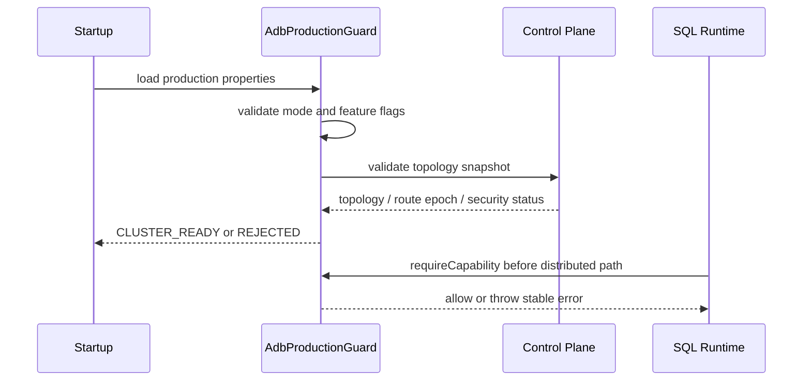
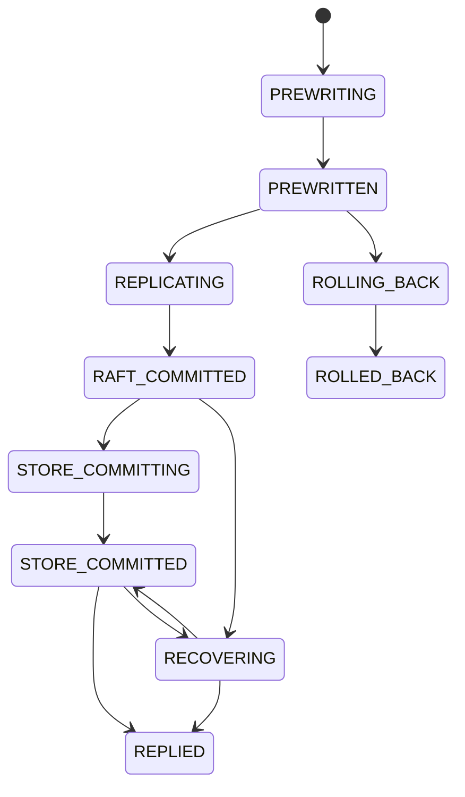
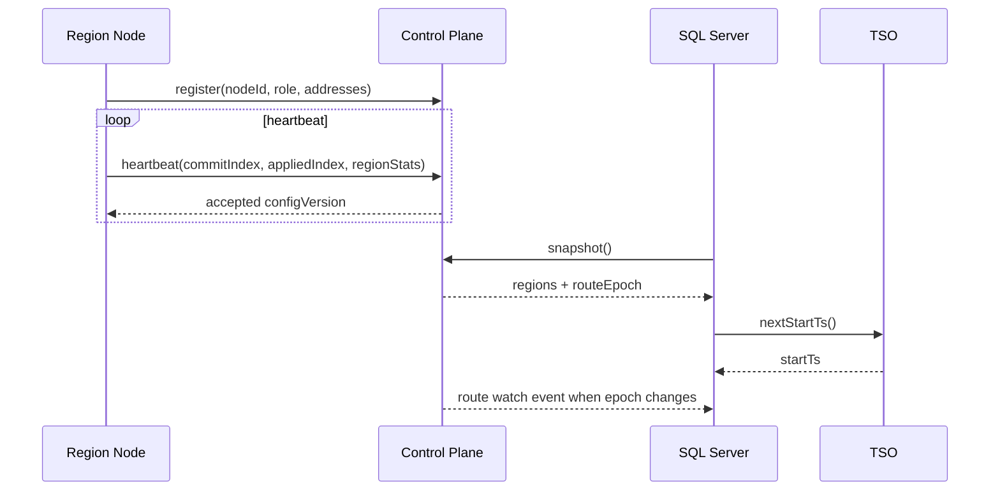
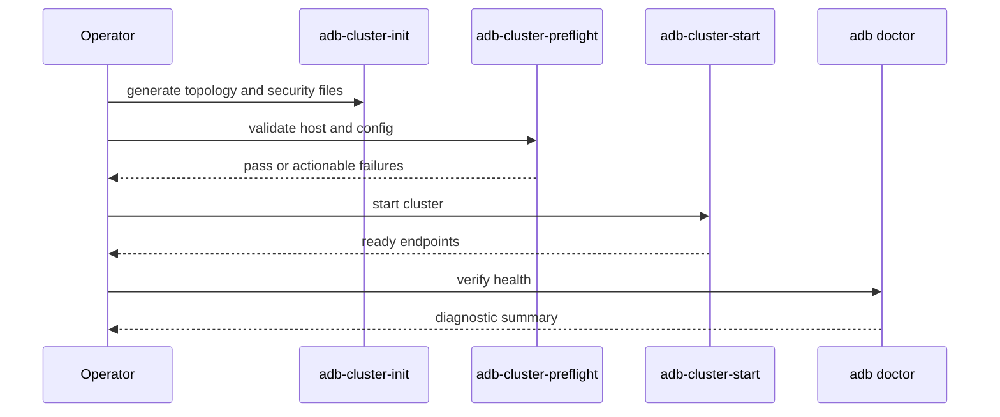

# ADB 生产级 MVP 加固规划

## 背景

`vexra-adb` 已完成 h2db 插件化迁移、远端 region SQL 读写、共享 catalog / TSO 原型、集群编排计划、安全安装模板和端到端压测门禁。当前能力已经能证明 ADB 可以沿着 TiDB-like 架构继续演进，但这些能力仍以原型、模型和 smoke 验证为主，距离可交付给真实生产环境还有明确差距。

本规划不以“完整复刻 TiDB”为目标，而是把项目收敛成一个更快可落地的生产级最小闭环：有限 SQL 能力、有限拓扑、有限事务范围，但必须做到数据安全、故障边界明确、可部署、可恢复、可观测、可发布。

## 目标

- 定义 ADB 第一版生产级 MVP 的功能边界、部署边界和失败边界。
- 拆分能被其他实现模型直接接手的阶段设计，每个阶段包含接口、数据结构、状态、异常、测试和验收标准。
- 优先保证“不会丢数据”和“故障时不产生错误写入”，再逐步提升自动化、性能和兼容性。
- 保留现有单机 ADB/H2 插件模式作为默认回滚路径。
- 把 2 数据节点 + 1 witness 作为第一版 HA 推荐拓扑，shared-storage 继续保留为显式兼容模式而非默认生产形态。

## 非目标

- 不承诺完整 TiDB、MySQL 或 PostgreSQL 兼容。
- 不在第一版实现完整 MPP、复杂 CBO、自动热点调度、自动 split/merge 和跨 region 大事务。
- 不支持纯 2 数据节点在无 witness、无共享存储时进行自动强一致故障切换。
- 不把所有已有原型直接视为生产完成；每个生产阶段都需要独立验收。
- 不在没有发布门禁和恢复演练前声明生产可用。

## 生产 MVP 范围

### 支持范围

| 领域 | 第一版支持 | 明确限制 |
| --- | --- | --- |
| 拓扑 | 2 data node + 1 lightweight witness；单机模式保留 | 不支持纯 2 data 自动切主 |
| SQL 接入 | h2db JDBC / Server / parser，ADB table engine | 不承诺完整 MySQL 兼容 |
| 分片 | 固定 region 或手工 region 配置 | 不做自动 split/merge |
| 写入 | 单 region 强一致写入，跨 region 写入默认拒绝或显式实验开关 | 不默认开启跨 region 2PC |
| 读取 | leader read 或带 read-index 的一致读，第一版禁止不安全 follower read | follower read 后续单独设计 |
| DDL | 建表、删表、基础索引能力；在线 DDL 仅限已验收子集 | 不支持复杂在线 schema 变更 |
| 备份恢复 | 全量备份、全量恢复、恢复校验 | PITR / CDC 后续阶段 |
| 安全 | TLS、token/auth、最小权限服务模板 | 不做复杂多租户 RBAC |
| 运维 | 安装、启动、停止、doctor、状态检查、滚动升级骨架 | 不承诺自动容量调度 |

### 禁止范围

- 当配置为两个 data node 且没有 witness 或 shared-storage fencing 时，必须拒绝启用自动写入 HA。
- 当 region 路由缺失、epoch 过期、leader 不确定或无法确认多数派时，写入必须失败。
- 当事务命中多个 region 且未显式启用已验收的跨 region 协议时，commit 必须失败。
- 当 safe point、lock resolve 或恢复状态不确定时，后台清理不得删除可能仍被快照读访问的数据。

## 现状/已有流程

| 组件 | 已有能力 | 生产缺口 |
| --- | --- | --- |
| `TxnManager` | ADB 本地事务、region write gate、read router、commit coordinator、TSO provider 接入点 | commit 成功语义、宕机恢复和跨 region 限制需要生产级门禁 |
| `AdbControlPlaneClient` / `InMemoryAdbControlPlaneClient` | 控制面快照和内存 TSO 原型 | 需要持久化、高可用、心跳、租约和版本化元数据 |
| `RegionRouter` / `RegionMetadata` | region 元数据和路由模型 | 需要运行时元数据来源、epoch 变更、路由刷新和系统表 |
| `RegionWitnessBinding` / HA 模型 | witness 多数派和 failover 模型 | 需要接入真实部署、故障注入和恢复演练 |
| 远端 region SQL | SQL Server 到 region node 的 smoke 路径 | 需要真实长稳、错误码、超时、重试和可观测性 |
| 安装模板 | systemd / Windows 服务模板、安全默认值规划 | 需要一键生成、预检、证书/权限校验和升级策略 |
| 压测门禁 | 端到端压测报告和 gate 模型 | 需要可运行的集群压测任务和发布流水线接入 |

## 核心约束

- Java 代码保持 JDK 8 兼容。
- 生产默认值必须偏安全：未知状态失败、无多数派失败、无认证失败、无 TLS 的分布式生产配置失败。
- 所有持久化元数据必须带版本号或 epoch，禁止无版本覆盖。
- 所有后台任务必须可幂等重试，必须能暴露最近一次成功、失败和跳过原因。
- 所有新增网络/RPC 调用必须有明确超时、错误分类和调用方可见错误。
- 所有阶段必须保留 `single` 模式回滚能力，不破坏旧 `jdbc:adb:*` 单机行为。
- 文档、源码注释、提交说明默认中文；设计文档必须同步英文副本。

## 总体阶段

| 阶段 | 名称 | 目标 | 主要交付 | 验收门禁 |
| --- | --- | --- | --- | --- |
| ADB-GA-01 | 生产 MVP 范围冻结 | 显式限制能力边界，避免误用未成熟功能 | 配置校验、能力矩阵、错误码、文档 | 不支持场景全部可被拒绝并有测试 |
| ADB-GA-02 | 数据安全闭环 | 证明 commit、落盘、恢复和 leader 切换不会丢数据 | commit 语义、恢复校验、宕机测试 | kill/restart/leader transfer 后数据一致 |
| ADB-GA-03 | 轻量控制面 | 用持久化控制面替代静态 shared catalog 原型 | 节点心跳、region 元数据、TSO、租约、系统表 | SQL 层可动态刷新路由和 TSO |
| ADB-GA-04 | 事务最小生产化 | 固化单 region 事务，限制或实验化跨 region | 单 region SI、lock resolve、GC safe point、跨 region guard | 事务冲突、超时、恢复测试通过 |
| ADB-GA-05 | 安装与运维产品化 | 让 2 data + 1 witness 可被可靠部署和升级 | 安装器、doctor、备份恢复、滚动升级脚本 | 新环境可按手册完成部署、恢复和升级 |
| ADB-GA-06 | 可观测性与诊断 | 生产问题能定位、告警和审计 | metrics、slow SQL、system tables、diagnostic bundle | 故障场景能输出定位证据 |
| ADB-GA-07 | 发布门禁与试生产 | 把长稳、故障注入和恢复演练纳入 release | release checklist、压测流水线、试生产准入 | 满足全部 GA gate 后才能发布 |

## ADB-GA-01：生产 MVP 范围冻结

### 目标

- 把第一版生产支持范围写入配置、文档和运行时校验。
- 所有未完成能力必须显式拒绝，而不是隐式走不安全路径。
- 为后续阶段提供统一能力探测 API 和错误码。

### 接口设计

| 接口/类 | 位置建议 | 职责 |
| --- | --- | --- |
| `AdbProductionMode` | `net.xdob.vexra.adb.db` | 枚举 `SINGLE`、`MVP_CLUSTER`、`EXPERIMENTAL` |
| `AdbProductionCapability` | `net.xdob.vexra.adb.db` | 枚举 SQL、事务、HA、DDL、备份等能力 |
| `AdbProductionGuard` | `net.xdob.vexra.adb.db` | 根据配置、拓扑和请求上下文拒绝不支持路径 |
| `AdbUnsupportedProductionFeatureException` | `net.xdob.vexra.adb.db` | 对外暴露稳定 SQLState / error code |
| `adb.production.mode` | 配置 | 默认 `single`，生产集群显式设置 `mvp-cluster` |
| `adb.production.allowExperimental` | 配置 | 默认 `false`，只允许测试环境开启实验能力 |

建议方法签名：

```java
public final class AdbProductionGuard {
  public void requireCapability(AdbProductionCapability capability,
      AdbRequestContext context) throws SQLException;

  public void validateClusterTopology(AdbClusterTopology topology)
      throws SQLException;

  public void validateTransactionRegions(Collection<Long> regionIds,
      AdbRequestContext context) throws SQLException;
}
```

### 数据结构

| 字段 | 含义 | 约束 |
| --- | --- | --- |
| `mode` | 当前运行模式 | `single` 默认保守；`mvp-cluster` 需要安全配置通过 |
| `topologyKind` | `single` / `2data1witness` / `shared-storage` | 纯 2 data 自动写入非法 |
| `enabledCapabilities` | 已启用能力集合 | 由 mode + feature flags 推导，不允许任意打开 |
| `experimentalCapabilities` | 实验能力集合 | 只有 `allowExperimental=true` 时可用 |
| `reason` | 拒绝原因 | 必须进入日志、system table 和异常消息 |

### 状态机

| 状态 | 含义 | 允许写入 |
| --- | --- | --- |
| `UNVERIFIED` | 配置尚未完成校验 | 否 |
| `SINGLE_READY` | 单机能力可用 | 是，单机范围 |
| `CLUSTER_READY` | 2 data + witness、安全配置、路由均可用 | 是，MVP 范围 |
| `DEGRADED_READONLY` | 缺少多数派或控制面不确定 | 否，可选只读 |
| `REJECTED` | 配置非法 | 否 |

非法转换：`REJECTED` 不得自动转为 `CLUSTER_READY`；必须修改配置并重启或显式 reload。

### 时序流程



### 异常处理

| 场景 | 行为 |
| --- | --- |
| 纯 2 data 自动 HA | 启动失败，提示必须配置 witness 或 shared-storage fencing |
| 跨 region 写入 | 默认 commit 失败，提示需要实验开关或后续 GA 阶段 |
| 缺少 TLS/auth | `mvp-cluster` 启动失败 |
| 未知 capability | 拒绝并记录 P0 级日志 |

### 幂等性

配置校验只读取配置和控制面快照，不修改业务数据。重复校验结果必须稳定；reload 时按新 `routeEpoch` 和 `configVersion` 生成新状态。

### 回滚策略

- 将 `adb.production.mode` 改回 `single`。
- 删除 `mvp-cluster` feature flags。
- 保留旧数据目录不变；不做磁盘格式变更。

### 测试方案

- 单元测试：能力矩阵、非法拓扑、实验能力开关。
- 集成测试：SQL 建表、commit、远端读写在未启用能力时被拒绝。
- 兼容测试：旧 `jdbc:adb:*` 单机 URL 不受影响。
- 文档测试：quickstart 中的生产模式配置能被 parser 读取。

### 当前实现状态

`ADB-GA-01` 已完成第一轮运行时边界实现：

- `AdbProductionMode` 定义 `single`、`mvp-cluster` 和 `experimental` 三种生产运行模式。
- `AdbProductionTopologyKind` 定义 `single`、`2data1witness`、`shared-storage` 和 `pure-2data` 拓扑分类。
- `AdbProductionCapability` 将本地 SQL、分布式 SQL、单 region 事务、备份恢复、滚动升级与跨 region 事务、follower read、自动 split/merge 等实验能力分开。
- `AdbProductionGuard` 根据生产模式、拓扑、安全开关和实验开关执行统一拒绝；默认单机 guard 保持旧 `jdbc:adb:*` 本地行为。
- `AdbUnsupportedProductionFeatureException` 提供稳定 SQLState `ADB01` 和错误码 `7101`，便于后续 SQL/事务入口统一映射。
- `AdbProductionGuardTest` 覆盖单机兼容、2 data + witness 生产放行、缺安全默认值拒绝、纯 2 data 拒绝、跨 region 默认拒绝和实验 opt-in。

本阶段尚未把 guard 接入所有 SQL/事务真实入口；后续阶段在改动对应路径时必须先调用该 guard，不能绕过生产范围冻结。

## ADB-GA-02：数据安全闭环

### 目标

- 明确 SQL commit 成功返回前必须满足的持久化和复制条件。
- 覆盖宕机、重启、leader 切换、重复提交和恢复场景。
- 建立“数据不丢、不重复应用、不越权写入”的可验证证据。

### Commit 语义

生产模式下，SQL commit 返回成功必须满足：

1. 事务已经分配单调递增 `commitTs`。
2. write set 已通过 region 路由和 epoch 校验。
3. 对每个命中的 region，写入已经通过 leader fencing 和多数派提交。
4. 本地或远端 store 已持久化 durable intent / committed version。
5. commit result 已进入幂等记录，客户端重试不会重复应用。

第一版若只允许单 region 事务，则第 3 步只允许一个 region；多个 region 直接失败。

### 接口设计

| 接口/类 | 职责 |
| --- | --- |
| `AdbDurableCommitMarker` | 记录 txnId、startTs、commitTs、regionId、commitState |
| `AdbCommitRecoveryScanner` | 启动时扫描 in-doubt transaction 并恢复 |
| `AdbCommitIdempotencyStore` | 基于 txnId/client request id 去重 |
| `AdbCrashInjectionHook` | 测试专用，在 prewrite、raft commit、store commit、reply 前注入失败 |
| `AdbDataSafetyVerifier` | 验证提交记录、可见版本、lock record、region commit index 一致 |

### 数据结构

| 字段 | 含义 |
| --- | --- |
| `txnId` | ADB 内部事务 ID |
| `clientRequestId` | 客户端幂等键，可为空但生产建议必填 |
| `startTs` | 事务开始时间戳 |
| `commitTs` | 提交时间戳 |
| `regionIds` | 命中的 region 集合，MVP 只允许一个 |
| `state` | `PREWRITTEN` / `RAFT_COMMITTED` / `STORE_COMMITTED` / `REPLIED` / `ROLLED_BACK` |
| `lastError` | 最近一次恢复错误 |

### 状态机



非法转换：

- `RAFT_COMMITTED` 不得回滚业务数据，只能 roll-forward。
- `STORE_COMMITTED` 重试不得再次产生新版本。
- `REPLIED` 不得回到任何未完成状态。

### 异常处理

| 注入点 | 恢复行为 |
| --- | --- |
| prewrite 前宕机 | 无 durable intent，事务可安全丢弃 |
| prewrite 后、raft commit 前宕机 | 根据 lock TTL 和 primary 状态 rollback |
| raft commit 后、store commit 前宕机 | 启动恢复必须 roll-forward |
| store commit 后、reply 前宕机 | 客户端重试返回已提交 |
| leader 切换期间重复提交 | 幂等 store 返回同一 commitTs |

### 测试方案

- JUnit crash-injection：每个注入点 kill/reopen store 后校验。
- 进程级 smoke：启动 2 data + witness，提交中 kill leader，再由剩余 data + witness 接管。
- 数据校验：按 txnId 校验 committed version、lock record、commit marker。
- 并发测试：重复 client request id、重复 commit、rollback/commit 竞争。
- 回归命令建议：`.\gradlew.bat :vexra-adb:test --tests *DataSafety*`。

### 当前实现状态

`ADB-GA-02` 已完成第二轮 durable commit 记录链路：

- `AdbDurableCommitState` 定义 `PREWRITTEN`、`RAFT_COMMITTED`、`STORE_COMMITTED`、`REPLIED` 和 `ROLLED_BACK`。
- `AdbDurableCommitMarker` 记录 txnId、clientRequestId、startTs、commitTs、regionId、状态和最近错误，并限制状态只能按数据安全顺序推进。
- `AdbCommitRecoveryScanner` 将 marker 映射为 `ROLLBACK`、`ROLL_FORWARD`、`RETURN_COMMITTED` 或 `DISCARD` 恢复动作。
- `AdbCommitIdempotencyStore` 提供内存幂等记录模型，证明同一客户端幂等键重复提交不会生成新的 commitTs，并支持同一事务按 region 分别记录恢复状态。
- `AdbDurableCommitRecorder` 定义真实提交路径上的状态记录接口；默认 no-op 保持旧单机路径兼容，`AdbInMemoryDurableCommitRecorder` 用于测试和后续持久化实现的语义样板。
- `AdbRegionCommitCoordinator` 已在单 region commit、2PC prewrite、primary/secondary commit、rollback 路径上推进 marker 状态，能区分 `REPLIED`、`PREWRITTEN` 和 `ROLLED_BACK` 等恢复证据。
- `AdbDurableCommitRecoveryTest` 覆盖 marker 状态推进、RAFT_COMMITTED 后禁止回滚、prewrite 后可回滚、恢复决策映射和幂等键冲突。
- `AdbRegionCommitCoordinatorTest` 覆盖真实 coordinator 路径上的单 region 成功 marker、prewrite 失败回滚 marker、primary 已提交后 secondary 待恢复 marker。

本阶段尚未把 marker 持久化到真实 LDB/Rocks，也尚未完成进程重启后的自动扫描和恢复执行。下一轮需要实现持久化 marker store、reopen 恢复、crash-injection 和 kill/restart 验收。

## ADB-GA-03：轻量控制面

### 目标

- 用持久化、高可用的控制面替代静态 shared catalog 文件。
- 控制面负责节点注册、心跳、region 元数据、TSO、租约、路由版本和系统表。
- 第一版控制面可以轻量，但必须是 SQL 层和 region 层共享的事实来源。

### 接口设计

| 接口/类 | 职责 |
| --- | --- |
| `AdbControlPlaneServer` | 控制面服务入口 |
| `AdbControlPlaneStore` | 持久化 nodes、regions、leases、tso |
| `AdbNodeHeartbeatService` | 节点心跳和状态机 |
| `AdbRegionCatalogService` | region 元数据 CRUD、epoch 推进 |
| `AdbTsoService` | 分配全局单调时间戳 |
| `AdbRouteWatch` | SQL Server 订阅 routeEpoch 变化 |
| `AdbSystemTableProvider` | 暴露 nodes、regions、leases、tso、capabilities |

建议核心方法：

```java
public interface AdbControlPlaneClient {
  AdbControlPlaneSnapshot snapshot() throws SQLException;
  long nextStartTs() throws SQLException;
  long nextCommitTs(long startTs) throws SQLException;
  void heartbeat(AdbNodeHeartbeat heartbeat) throws SQLException;
  AdbRouteWatch watchRoutes(long lastSeenEpoch);
}
```

### 数据结构

| 表/记录 | 主键 | 字段 |
| --- | --- | --- |
| `adb_cp_node` | `nodeId` | role、host、ports、status、lastHeartbeat、failureDomain |
| `adb_cp_region` | `regionId` | startKey、endKey、epoch、leaderId、replicas、state |
| `adb_cp_tso` | `scope` | physical、logical、lastIssuedTs、leaseOwner |
| `adb_cp_lease` | `leaseName` | owner、epoch、expireAt、fencingToken |
| `adb_cp_config` | `configKey` | value、version、updatedAt |

### 状态机

| 节点状态 | 触发 | 行为 |
| --- | --- | --- |
| `JOINING` | 首次注册 | 不参与写入 |
| `UP` | 心跳正常 | 可参与路由和多数派 |
| `SUSPECT` | 心跳超时一次或少量失败 | 暂停新 leader 分配 |
| `DOWN` | 超过故障阈值 | 从可用副本集合移除 |
| `RECOVERING` | 节点重启并同步中 | 只允许追赶，不承接 leader |
| `DECOMMISSIONED` | 显式下线 | 不再自动加入 |

### 时序流程



### 异常处理

- 控制面不可达：已有 SQL session 可继续读已缓存路由，但写入必须根据 route TTL 和 lease 规则决定；超过 TTL 后拒绝写入。
- TSO lease 过期：停止分配时间戳，等待新 owner 接管。
- region epoch 冲突：新写入失败并要求刷新路由。
- 节点心跳抖动：先进入 `SUSPECT`，避免频繁迁移。

### 回滚策略

- `adb.controlPlane.mode=static-catalog` 回退到现有 shared catalog 原型。
- 控制面元数据以独立命名空间保存，不改变 ADB 表数据格式。
- SQL Server 保留启动时读取静态 catalog 的兼容路径。

### 测试方案

- 控制面 store reopen 后 TSO 不回退。
- routeEpoch 更新后 SQL 层自动刷新。
- 心跳超时导致 node 从 `UP` 到 `SUSPECT` / `DOWN`。
- 控制面不可达时写入按 TTL 拒绝。
- system table 输出 nodes、regions、tso 和 leases。

## ADB-GA-04：事务最小生产化

### 目标

- 第一版只把单 region Snapshot Isolation 作为生产主路径。
- 跨 region 事务默认拒绝；实验模式下才允许 2PC，并必须有单独验收。
- lock resolve、safe point 和 GC 行为必须保守，不破坏长事务和备份。

### 接口设计

| 接口/类 | 职责 |
| --- | --- |
| `AdbTxnRegionClassifier` | 根据 write set/read set 判断事务命中 region |
| `AdbSingleRegionTxnCoordinator` | 单 region prewrite/commit/rollback |
| `AdbCrossRegionTxnGuard` | 默认拒绝跨 region commit |
| `AdbLockResolveWorker` | 周期处理过期 lock |
| `AdbGlobalSafePointAdvancer` | 推进 safe point，保护活跃事务 |
| `AdbBackupSafePointRegistry` | 备份期间阻止 GC 删除历史版本 |

### 数据结构

| 字段 | 含义 | 约束 |
| --- | --- | --- |
| `primaryRegionId` | primary key 所在 region | 单 region 模式下所有写入必须一致 |
| `participantRegionIds` | 事务参与 region | MVP 生产模式大小必须为 1 |
| `lockTtlMillis` | lock TTL | 超时后由 resolver 判断 primary 状态 |
| `safePoint` | 可 GC 的最大历史时间戳 | 不得超过活跃事务和备份保护点 |
| `backupSafePoint` | 备份保护时间戳 | 存在时 GC 不得越过 |

### 异常处理

| 场景 | 行为 |
| --- | --- |
| 单 region 写冲突 | 返回稳定 SQLState，调用方可重试 |
| 跨 region commit | 默认拒绝，错误消息包含 region 列表 |
| primary 已提交 secondary 残留 | resolver roll-forward |
| primary 未提交且 lock 过期 | resolver rollback |
| 长事务阻塞 GC | safe point 停止推进并暴露阻塞事务 |

### 测试方案

- 单 region SI：读写冲突、快照读、提交可见性。
- 跨 region guard：多 region write set 必须失败。
- resolver：rollback、roll-forward、重复 resolve 幂等。
- GC：保留每个 logical key 最新 committed version，保护长事务和备份。
- 故障组合：partial commit + restart + resolve + GC。

## ADB-GA-05：安装与运维产品化

### 目标

- 让用户可以可靠部署 2 data + 1 witness，而不是复制多个命令手工拼装。
- 所有生产安装默认启用安全配置，并在启动前完成预检。
- 提供备份、恢复、滚动升级和节点替换的最小 runbook。

### 命令设计

| 命令 | 职责 |
| --- | --- |
| `adb-cluster-init` | 生成 2 data + 1 witness 配置、证书目录、服务模板 |
| `adb-cluster-preflight` | 检查端口、目录、权限、TLS/auth、磁盘空间、时钟偏移 |
| `adb-cluster-start` | 按拓扑启动服务并等待 ready |
| `adb-cluster-stop` | 有序停止 SQL、region、witness |
| `adb-cluster-status` | 输出节点、region、leader、quorum、版本 |
| `adb-backup` | 创建全量备份和 checksum |
| `adb-restore` | 从全量备份恢复并校验 |
| `adb-upgrade-plan` | 生成滚动升级顺序和回滚步骤 |

### 配置结构

| 配置 | 示例 | 说明 |
| --- | --- | --- |
| `adb.install.topology` | `2data1witness` | 生产推荐拓扑 |
| `adb.install.failureDomain.node-a` | `rack-a` | 故障域 |
| `adb.security.tls.enabled` | `true` | 分布式生产必须为 true |
| `adb.security.auth.enabled` | `true` | 分布式生产必须为 true |
| `adb.backup.dir` | `D:/adb/backup` | 备份目录 |
| `adb.upgrade.maxUnavailable` | `1` | 滚动升级约束 |

### 运维流程



### 回滚策略

- 安装器只生成文件，不覆盖已有配置，除非传入 `--force`。
- 滚动升级一次只升级一个 data node 或 witness。
- 升级失败时先禁止继续升级，再按 `adb-upgrade-plan` 回滚当前节点。
- 恢复流程必须先在隔离目录恢复并 checksum，再允许替换生产目录。

### 测试方案

- 临时目录安装 smoke：生成配置、预检、启动脚本存在。
- 安全默认值测试：缺少 TLS/auth 时 preflight 失败。
- 备份恢复测试：写入样本数据、备份、恢复、checksum 一致。
- 滚动升级计划测试：任一 data node 升级时仍满足 data+witness 多数派。

## ADB-GA-06：可观测性与诊断

### 目标

- 生产故障必须能从指标、日志、system table 和 diagnostic bundle 定位。
- 所有关键后台任务暴露最近一次状态。
- SQL 用户能看到慢 SQL、region 路由和分布式执行摘要。

### 指标设计

| 指标 | 类型 | 标签 | 说明 |
| --- | --- | --- | --- |
| `adb_sql_request_latency_ms` | timer | sqlType、table | SQL 请求耗时 |
| `adb_sql_slow_total` | counter | table、reason | 慢 SQL 数 |
| `adb_region_commit_latency_ms` | timer | regionId、leaderId | region commit 耗时 |
| `adb_region_route_miss_total` | counter | table | 路由失败 |
| `adb_raft_commit_lag` | gauge | regionId、replicaId | 副本提交落后 |
| `adb_lock_resolve_total` | counter | action | lock resolve 次数 |
| `adb_gc_safe_point` | gauge | scope | 当前 safe point |
| `adb_control_plane_heartbeat_lag_ms` | gauge | nodeId | 心跳延迟 |

### System Table

| 表 | 字段 |
| --- | --- |
| `ADB_NODES` | nodeId、role、status、lastHeartbeat、failureDomain |
| `ADB_REGIONS` | regionId、range、epoch、leaderId、replicas、state |
| `ADB_TRANSACTIONS` | txnId、startTs、state、regionIds、ageMillis |
| `ADB_LOCKS` | key、primaryKey、startTs、ttl、regionId |
| `ADB_GC` | safePoint、owner、leaseExpireAt、lastRunStatus |
| `ADB_CAPABILITIES` | capability、enabled、mode、reason |

### Diagnostic Bundle

`adb doctor --bundle` 应输出：

- 集群配置脱敏副本。
- 节点状态、region 路由、leader、quorum。
- 最近慢 SQL 和失败 SQL 摘要。
- 最近 lock resolve、GC、backup、restore、upgrade 结果。
- 关键日志尾部。
- 版本、依赖版本、h2db 和 ldb 版本。

### 测试方案

- metrics 注册和标签测试。
- system table 查询 smoke。
- 人为制造 route miss、lock resolve、GC skip，验证诊断信息。
- bundle 脱敏测试，禁止输出 token、私钥和密码。

## ADB-GA-07：发布门禁与试生产

### 目标

- 建立“满足这些门禁才允许发布”的硬标准。
- 用自动化和人工 runbook 结合，完成试生产准入。

### Release Gate

| 门禁 | 最低要求 |
| --- | --- |
| 单元测试 | `:vexra-adb:test` 通过 |
| 兼容测试 | 旧 `jdbc:adb:*` 单机路径通过 |
| 集群 smoke | 2 data + 1 witness 启动、写入、查询、停止通过 |
| 数据安全 | commit crash-injection 全部通过 |
| 故障恢复 | kill leader、kill follower、kill witness、重启全集群通过 |
| 备份恢复 | 全量备份恢复 checksum 一致 |
| 滚动升级 | 逐节点升级和回滚演练通过 |
| 长稳压测 | 至少 6 小时内部门禁；试生产前提升到 24 小时 |
| 安全扫描 | TLS/auth/最小权限配置检查通过 |
| 文档 | quickstart、user guide、runbook、已知限制同步 |

### 试生产准入

| 项 | 要求 |
| --- | --- |
| 数据规模 | 先限制为小规模、非核心业务 |
| 回滚预案 | 有可执行备份恢复和流量切回方案 |
| 告警 | 关键指标接入告警 |
| 值守 | 首批试生产需要人工值守窗口 |
| 已知限制 | 用户明确接受不支持跨 region 大事务、复杂在线 DDL 等限制 |

### 测试方案

- CI 增加 release profile。
- 长稳压测输出结构化报告，复用 `AdbEndToEndClusterStressGate`。
- 故障注入测试必须保存日志、指标和恢复结果。
- 每次发布生成 release evidence 目录，包含命令、版本、报告和 checksum。

## 实施顺序建议

1. 先做 `ADB-GA-01`，因为它会防止后续未成熟能力被误当成生产能力。
2. 紧接做 `ADB-GA-02`，没有数据安全闭环就不应继续扩大生产范围。
3. 再做 `ADB-GA-03`，把 shared catalog 原型升级为运行时事实来源。
4. `ADB-GA-04` 和 `ADB-GA-05` 可部分并行，但事务限制必须先于安装器对外暴露。
5. `ADB-GA-06` 应随每个阶段同步补指标，最后集中补 doctor 和 bundle。
6. `ADB-GA-07` 只在前六阶段均有可运行证据后关闭。

## 风险点

| 风险 | 等级 | 说明 | 缓解 |
| --- | --- | --- | --- |
| 误把原型能力当生产能力 | P0 | shared catalog、静态 TSO、smoke executor 可能被误用 | `ADB-GA-01` 运行时 guard |
| commit 语义不清 | P0 | 成功返回前若未复制或未落盘会丢数据 | `ADB-GA-02` crash-injection |
| 控制面单点 | P0 | 路由和 TSO 不可用会影响全局读写 | 控制面持久化、租约和回退策略 |
| 跨 region 事务过早开放 | P0 | 2PC/lock resolve/GC 任一缺陷会破坏一致性 | 默认拒绝，实验开关隔离 |
| 运维脚本误覆盖配置 | P1 | 可能破坏生产节点 | 默认不覆盖，`--force` 显式确认 |
| 指标不足 | P1 | 故障无法定位 | 每阶段都要求 metrics/system table |

## 开放问题

- 控制面第一版是否复用现有 Vexra Raft group，还是作为独立轻量进程运行。
- TSO 是否需要物理时钟参与，还是先使用纯逻辑时间戳。
- 第一版是否允许只读 follower read；建议默认禁止，后续单独设计。
- 备份恢复第一版是否必须支持在线备份；建议先支持全量一致性备份。
- `vexra-ldb` 是否需要新增更明确的 fsync、checkpoint 和恢复证明接口。

## 完成定义

本规划视为完成时，需要满足：

- 中文与英文规划文档均存在并保持同样阶段结构。
- 每个阶段均包含目标、接口/数据结构、异常、回滚和测试方案。
- 规划明确第一版生产 MVP 的支持范围和禁止范围。
- 规划明确 2 data + 1 witness 是推荐 HA 拓扑，纯 2 data 自动写入被禁止。
- 规划能够直接派生后续实现 issue、代码阶段和测试门禁。
