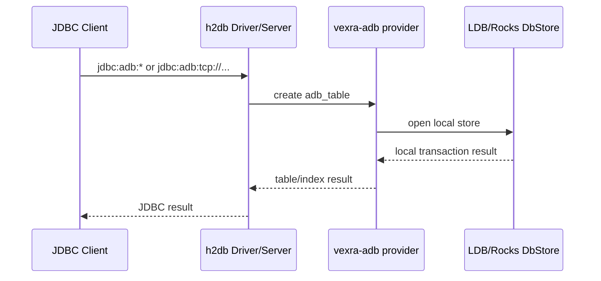
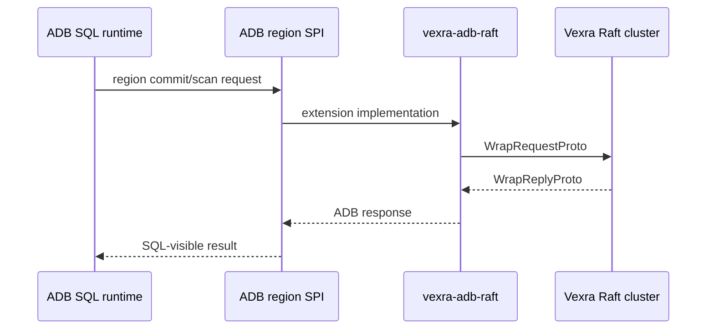

# ADB Standalone Split Design

## Background

`vexra-adb` currently owns both local database capabilities and Raft-backed cluster database capabilities. Before ADB can become an independent project, the core ADB artifact needs to be decoupled from the Vexra Raft runtime.

Today, `vexra-adb` exposes Raft dependencies through `api project(':vexra-client')`, `api project(':vexra-server')`, and `api project(':vexra-grpc')`. Classes such as `AdbSMPlugin`, `AdbStateMachine`, `net.xdob.vexra.adb.ha2.*`, remote SQL runtimes, and region-node scripts also bind core ADB and Vexra Raft into one artifact.

## Goals

- Keep the `vexra-adb` module name and local database capabilities.
- Add `vexra-adb-raft` for the Raft cluster database extension.
- Remove direct `vexra-client`, `vexra-server`, and `vexra-grpc` dependencies from `vexra-adb`.
- Keep embedded mode and single-node TCP mode in `vexra-adb`.
- Expose cluster capabilities through `vexra-adb-raft`.

## Non-Goals

- Do not change ADB data files, key encoding, MVCC, transaction records, or LDB/Rocks storage formats.
- Do not change the `jdbc:adb:*` compatibility URL prefix.
- Do not design new SQL syntax or JDBC protocol behavior.
- Do not modify `vexra-ldb`.
- Do not implement a non-Raft cluster protocol in this phase.

## Current Flows

| Area | Current location | Issue |
| --- | --- | --- |
| Embedded mode | H2 provider, `DbStoreEngine`, LDB/Rocks store in `vexra-adb` | Should stay in core |
| Single-node TCP | `AdbSqlServerMain` using `org.h2.tools.Server` | Should stay in core |
| Raft state machine | `AdbSMPlugin`, `AdbStateMachine` | Directly depends on Raft server/state machine APIs |
| Raft client/store | `net.xdob.vexra.adb.ha2.RaftRClient`, `RaftStore` | Directly depends on Raft client/protocol APIs |
| Region node | `AdbRegionNodeMain`, `AdbRegionNodeConfig` | Directly starts GRPC/RaftServer |
| Distributed transaction abstractions | `AdbRegionCommit*`, `AdbRegionScan*`, `AdbRegionReadRouter`, `AdbRegionWriteGate` | Most can remain as core SPI |

## Core Constraints

- `vexra-adb` must no longer transitively expose `vexra-client`, `vexra-server`, or `vexra-grpc`.
- `vexra-adb` must keep `jdbc:adb:mem:`, `jdbc:adb:ldb:`, and `jdbc:adb:tcp://...` working.
- `vexra-adb-raft` may depend on `vexra-adb`, but `vexra-adb` must not depend on `vexra-adb-raft`.
- Core SPI types may describe requests, responses, routing, commit phases, and local fallback, but must not import Raft types.
- Moved entry points must keep a clear rollback path.

## Interface Design

### Module Topology

| Module | Responsibility | Main dependencies |
| --- | --- | --- |
| `vexra-adb` | ADB core, H2 provider, JDBC URL prefix, LDB/Rocks, local transactions, single-node TCP | `vexra-proto`, `vexra-common`, `h2db`, `vexra-ldb` |
| `vexra-adb-raft` | ADB Raft state machine, Raft client/store, region node, cluster runtime distribution | `vexra-adb`, `vexra-client`, `vexra-server`, `vexra-grpc` |

### Core SPI Rule

`vexra-adb` may keep interfaces and data structures that do not directly depend on Raft, for example:

- `AdbRegionCommitClient`
- `AdbRegionCommitTransport`
- `AdbRegionCommitRequest`
- `AdbRegionCommitResponse`
- `AdbRegionScanClient`
- `AdbRegionReadRouter`
- `AdbRegionWriteGate`

These types are the socket: they describe ADB transaction, read/write routing, and region request semantics. `vexra-adb-raft` is the Raft plug: it implements these interfaces using the Vexra Raft client/server runtime.

### Raft Extension Move List

| Source | Target | Reason |
| --- | --- | --- |
| `net.xdob.vexra.adb.AdbSMPlugin` | `vexra-adb-raft` | Implements Vexra `SMPlugin` |
| `net.xdob.vexra.adb.AdbStateMachine` | `vexra-adb-raft` | Extends the Vexra state machine |
| `net.xdob.vexra.adb.ha2.RaftRClient` | `vexra-adb-raft` | Uses Vexra `RaftClient` |
| `net.xdob.vexra.adb.ha2.RaftStore` | `vexra-adb-raft` | Sends ADB proto through Raft |
| `net.xdob.vexra.adb.ha2.AdbRegionNodeMain` | `vexra-adb-raft` | Starts `RaftServer` |
| `net.xdob.vexra.adb.ha2.AdbRegionNodeConfig` | `vexra-adb-raft` | Parses Raft group/peer configuration |
| `net.xdob.vexra.adb.ha2.AdbRaft*` | `vexra-adb-raft` | Raft commit/scan/lock-status clients |

## Data Structures

This phase does not change data structures or persistence formats. `vexra-adb` keeps the current `DbStore`, `DbStoreType.LDB`, `DbStoreType.ROCKSDB`, MVCC keys, transaction markers, and region request/response objects.

`DbStoreType.HA2` must not instantiate `RaftStore` in the core module. Phase 1 keeps the enum value for compatibility and makes `DbStoreEngine` fail explicitly when HA2 is requested from core.

## State Machine

Core `vexra-adb` no longer contains the Vexra Raft state machine. `vexra-adb-raft` keeps:

- `AdbStateMachine`
- `AdbSMPlugin`
- Raft apply/query adapters for `DbStore`

This phase does not change state transitions or Raft commit semantics.

## Sequence Flows

### Embedded / Single-Node TCP

### Raft Cluster Extension

## Error Handling

- Core ADB returns a clear unsupported error for `DbStoreType.HA2`, telling callers to use `vexra-adb-raft`.
- Core ADB returns a clear unsupported error for explicit `raft` distributed SQL parameters when no extension implementation is available.
- `vexra-adb-raft` keeps the existing Raft client error mapping.

## Idempotency

This phase does not change the commit protocol. `AdbRegionCommitRequest`, `AdbDurableCommitRecorder`, and transaction marker idempotency semantics remain unchanged.

## Rollback

- Revert the new module and Gradle dependency changes to restore the single-module layout.
- No data conversion is required because storage formats are unchanged.
- If `vexra-adb-raft` compilation or tests fail, the documentation can remain while implementation changes are narrowed to preparatory core dependency cleanup.

## Compatibility

- Embedded mode: `jdbc:adb:mem:` and `jdbc:adb:ldb:` remain compatible.
- Single-node TCP: `adb-sql-server` and `jdbc:adb:tcp://...` remain compatible.
- Raft cluster entry points: `adb-region-node`, Raft smoke tests, and cluster runtime move from `vexra-adb` to `vexra-adb-raft`.
- Maven/Gradle consumers must explicitly depend on `vexra-adb-raft` for cluster capabilities.

## Rollout

| Phase | Work | Acceptance |
| --- | --- | --- |
| 1 | Add design docs and `vexra-adb-raft` | Chinese/English docs exist, Gradle recognizes the module |
| 2 | Move explicit Raft classes and tests | `:vexra-adb-raft:compileJava` passes |
| 3 | Remove Raft dependencies from core | `:vexra-adb:compileJava` no longer depends on client/server/grpc |
| 4 | Split runtime scripts | Core package keeps single-node scripts, Raft package keeps region/cluster scripts |
| 5 | Regression tests | Core local tests and Raft extension tests pass |

## Test Plan

- `:vexra-adb:compileJava`
- `:vexra-adb:test --tests net.xdob.vexra.adb.h2plugin.*`
- `:vexra-adb:test --tests net.xdob.vexra.adb.AdbSqlServerMainTest`
- `:vexra-adb-raft:compileJava`
- `:vexra-adb-raft:test --tests net.xdob.vexra.adb.ha2.*`

## Risks

| Risk | Level | Mitigation |
| --- | --- | --- |
| `AdbTableProvider` currently constructs Raft runtime directly | P1 | Introduce an extension factory or reject raft params in core |
| Test package moves can miss files | P1 | Move by import/package scans |
| Runtime distribution boundary can become unclear | P2 | Core keeps SQL/backup/restore/benchmark, Raft keeps region/cluster |
| Existing consumers rely on Raft transitively from `vexra-adb` | P2 | Document explicit `vexra-adb-raft` dependency |

## Implementation Plan

1. Add `vexra-adb-raft` and paired Chinese/English design docs.
2. Move explicit Raft classes into `vexra-adb-raft`, keeping package names unchanged for now.
3. Remove Raft `api` dependencies from `vexra-adb/build.gradle`.
4. Adjust `DbStoreEngine` and `AdbTableProvider` so core no longer imports `ha2`.
5. Move Raft/region-node tests into `vexra-adb-raft`.
6. Verify the core module and Raft extension module separately.
