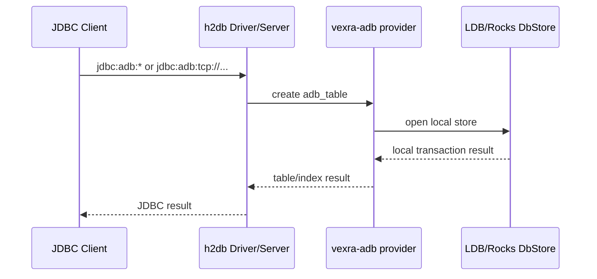
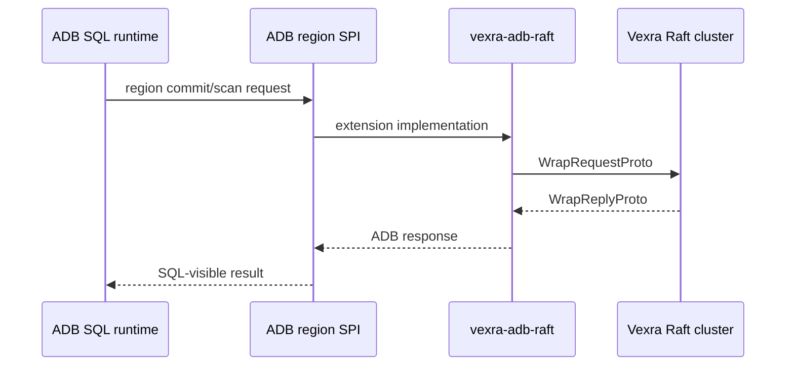

# ADB 独立化前置拆分设计

## 背景

`vexra-adb` 当前同时承担本地数据库能力和 Raft 集群数据库能力。为了未来把 ADB 变成独立项目，需要先把核心 ADB 与 Vexra Raft 运行时解耦。

现状中，`vexra-adb` 通过 `api project(':vexra-client')`、`api project(':vexra-server')` 和 `api project(':vexra-grpc')` 直接暴露 Raft 依赖；源码中 `AdbSMPlugin`、`AdbStateMachine`、`net.xdob.vexra.adb.ha2.*`、远端 SQL runtime 和 region node 启动脚本也把 ADB 核心与 Vexra Raft 绑定在同一个 artifact 内。

## 目标

- 保留 `vexra-adb` 模块名和单机能力。
- 新增 `vexra-adb-raft` 模块承载 Raft 集群数据库扩展。
- 让 `vexra-adb` 不再直接依赖 `vexra-client`、`vexra-server`、`vexra-grpc`。
- `vexra-adb` 继续支持嵌入模式和单机 TCP 模式。
- 集群版能力通过 `vexra-adb-raft` 接入，避免核心 ADB artifact 被 Raft 依赖拖住。
- 将核心 `vexra-adb` 提取为与 `vexra` 并列的独立 Gradle 项目，目录为 `D:\\work\\java2\\vexra-adb`。
- `vexra-adb-raft` 继续保留在 `vexra` 项目中，并通过发布坐标依赖独立的 `vexra-adb`。

## 非目标

- 不修改 ADB 数据文件、键编码、MVCC、事务记录和 LDB/Rocks 存储格式。
- 不改变 `jdbc:adb:*` URL 兼容前缀。
- 不设计新的 SQL 语法或 JDBC 协议。
- 不改造 `vexra-ldb`。
- 不在本阶段实现非 Raft 的新集群协议。
- 不把 `vexra-adb-raft` 提取到独立项目，也不改变其 Raft 集群职责。

## 现状/已有流程

| 领域 | 当前位置 | 问题 |
| --- | --- | --- |
| 嵌入模式 | `vexra-adb` 的 H2 provider、`DbStoreEngine`、LDB/Rocks store | 应保留在核心模块 |
| 单机 TCP | `AdbSqlServerMain` 使用 `org.h2.tools.Server` | 应保留在核心模块 |
| Raft 状态机 | `AdbSMPlugin`、`AdbStateMachine` | 直接依赖 Raft server/state machine API |
| Raft client/store | `net.xdob.vexra.adb.ha2.RaftRClient`、`RaftStore` | 直接依赖 Raft client/protocol API |
| Region node | `AdbRegionNodeMain`、`AdbRegionNodeConfig` | 直接依赖 GRPC/RaftServer 启动 |
| 分布式事务抽象 | `AdbRegionCommit*`、`AdbRegionScan*`、`AdbRegionReadRouter`、`AdbRegionWriteGate` | 多数可作为核心 SPI 保留 |

## 核心约束

- `vexra-adb` 的发布物不能再传递暴露 `vexra-client`、`vexra-server`、`vexra-grpc`。
- `vexra-adb` 不得依赖 `vexra-proto`、`vexra-common` 或其他 Vexra 模块；在并列项目中只允许依赖独立的 `vexra-ldb`。
- `vexra-adb` 必须继续通过 `jdbc:adb:mem:`、`jdbc:adb:ldb:` 和 `jdbc:adb:tcp://...` 工作。
- `vexra-adb-raft` 可以依赖 `vexra-adb`，但 `vexra-adb` 不能反向依赖 `vexra-adb-raft`。
- 核心 SPI 只能表达请求、响应、路由、提交阶段和本地 fallback，不允许 import Raft 类型。
- 任何跨模块的入口类移动都要保留清晰的回滚路径。

## 接口设计

### 模块拓扑

| 模块 | 职责 | 主要依赖 |
| --- | --- | --- |
| `vexra-adb` | ADB 核心、H2 provider、JDBC URL 前缀、LDB/Rocks、本地事务、单机 TCP | `h2db`、`vexra-ldb` 及通用第三方库，不依赖 Vexra |
| `vexra-adb-raft` | ADB Raft 状态机、Raft client/store、region node、集群运行时发行包 | `vexra-adb`、`vexra-client`、`vexra-server`、`vexra-grpc` |

第二阶段采用以下项目拓扑：

| 项目目录 | 内容 | 依赖方式 |
| --- | --- | --- |
| `D:\\work\\java2\\vexra-adb` | 独立 ADB 根项目，原模块源码直接位于 `src/` | 只通过 Maven 坐标依赖 `vexra-ldb`，不 include 或依赖相邻 Vexra 项目 |
| `D:\\work\\java2\\vexra` | Vexra Raft 工程及 `vexra-adb-raft` 模块 | 发布时 `vexra-adb-raft` 通过 `net.xdob.vexra:vexra-adb` 依赖核心；本地构建通过 Gradle `includeFlat` 链接相邻源码项目 |

独立项目继续发布 `net.xdob.vexra:vexra-adb`，因此 Java 包名和调用方依赖坐标不变。仅源码所属的 Gradle 根项目发生变化。

为保持既有 SPI 和源码兼容，ADB 已使用的纯数据模型、路由模型、DDL/事务计划和基础副本描述由 `vexra-adb` 持有，暂时保留现有 `net.xdob.vexra.cluster.*` / `net.xdob.vexra.ha.*` 包名。它们不得依赖 Raft client/server、网络或 Vexra runtime；Vexra 通过依赖 ADB 复用这些类型。协议编解码和 witness/Raft 实现继续留在 `vexra-adb-raft` 或 Vexra 模块中。

### 核心 SPI 保留原则

`vexra-adb` 可以保留不直接依赖 Raft 的接口和数据结构，例如：

- `AdbRegionCommitClient`
- `AdbRegionCommitTransport`
- `AdbRegionCommitRequest`
- `AdbRegionCommitResponse`
- `AdbRegionScanClient`
- `AdbRegionReadRouter`
- `AdbRegionWriteGate`

这些类型是“插座”：它们只描述 ADB 事务、读写路由和 region 请求语义。`vexra-adb-raft` 是“Raft 插头”：它用 Vexra Raft client/server 实现这些接口。

### Raft 扩展迁移清单

第一阶段迁移以下显式 Raft 类：

| 原位置 | 目标位置 | 原因 |
| --- | --- | --- |
| `net.xdob.vexra.adb.AdbSMPlugin` | `vexra-adb-raft` | 实现 Vexra `SMPlugin` |
| `net.xdob.vexra.adb.AdbStateMachine` | `vexra-adb-raft` | 继承 Vexra state machine |
| `net.xdob.vexra.adb.ha2.RaftRClient` | `vexra-adb-raft` | 使用 Vexra `RaftClient` |
| `net.xdob.vexra.adb.ha2.RaftStore` | `vexra-adb-raft` | 通过 Raft 发送 ADB proto |
| `net.xdob.vexra.adb.ha2.AdbRegionNodeMain` | `vexra-adb-raft` | 启动 `RaftServer` |
| `net.xdob.vexra.adb.ha2.AdbRegionNodeConfig` | `vexra-adb-raft` | 解析 Raft group/peer 配置 |
| `net.xdob.vexra.adb.ha2.AdbRaft*` | `vexra-adb-raft` | Raft commit/scan/lock status client |

## 数据结构

本阶段不改数据结构和持久化格式。`vexra-adb` 保留现有 `DbStore`、`DbStoreType.LDB`、`DbStoreType.ROCKSDB`、MVCC key、事务 marker 和 region 请求/响应对象。

`DbStoreType.HA2` 不应在核心模块实例化 `RaftStore`。可选处理：

1. 从核心枚举中移除 `HA2`。
2. 暂时保留 `HA2` 但在 `DbStoreEngine` 中显式抛出“不在核心模块支持”的异常。

第一阶段采用第 2 种，降低枚举兼容风险。

## 状态机

核心 `vexra-adb` 不再包含 Vexra Raft 状态机。`vexra-adb-raft` 中保留：

- `AdbStateMachine`
- `AdbSMPlugin`
- Raft apply/query 到 `DbStore` 的适配逻辑

状态转移和 Raft commit 语义不在本阶段修改。

## 时序流程

### 嵌入/单机 TCP

### Raft 集群扩展

## 异常处理

- 核心模块遇到 `DbStoreType.HA2` 时返回明确异常，提示使用 `vexra-adb-raft`。
- 核心模块遇到显式 `raft` 分布式 SQL 参数时，在没有扩展实现的情况下返回明确异常，而不是尝试加载 Raft 类。
- `vexra-adb-raft` 保持现有 Raft client 的异常映射策略。

## 幂等性

本阶段不改变提交协议。移动模块后，`AdbRegionCommitRequest`、`AdbDurableCommitRecorder` 和事务 marker 的幂等语义保持不变。

## 回滚策略

- 回滚新增模块和 Gradle 依赖调整即可恢复单模块结构。
- 独立项目提取阶段可把 `vexra-adb` 目录重新放回 `vexra` 并恢复 `settings.gradle` 的模块声明；由于发布坐标和源码包名不变，不需要修改业务代码。
- 不涉及磁盘格式迁移，回滚不需要数据转换。
- 若 `vexra-adb-raft` 编译或测试失败，可先保留文档并只合入 `vexra-adb` 核心依赖收敛前的准备改动。

## 兼容性

- 嵌入模式：`jdbc:adb:mem:`、`jdbc:adb:ldb:` 保持兼容。
- 单机 TCP：`adb-sql-server` 和 `jdbc:adb:tcp://...` 保持兼容。
- Raft 集群入口：`adb-region-node`、Raft smoke tests 和集群 runtime 从 `vexra-adb` 移到 `vexra-adb-raft`。
- Maven/Gradle 依赖：需要集群能力的调用方显式依赖 `vexra-adb-raft`。
- 源码构建：相邻项目存在时，`vexra` 通过 Gradle `includeFlat` 链接独立 `vexra-adb` 项目；相邻项目缺失时使用 Maven 坐标。发布元数据始终使用同坐标制品，不暴露本地目录关系。

## 灰度/迁移

| 阶段 | 内容 | 验收 |
| --- | --- | --- |
| 1 | 新增设计文档和 `vexra-adb-raft` 模块 | 文档中英文齐备，Gradle 能识别模块 |
| 2 | 迁移显式 Raft 类和 tests | `:vexra-adb-raft:compileJava` 通过 |
| 3 | 核心模块移除 Raft 依赖 | `:vexra-adb:compileJava` 不依赖 client/server/grpc |
| 4 | 拆分 runtime 脚本 | `vexra-adb` 只打包单机脚本，`vexra-adb-raft` 打包 region/cluster 脚本 |
| 5 | 回归测试 | 核心本地测试和 Raft 扩展定向测试通过 |
| 6 | 将核心模块提取为并列独立项目 | 独立项目编译通过，原仓库不再包含 `vexra-adb` 源码目录，`vexra-adb-raft` 仍能编译 |

## 测试方案

- `:vexra-adb:compileJava`
- `:vexra-adb:test --tests net.xdob.vexra.adb.h2plugin.*`
- `:vexra-adb:test --tests net.xdob.vexra.adb.AdbSqlServerMainTest`
- `:vexra-adb-raft:compileJava`
- `:vexra-adb-raft:test --tests net.xdob.vexra.adb.ha2.*`
- 在独立项目执行 `:compileJava` 和 `:compileTestJava`
- 检查独立项目 `compileClasspath` 不包含任何 `net.xdob.vexra:vexra-*`，`vexra-ldb` 除外
- 在原 `vexra` 项目执行 `:vexra-adb-raft:compileJava` 和 `:vexra-adb-raft:compileTestJava`

## 风险点

| 风险 | 等级 | 缓解 |
| --- | --- | --- |
| `AdbTableProvider` 当前直接构造 Raft runtime | P1 | 引入扩展工厂或在核心中禁用 raft 参数 |
| 测试包移动遗漏 | P1 | 先按 import 和包名扫描迁移 |
| runtime distribution 依赖边界混乱 | P2 | 核心包只保留 SQL/backup/restore/benchmark，Raft 包保留 region/cluster |
| 旧调用方依赖 `vexra-adb` 获得 Raft 传递依赖 | P2 | 文档说明需要显式依赖 `vexra-adb-raft` |
| 两个并列项目的本地快照版本不一致 | P1 | 统一 `vexra_adb_version`，本地通过 `includeFlat` 直接链接相邻源码项目 |
| 提取时遗漏未提交的核心改动 | P1 | 先复制当前工作树完整内容并校验文件清单，再从原项目移除模块目录 |
| 纯 SPI 模型仍由 `vexra-common` 提供，导致依赖方向反转 | P1 | 将 ADB 已使用的无 runtime 模型归属到 ADB，Vexra 改为依赖 ADB；协议适配留在 Raft 扩展 |

## 分阶段实施计划

1. 新增 `vexra-adb-raft` 模块和中英文设计文档。
2. 将显式 Raft 类迁入 `vexra-adb-raft`，保持 package 名暂不变，降低源码引用变更。
3. 调整 `vexra-adb/build.gradle`，移除 Raft 相关 `api` 依赖。
4. 调整 `DbStoreEngine` 和 `AdbTableProvider`，让核心模块不再 import `ha2`。
5. 将 Raft/region node 相关测试迁到 `vexra-adb-raft`。
6. 分别验证核心模块和 Raft 扩展模块。
7. 将 `vexra-adb` 提取为并列独立 Gradle 根项目，保留当前工作树中的核心改动。
8. 从原仓库移除核心源码目录，并让 `vexra-adb-raft` 通过发布坐标和本地 `includeFlat` 链接依赖独立项目。
9. 移除核心对 `vexra-proto`、`vexra-common` 的依赖，把纯 SPI 模型归属到 ADB，并把 Proto/witness 适配迁入 `vexra-adb-raft`。
