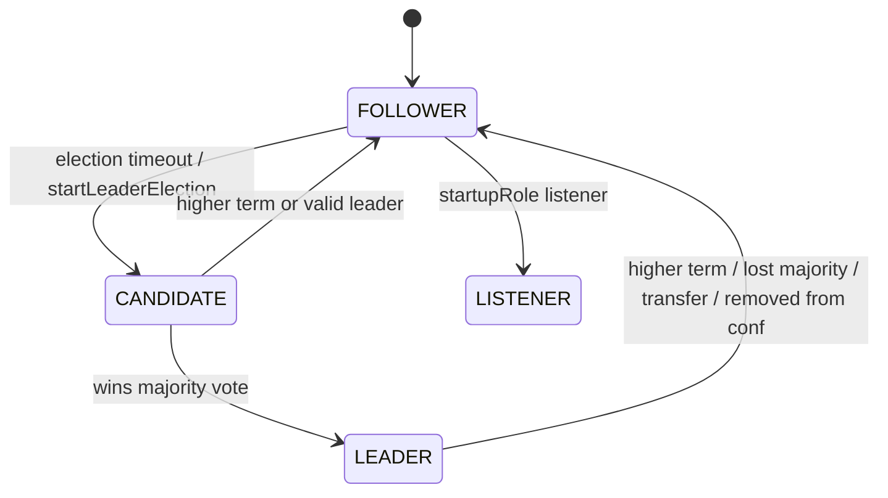
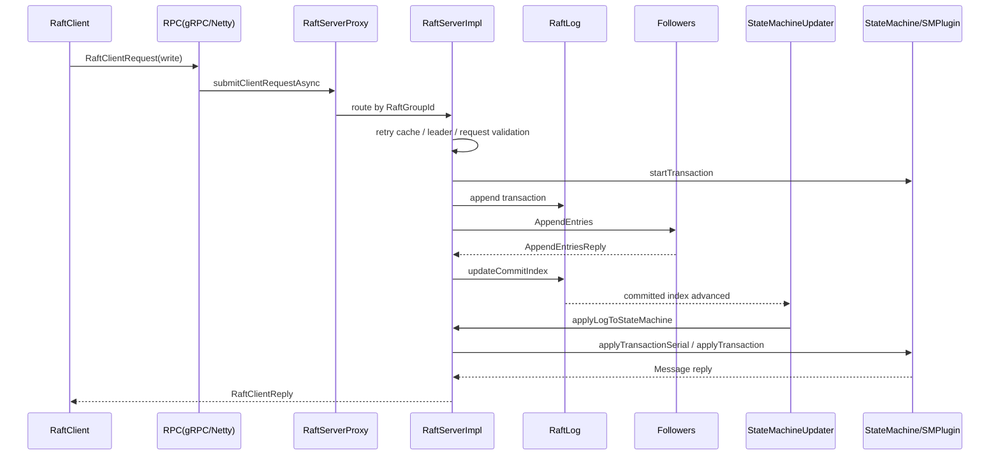

# Vexra Project Design Document

## Background

Vexra is a distributed data storage project based on the Raft consensus protocol. Its README positions the project as distributed storage with strong consistency, fault tolerance, real-time replication, virtual node support, standard JDBC access, and future horizontal scalability.

This document is generated from the current code implementation. It covers the Gradle modules, protocol definitions, Raft server core, client APIs, RPC transports, state machine plugins, the ADB storage plugin, local LDB storage, and snapshot flow. The document describes the current implementation and does not directly propose changes to interfaces, protocols, database structures, state machines, or task flows.

## Goals

- Explain current module boundaries, responsibilities, and dependencies.
- Describe client write/read, Raft log replication, state machine application, snapshot, and recovery flows.
- Record current protocol, interface, data structure, state machine, and failure-handling constraints.
- Provide a baseline for future implementation, review, compatibility analysis, and test work.
- Maintain this English copy together with the Chinese source document `docs/project-design.md`.

## Non-Goals

- Do not change existing interfaces, protocols, database structures, or state machine flows in this document.
- Do not replace detailed API documentation, Javadocs, or operations manuals.
- Do not claim that all current implementation paths are production-complete; unknowns are marked as "TBD".
- Do not make final commitments about performance, capacity, or production topology.

## Current Implementation And Existing Flow

### Build And Modules

The project uses a Gradle multi-module build. The root build sets `sourceCompatibility` and `targetCompatibility` from `jdkVersion=1.8` in `gradle.properties`, and Java compilation uses UTF-8. The root `build.gradle` currently disables all `Test` tasks.

| Module | Responsibility | Notes |
| --- | --- | --- |
| `vexra-proto` | Protobuf definitions and gRPC code generation | `Base.proto`, `Raft.proto`, `Grpc.proto`, `Netty.proto`, `Sm.proto`, `Adb.proto` |
| `vexra-common` | Protocol objects, config, utilities, exceptions, serialization helpers | Depends on protobuf, gRPC, Netty, Guava |
| `vexra-client` | Client APIs, retry, ordered/unordered requests, admin APIs | Depends on `vexra-common` and `vexra-proto` |
| `vexra-server-api` | Server interfaces, Raft config, storage interfaces, state machine interfaces | Exposes `RaftServer`, `Division`, `RaftLog`, `StateMachine` |
| `vexra-server-sm` | State machine base implementation, plugin container, Raft log implementation, storage directory and snapshot management | Includes `CompoundStateMachine`, `SegmentedRaftLog`, `FileListStateMachineStorage` |
| `vexra-server` | Raft server core | Election, role changes, commit, read index, configuration changes, snapshot management |
| `vexra-grpc` | gRPC transport | Server, client, LogAppender, TLS, metrics interceptors |
| `vexra-netty` | Netty transport and DataStream | Protobuf codec, Netty RPC, stream data transport |
| `vexra-rmap` | Example replicated map state machine plugin | Based on `SMPlugin`, supports snapshots |
| `vexra-adb` | ADB/JDBC/database state machine plugin | `AdbSMPlugin` uses `DbStore` and `vexra-ldb` |
| `vexra-ldb` | Local LevelDB-like KV storage implementation | WAL, MemTable, SST, MANIFEST, Compaction, Checkpoint |
| `vexra-metrics-api` / `vexra-metrics-default` | Metrics API and default implementation | Dropwizard/JMX related implementation |

### Runtime Flow

1. An application creates a server through `RaftServer.newBuilder()` and configures server ID, RaftGroup, state machine registry, startup option, properties, and parameters.
2. `RaftServerProxy` creates a `ServerFactory` based on `RaftConfigKeys.Rpc.type`, then creates the RPC service and DataStream service.
3. Each RaftGroup maps to one `RaftServerImpl`, which owns `ServerState`, `RoleInfo`, `RetryCacheImpl`, `TransactionManager`, `WriteIndexCache`, and `StateMachineUpdater`.
4. `ServerState` initializes local storage, loads Raft configuration, initializes the state machine, loads term/votedFor metadata, and opens either `MemoryRaftLog` or `SegmentedRaftLog`.
5. After startup, the node enters follower/listener/initializing state based on configuration, and election logic drives leader creation.
6. The leader uses `LeaderStateImpl` to manage LogAppenders, follower progress, commit index, configuration-change staging, read-index heartbeats, and leader lease.
7. Committed logs are applied by the single-threaded `StateMachineUpdater`, which calls `RaftServerImpl.applyLogToStateMachine`.

## Core Constraints

- JDK compatibility: the project targets JDK 8; new code must not use post-Java-8 syntax or APIs.
- Encoding: documentation, source comments, and explanatory text must remain UTF-8; project explanations default to Chinese.
- Consistency: writes must be replicated through Raft logs, committed, and then applied to the state machine; state machine behavior must be deterministic.
- Thread model: server and client requests use separate thread pools; state machine application is advanced sequentially by `StateMachineUpdater`; RPC callbacks must not run long blocking work.
- Storage: Raft metadata, logs, snapshots, and state machine data have separate ownership boundaries.
- Virtual nodes: the implementation supports virtual peer IDs, shared storage mount checks, VNodeLease, and virtual follower selection for minimum two-node deployment scenarios.
- Snapshot: snapshots should only be created when no unfinished transaction exists and `getLastValidTxTermIndex` is valid.
- Transport: gRPC and Netty transports share Raft semantics but use different wire wrappers.
- Tests: root Gradle currently disables test tasks, so validation commands must account for that.

## Interface Design

### External Client Interfaces

| Interface | Location | Responsibility |
| --- | --- | --- |
| `RaftClient` | `vexra-client` | Client entry point for blocking, async, message stream, data stream, admin, group, snapshot, node admin, leader election, and DRpc APIs |
| `BlockingApi` / `AsyncApi` | `vexra-client.api` | Synchronous and asynchronous read/write APIs |
| `AdminApi` | `vexra-client.api` | Configuration change and leadership transfer |
| `GroupManagementApi` | `vexra-client.api` | Add or remove RaftGroup |
| `SnapshotManagementApi` | `vexra-client.api` | Trigger snapshot creation |
| `DRpcApi` | `vexra-client.api` | Remote function invocation through `BeanTarget` |

### Server Interfaces

| Interface | Location | Responsibility |
| --- | --- | --- |
| `RaftServer` | `vexra-server-api` | Main server entry point implementing server/client/admin Raft protocols |
| `Division` | `vexra-server-api` | Per-RaftGroup runtime unit on a node |
| `RaftServerRpc` | `vexra-server-api` | Abstract peer-to-peer RPC service |
| `DataStreamServerRpc` | `vexra-server-api` | Abstract data stream service |
| `StateMachine` | `vexra-server-api` | State machine lifecycle, transactions, queries, and snapshots |
| `SMPlugin` | `vexra-server-sm` | State machine plugin extension point |

### RPC And Protocol Interfaces

| Proto | Responsibility |
| --- | --- |
| `Raft.proto` | Raft peers, groups, configs, logs, voting, append entries, snapshots, read index, client requests, admin requests, and exceptions |
| `Grpc.proto` | gRPC services for client protocol, Raft server protocol, and admin protocol |
| `Netty.proto` | Netty request/reply oneof wrapper and exception replies |
| `Sm.proto` | State machine plugin request/reply wrapper |
| `Adb.proto` | ADB read/write requests, batch writes, segment allocation, commit/rollback, scan, and count |
| `Base.proto` | Common JDBC/SQL value types, list, map, and exception wrapper |

## Data Structures

### Raft Core Structures

| Structure | Key Fields | Notes |
| --- | --- | --- |
| `RaftPeerProto` | `id`, `address`, `priority`, `dataStreamAddress`, `clientAddress`, `adminAddress`, `startupRole` | Peer identity and service addresses |
| `RaftGroupProto` | `groupId`, `peers` | Raft group definition |
| `RaftConfigurationProto` | `peers`, `oldPeers`, `listeners`, `oldListeners` | Joint configuration and listener support |
| `LogEntryProto` | `term`, `index`, `stateMachineLogEntry`, `configurationEntry`, `metadataEntry` | Raft log entry |
| `StateMachineLogEntryProto` | `logData`, `stateMachineEntry`, `type`, `clientId`, `callId` | State machine log data and retry-cache reconstruction data |
| `CommitInfoProto` | `server`, `commitIndex` | Peer commit progress |

### ADB Storage Structures

| Structure | Notes |
| --- | --- |
| `ColumnFamily` | `DEFAULT`, `META`, and `TXN` column families |
| `WriteEntry` | Supports put, delete, and delete range |
| `Batch` | Atomic group of `WriteEntry` records |
| `AllocateSegment` | Key-based segment allocation |
| `Commit` / `Rollback` | MVCC/transaction commit and rollback semantics |
| `ReadRequest` | get, scan, prefix scan, exists, first, last, count |
| `ScanResult` | entries, hasMore, and resumeKey for paged scans |

### Local LDB Structures

`vexra-ldb` implements a LevelDB-like storage engine: WAL, MemTable, immutable MemTable, SST/Table, MANIFEST/VersionSet, TableCache, Compaction, and Checkpoint. Writes first enter WAL and MemTable, background compaction flushes and reorganizes tables, and recovery reads MANIFEST plus WAL to rebuild state.

## State Machines

### Raft Peer Role State

### Service Lifecycle State

`RaftServerImpl` uses `LifeCycle` and `startComplete` to coordinate start, pause, resume, and stop. If a virtual node or storage health check fails, `startComplete=false` causes the follower to reply `UNAVAILABLE` to AppendEntries, and periodic checks attempt recovery.

### State Machine Plugin State

`CompoundStateMachine` maintains the plugin set, leader state, transaction set, last valid transaction index, and snapshot boundary. Plugins receive callbacks through `SMPlugin`: `startTransaction`, `query`, `applyTransaction`, `takeSnapshot`, and `restoreFromSnapshot`.

## Sequence Flows

### Write Flow

### Read Flow

| Read Type | Current Flow |
| --- | --- |
| Normal query | `queryStateMachine` calls `stateMachine.query` directly |
| Stale read | `queryStale` waits until `minIndex <= lastApplied`, then queries |
| Linearizable/read-index | The leader obtains a readIndex, sends heartbeat confirmation when needed, waits for the state machine to apply through that index, then queries |
| Read-after-write | `WriteIndexCache` records client write indices and uses them as the consistency lower bound |

### Snapshot Flow

1. `SnapshotManagementRequest` or an automatic threshold triggers `StateMachineUpdater.takeSnapshot`.
2. `CompoundStateMachine.readySnapshot` holds a read lock, verifies there is no unfinished transaction, and calls each plugin's `takeSnapshot`.
3. `finishSnapshot` runs without the read lock and completes validation, digest, summary file, and latest snapshot update.
4. After snapshot completion, old snapshots are cleaned up and Raft logs may be purged.
5. When a follower installs a snapshot, it pauses the state machine, writes chunks, reloads the state machine, and updates the log snapshot index.

## Exception Handling

- The protocol layer wraps common errors in `RaftClientReplyProto`: not leader, not replicated, state machine, leader not ready, already closed, data stream, read index, and others.
- Netty RPC serializes IOException into `RaftNettyExceptionReplyProto`.
- State machine application exceptions are wrapped as `StateMachineException`, returned to the client, and recorded in the retry cache.
- `StateMachineUpdater` enters `EXCEPTION` on unrecoverable errors; some snapshot failure paths call `stopSeverState`.
- Storage health check failures may stop `ServerState` and extend the virtual-node lease.
- TBD: whether all exception paths preserve causes consistently and whether all async joins have timeout boundaries.

## Idempotency

- Client requests use `clientId + callId` to create `ClientInvocationId`, which is recorded in `StateMachineLogEntryProto`.
- The leader uses `RetryCacheImpl` to query and cache request results; retried requests can reuse completed results or wait for pending results.
- `replyPendingRequest` updates both pending requests and retry cache when the state machine completes.
- ADB batch writes, commits, and segment allocation currently rely on Raft log order for replicated consistency; business-level duplicate commit semantics require further confirmation around txnId/commitTs.
- Snapshot installation carries requestId/requestIndex/done and result enums, so it can express repeated installation, in-progress, expired, and configuration-mismatch cases.

## Rollback Strategy

- Configuration changes follow the Raft joint-configuration model: old-new transitional config first, then committed new config; failed staging returns errors to pending config requests.
- Group removal supports deleting or renaming the directory after closing the corresponding `RaftServerImpl` and notifying the state machine.
- Log truncation removes transaction context and returns not-leader replies for affected retry-cache entries.
- Snapshot creation failures clean the current snapshot directory in `CompoundStateMachine`; snapshot installation reloads the state machine afterward.
- LDB checkpoint requires an empty target directory and leaves the original database untouched on failure; failed compaction installation deletes output files.
- TBD: production runbooks for protocol upgrade, data-structure change, and ADB transaction commit failure rollback.

## Compatibility

- The source target is JDK 8; do not introduce newer syntax or APIs.
- Protobuf uses proto3. New fields should preserve backward compatibility: keep field numbers stable and avoid reusing removed field numbers.
- Mixed-version Raft clusters require older nodes to ignore unknown fields safely; new oneof branches require special evaluation.
- gRPC and Netty transports share Raft semantics but use different wrappers; protocol field changes must check `Grpc.proto`, `Netty.proto`, and Java conversion logic together.
- State machine plugins route through `WrapRequestProto.type`; new plugins must avoid conflicts with existing `rmap` and `adb`.
- ADB/LDB disk format, MANIFEST, WAL, SST, and snapshot summary changes require migration and rollback design.

## Rollout And Migration

The current code includes configuration change, node suspend/resume, snapshot management, virtual-node, and DataStream features, but no unified rollout framework. Any future protocol, state machine, storage-format, or interface change should follow this order:

| Phase | Action | Verification | Rollback Point |
| --- | --- | --- | --- |
| Design review | Update Chinese and English design docs | Compatibility and rollback impact are explicit | Do not enter implementation |
| Single-node validation | Start a local single node or single group | Write, read, snapshot, and recovery succeed | Revert code |
| Small-cluster validation | 3 nodes or topology with virtual nodes | Election, replication, read-index, failure recovery | Disable new config |
| Mixed deployment | Mix old and new versions | Old nodes ignore unknown fields; new nodes read old data | Roll back new nodes |
| Full rollout | Expand to all nodes | Metrics, logs, and storage health remain stable | Node-by-node rollback |

## Test Plan

### Existing Test Assets

`vexra-ldb` contains tests for API behavior, logs, tables, restart reliability, row count and reopen, CRC, encoding, and related utilities. However, the root `build.gradle` disables all `Test` tasks through `tasks.withType(Test).configureEach { enabled = false }`.

### Recommended Verification Scope

- Build: `.\gradlew.bat clean assemble`.
- Unit tests: after removing or overriding the root test disablement, prioritize `vexra-ldb:test`, `vexra-server-sm:test`, and `vexra-server:test`.
- Protocol tests: Raft/Netty/gRPC conversion, exception serialization, oneof compatibility.
- Raft integration tests: leader election, log replication, leader step down, configuration change, read index, snapshot installation.
- State machine tests: `CompoundStateMachine` plugin routing, transaction boundary, snapshot/recovery, leader events.
- ADB tests: batch, scan, resumeKey, allocateSegment, commit/rollback, column-family isolation.
- LDB tests: WAL recovery, MemTable flush, Compaction, Checkpoint, ColumnFamily, resource closing.
- Fault injection: network timeout, RPC failure, disk unavailable, JVM pause, virtual-node lease, interrupted snapshot.

## Risks

| Risk | Severity | Description | Recommendation |
| --- | --- | --- | --- |
| Root build disables tests | P1 | Default Gradle test does not execute real tests | Define CI verification tasks or remove global disablement |
| JDK 8 with dependency versions | P1 | Some dependencies may target newer JDKs by default | Verify both build and runtime on JDK 8 |
| Blocking RPC callbacks | P1 | Blocking IO in Netty/gRPC callback paths can hurt throughput | Review callback threads specifically |
| Snapshot and transaction boundary | P1 | `CompoundStateMachine` allows snapshot only when no unfinished transaction exists | Add concurrent transaction and snapshot race tests |
| ADB snapshot implementation TBD | P1 | `AdbSMPlugin` currently uses default empty snapshot methods | Design ADB data recovery explicitly |
| Async join and timeout boundaries | P2 | Some paths use `join` or waits that need timeout review | Audit all Future wait points |
| Resource closing | P2 | LDB, iterators, RPC channels, and snapshot files need strict closing | Use `java-infra-review` for a dedicated review |
| Protocol compatibility | P2 | proto oneof and storage format changes affect mixed-version clusters | Establish field evolution rules |

## Phased Implementation Plan

This document describes the current implementation. Suggested follow-up phases:

1. Phase 1: Add module-level design docs, prioritizing the Raft core, state machine plugins, and ADB/LDB storage.
2. Phase 2: Add bilingual protocol evolution rules for proto fields, oneof branches, exceptions, and mixed-version behavior.
3. Phase 3: Complete ADB snapshot/recovery design and add end-to-end recovery tests.
4. Phase 4: Clarify Gradle/CI verification strategy and re-enable or explicitly configure test tasks.
5. Phase 5: Add an operations guide covering deployment, virtual nodes, storage health, snapshots, expansion, and failure recovery.

