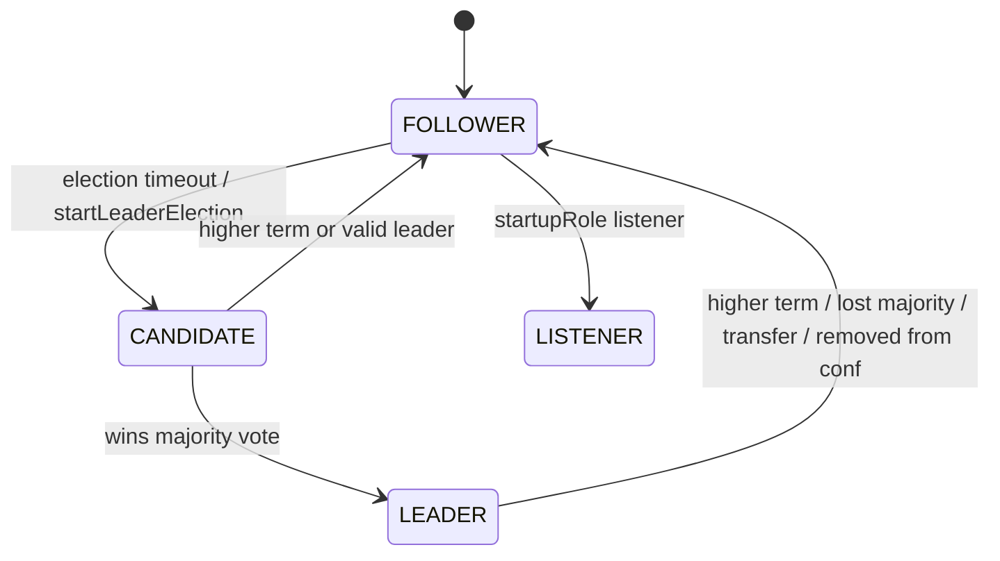
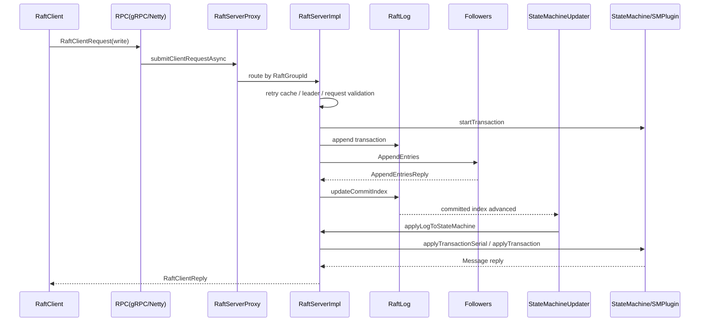

# Vexra 项目设计文档

## 背景

Vexra 是一个基于 Raft 协议的分布式数据存储项目，目标是在多节点环境下提供强一致、容错和可恢复的数据复制能力。项目 README 将其定位为“基于 Raft 协议的分布式数据存储”，并强调强一致性、容错性、实时复制、虚拟节点支持、标准 JDBC 访问以及未来水平扩展能力。

本设计文档基于当前代码实现扫描生成，覆盖 Gradle 模块结构、协议定义、服务端 Raft 内核、客户端 API、RPC 传输、状态机插件、ADB 存储插件、外部 LDB 本地存储依赖和快照流程。LDB 已从 Vexra 主仓库拆分为独立项目，本文只描述 Vexra 对 LDB 的依赖边界和集成约束，不再把 LDB 作为主仓库内部模块展开。

## 目标

- 说明当前项目的模块边界、核心职责和依赖关系。
- 梳理客户端写入、读取、Raft 日志复制、状态机应用、快照和恢复流程。
- 明确当前协议、接口、数据结构、状态机和异常处理的设计约束。
- 为后续代码实现、评审、兼容性分析和测试补强提供基线文档。
- 同步维护英文翻译副本：`docs/project-design.en.md`。

## 非目标

- 不在本文中修改现有接口、协议、数据库结构或状态机流程。
- 不替代详细 API 文档、Javadoc 或运维手册。
- 不承诺当前所有实现路径均已完备；未确认内容会标注为“待确认”。
- 不对性能指标、容量上限或生产部署拓扑做最终承诺。

## 现状/已有流程

### 构建与模块

项目使用 Gradle 多模块构建，根配置统一设置 `sourceCompatibility` 和 `targetCompatibility` 为 `gradle.properties` 中的 `jdkVersion=1.8`，Java 编译编码为 UTF-8。根 `build.gradle` 当前禁用了所有 `Test` 任务。

| 模块 | 主要职责 | 关键依赖/说明 |
| --- | --- | --- |
| `vexra-proto` | Protobuf 协议定义和 gRPC 代码生成 | `Base.proto`、`Raft.proto`、`Grpc.proto`、`Netty.proto`、`Sm.proto`、`Adb.proto` |
| `vexra-common` | 协议对象、配置、工具、异常、序列化辅助 | 依赖 protobuf、gRPC、Netty、Guava |
| `vexra-client` | 客户端 API、重试、有序/无序请求、管理 API | 依赖 `vexra-common`、`vexra-proto` |
| `vexra-server-api` | 服务端接口、Raft 配置、存储接口、状态机接口 | 暴露 `RaftServer`、`Division`、`RaftLog`、`StateMachine` |
| `vexra-server-sm` | 状态机基础实现、插件容器、Raft 日志实现、存储目录和快照管理 | 包含 `CompoundStateMachine`、`SegmentedRaftLog`、`FileListStateMachineStorage` |
| `vexra-server` | Raft 服务端核心实现 | 包含选举、角色切换、提交、读索引、配置变更、快照管理 |
| `vexra-grpc` | gRPC 传输实现 | 服务端、客户端、LogAppender、TLS、指标拦截器 |
| `vexra-netty` | Netty 传输实现和 DataStream | Protobuf 编解码、Netty RPC、流式数据传输 |
| `vexra-rmap` | 状态机插件示例：复制 Map | 基于 `SMPlugin`，支持快照 |
| `vexra-adb` | ADB/JDBC/数据库状态机插件 | 通过 `AdbSMPlugin` 使用 `DbStore`，并依赖独立发布的 LDB 存储库 |
| `vexra-metrics-api` / `vexra-metrics-default` | 指标接口和默认实现 | Dropwizard/JMX 相关实现 |

### 运行时主流程

1. 应用通过 `RaftServer.newBuilder()` 创建服务端，配置节点 ID、RaftGroup、状态机注册器、启动选项、属性和参数。
2. `RaftServerProxy` 根据 `RaftConfigKeys.Rpc.type` 创建 `ServerFactory`，再创建对应 RPC 服务和 DataStream 服务。
3. 每个 RaftGroup 对应一个 `RaftServerImpl`，内部持有 `ServerState`、`RoleInfo`、`RetryCacheImpl`、`TransactionManager`、`WriteIndexCache`、`StateMachineUpdater` 等组件。
4. `ServerState` 初始化本地存储、加载 Raft 配置、初始化状态机、加载 term/votedFor 元数据，并打开 `MemoryRaftLog` 或 `SegmentedRaftLog`。
5. 服务启动后根据配置角色进入 follower/listener/initializing 状态，并由选举线程推进 leader 产生。
6. leader 通过 `LeaderStateImpl` 管理 LogAppender、跟随者进度、提交索引、配置变更 staging、读索引心跳和 leader lease。
7. 已提交日志由 `StateMachineUpdater` 单线程顺序拉取并调用 `RaftServerImpl.applyLogToStateMachine` 应用到状态机。

## 核心约束

- JDK 兼容性：项目配置为 JDK 8，新增代码不得使用 Java 8 之后的语言语法或 API。
- 编码：所有文档、源码注释和说明性内容保持 UTF-8；项目说明性内容默认中文。
- 一致性：写入必须通过 Raft 日志复制后提交，再由状态机应用；状态机实现必须具备确定性。
- 线程模型：RaftServer 将服务端请求和客户端请求放入独立线程池；状态机应用由 `StateMachineUpdater` 顺序推进；RPC 回调中不能执行长期阻塞逻辑。
- 存储：Raft 元数据、日志、快照、状态机数据分别有独立责任边界；日志条目和状态机外置数据可拆分存储。
- 虚拟节点：代码支持虚拟节点 ID、共享存储挂载检查、VNodeLease 和虚拟 follower 有效性选择，适配最少两节点部署场景。
- 快照：快照只应在没有未完成事务、且 `getLastValidTxTermIndex` 有效时生成；快照完成后可清理旧快照和截断日志。
- 传输：当前支持 gRPC 与 Netty 两套 RPC 实现，协议对象由 Protobuf 定义。
- 测试：根构建默认禁用测试任务，执行验证时需注意 Gradle 配置对测试任务的影响。

## 接口设计

### 外部客户端接口

| 接口 | 位置 | 职责 |
| --- | --- | --- |
| `RaftClient` | `vexra-client` | 客户端入口，暴露 blocking、async、message stream、data stream、admin、group、snapshot、node admin、leader election、DRpc API |
| `BlockingApi` / `AsyncApi` | `vexra-client.api` | 读写请求的同步和异步接口 |
| `AdminApi` | `vexra-client.api` | 配置变更、领导权转移等管理操作 |
| `GroupManagementApi` | `vexra-client.api` | RaftGroup 添加/移除 |
| `SnapshotManagementApi` | `vexra-client.api` | 触发快照创建 |
| `DRpcApi` | `vexra-client.api` | 基于 `BeanTarget` 的远程函数调用 |

### 服务端接口

| 接口 | 位置 | 职责 |
| --- | --- | --- |
| `RaftServer` | `vexra-server-api` | 服务端总入口，同时实现 Raft server/client/admin 异步和同步协议 |
| `Division` | `vexra-server-api` | 单个 RaftGroup 在某节点上的运行单元 |
| `RaftServerRpc` | `vexra-server-api` | 节点间 RPC 服务抽象 |
| `DataStreamServerRpc` | `vexra-server-api` | 数据流服务抽象 |
| `StateMachine` | `vexra-server-api` | 状态机生命周期、事务、查询、快照接口 |
| `SMPlugin` | `vexra-server-sm` | 状态机插件扩展点 |
| `LdbPlugin` | 外部 LDB 依赖 | LDB 存储插件扩展点，供 ADB 等上层模块增强列族、写入和 checkpoint 行为 |

### RPC 与协议接口

| Proto | 职责 |
| --- | --- |
| `Raft.proto` | Raft 节点、组、配置、日志、投票、追加日志、快照、读索引、客户端请求、管理请求和异常 |
| `Grpc.proto` | gRPC 服务：客户端协议、服务端 Raft 协议、管理协议 |
| `Netty.proto` | Netty 请求/响应 oneof 封装和异常响应 |
| `Sm.proto` | 状态机插件请求/响应包装 |
| `Adb.proto` | ADB 读写请求、批量写、分段分配、提交/回滚、扫描和统计 |
| `Base.proto` | 通用 JDBC/SQL 值类型、列表、Map、异常包装 |

## 数据结构

### Raft 核心结构

| 结构 | 关键字段 | 说明 |
| --- | --- | --- |
| `RaftPeerProto` | `id`、`address`、`priority`、`dataStreamAddress`、`clientAddress`、`adminAddress`、`startupRole` | 节点身份和各类服务地址 |
| `RaftGroupProto` | `groupId`、`peers` | Raft 组定义 |
| `RaftConfigurationProto` | `peers`、`oldPeers`、`listeners`、`oldListeners` | 支持联合配置和 listener |
| `LogEntryProto` | `term`、`index`、`stateMachineLogEntry`、`configurationEntry`、`metadataEntry` | Raft 日志条目 |
| `StateMachineLogEntryProto` | `logData`、`stateMachineEntry`、`type`、`clientId`、`callId` | 状态机日志和重试缓存重建信息 |
| `CommitInfoProto` | `server`、`commitIndex` | 节点提交进度 |

### ADB 存储结构

| 结构 | 说明 |
| --- | --- |
| `ColumnFamily` | `DEFAULT`、`META`、`TXN` 三类列族 |
| `WriteEntry` | 支持 put、delete、delete range |
| `Batch` | 多个 `WriteEntry` 的原子批次 |
| `AllocateSegment` | 基于 key 的自增段分配 |
| `Commit` / `Rollback` | MVCC/事务提交与回滚语义 |
| `ReadRequest` | get、scan、prefix scan、exists、first、last、count |
| `ScanResult` | entries、hasMore、resumeKey，用于分页扫描 |

### 外部 LDB 存储依赖

LDB 已独立为单独项目，Vexra 不再在主仓库内维护其核心实现。ADB 通过 LDB 对外 API 使用 LevelDB 风格本地 KV 存储能力，包括 WAL、MemTable、SST/Table、MANIFEST、Compaction、Checkpoint、repair/check、backup/restore 和工具命令等。LDB 的磁盘格式、可靠性计划和 API 兼容说明以独立 LDB 项目为准；Vexra 侧只约束依赖版本、插件集成、checkpoint/restore 调用和与 ADB 语义相关的兼容性。

### LDB 插件化扩展

外部 LDB 提供插件扩展点，让上层模块在不反向依赖 `vexra-adb` 的前提下增强 LDB 行为。插件通过 `Options` 注册，由 LDB 在打开、写入、checkpoint 和关闭阶段回调。

| 接口 | 职责 |
| --- | --- |
| `LdbPlugin` | 插件生命周期接口，支持 `onOpen`、`beforeWrite`、`afterWrite`、`beforeCheckpoint`、`afterCheckpoint`、`beforeClose`、`close` |
| `LdbPluginContext` | 插件受控访问 LDB 的上下文，暴露数据库目录、配置、列族解析、快照游标、写批次创建和属性查询 |
| `Options.addPlugin` | 注册插件；不注册插件时 LDB 行为保持旧路径 |

ADB 通过 `AdbLdbPlugin` 使用该扩展点，集中声明 ADB 需要的列族，并为事务索引、扫描、checkpoint/restore 和统计能力提供统一入口。LDB 相关磁盘格式或 API 变更必须先在独立 LDB 项目中完成设计评审和版本发布，Vexra 再升级依赖并补充集成验证。

## 状态机

### Raft 节点角色状态

### 服务生命周期状态

`RaftServerImpl` 使用 `LifeCycle` 和 `startComplete` 协调启动、暂停、恢复和停止。虚拟节点或存储健康检查失败时，`startComplete=false` 会使 follower 对 AppendEntries 返回 `UNAVAILABLE`，并由定时检查尝试恢复。

### 状态机插件状态

`CompoundStateMachine` 维护插件集合、leader 状态、事务集合、最后有效事务索引和快照边界。插件通过 `SMPlugin` 接收 `startTransaction`、`query`、`applyTransaction`、`takeSnapshot`、`restoreFromSnapshot` 等回调。

## 时序流程

### 写请求流程

### 读请求流程

| 读类型 | 当前流程 |
| --- | --- |
| 普通查询 | `queryStateMachine` 直接调用 `stateMachine.query` |
| stale read | `queryStale` 等待 `minIndex <= lastApplied` 后查询 |
| linearizable/read-index | leader 获取 readIndex，必要时发送心跳等待多数确认，再等待状态机 apply 到对应索引后查询 |
| read-after-write | 使用 `WriteIndexCache` 记录客户端写入索引，读时以该索引作为一致性下界 |

### 快照流程

1. `SnapshotManagementRequest` 或自动阈值触发 `StateMachineUpdater.takeSnapshot`。
2. `CompoundStateMachine.readySnapshot` 持有读锁，确认当前无未完成事务，并调用各插件 `takeSnapshot`。
3. `finishSnapshot` 在不持有读锁的阶段完成校验、摘要、summary 文件和 latest snapshot 更新。
4. 快照完成后按保留策略清理旧快照，并根据配置 purge Raft 日志。
5. follower 安装快照时暂停状态机、写入快照片段、重新加载状态机并更新日志 snapshot index。

## 异常处理

- 协议层将常见异常封装进 `RaftClientReplyProto`：not leader、not replicated、state machine、leader not ready、already closed、data stream、read index 等。
- Netty RPC 使用 `RaftNettyExceptionReplyProto` 将 IOException 序列化为异常回复。
- 状态机应用异常会被包装为 `StateMachineException` 返回客户端，并更新 retry cache。
- `StateMachineUpdater` 捕获不可恢复异常后进入 `EXCEPTION` 状态；部分快照失败路径会触发 `stopSeverState`。
- 存储健康检查失败时，节点可能停止 `ServerState` 并延长虚拟节点租约。
- 待确认：部分异常路径是否统一保留 cause、是否所有 async join 都有超时，需要专项评审。

## 幂等性

- 客户端请求通过 `clientId + callId` 构造 `ClientInvocationId`，写日志时记录在 `StateMachineLogEntryProto`。
- leader 使用 `RetryCacheImpl` 查询和缓存请求结果，重试请求可复用已完成结果或等待 pending 结果。
- `replyPendingRequest` 在状态机完成后同时更新 pending request 和 retry cache。
- ADB 的批量写、提交和段分配当前通过 Raft 日志顺序保证复制一致性；业务级重复提交语义待结合 txnId/commitTs 进一步确认。
- 快照安装协议包含 requestId/requestIndex/done 和结果枚举，可表达重复安装、进行中、过期和配置不匹配等状态。

## 回滚策略

- 配置变更采用 Raft 联合配置思路：先 old-new transitional，再提交 new conf；失败时 pending 配置请求返回异常。
- group remove 支持删除目录或重命名目录，删除前关闭对应 `RaftServerImpl` 并通知状态机。
- 日志截断会清理对应事务上下文，并对 retry cache 中相关请求返回 not leader。
- 快照生成失败时，`CompoundStateMachine` 清理当前快照目录；快照安装后通过重新加载状态机恢复。
- LDB checkpoint 要求目标目录为空，失败会保留原数据库目录不变；Compaction 安装失败会删除输出文件。
- 待确认：生产环境下协议升级、数据结构变更和 ADB 事务提交失败后的人工回滚流程。

## 兼容性

- 源码目标为 JDK 8，不得引入高版本语法或 API。
- Protobuf 使用 proto3，新增字段应遵循向后兼容原则：保留字段编号语义，避免复用已删除字段编号。
- Raft mixed-version 集群需要保证旧节点能忽略未知字段；对 oneof 新分支需评估旧版本行为。
- gRPC 与 Netty 两套传输共享 Raft 语义，但封装方式不同；协议字段调整需同时检查 `Grpc.proto`、`Netty.proto` 和 Java 转换逻辑。
- 状态机插件通过 `WrapRequestProto.type` 路由，新增插件应避免与已有 `rmap`、`adb` 冲突。
- ADB 数据结构、快照 summary 文件以及 LDB 依赖版本升级都需要设计迁移和回滚；LDB 的 MANIFEST、WAL、SST 等磁盘格式以独立 LDB 项目设计为准。
- LDB 插件失败通过 `DBException` 暴露，调用方可回退到不注册插件或回退 LDB 依赖版本的路径。

## 灰度/迁移

当前代码存在配置变更、节点暂停/恢复、快照管理、虚拟节点和 DataStream 能力，但没有统一灰度发布框架。建议后续任何协议、状态机、存储格式或接口变更都按以下顺序执行：

| 阶段 | 动作 | 验证点 | 回滚点 |
| --- | --- | --- | --- |
| 设计评审 | 更新中英文设计文档 | 兼容性和回滚影响明确 | 不进入实现 |
| 单节点验证 | 本地启动单节点或单组 | 写入、读取、快照、恢复成功 | 回退代码 |
| 小集群验证 | 3 节点或含虚拟节点拓扑 | 选举、复制、read-index、故障恢复 | 停用新配置 |
| 混部验证 | 新旧版本混合 | 旧节点忽略未知字段，新节点兼容旧数据 | 回滚新节点 |
| 全量发布 | 扩大到所有节点 | 指标、日志、存储健康稳定 | 按节点回滚 |

## 测试方案

### 已有测试资源

LDB 的 API、日志、表、重启可靠性、CRC、编码、repair/check、backup/restore 等测试已迁移到独立 LDB 项目中维护。Vexra 主仓库的测试重点转为 ADB 与外部 LDB 依赖的集成边界；根 `build.gradle` 当前通过 `tasks.withType(Test).configureEach { enabled = false }` 禁用了测试任务，执行验证时需显式启用或使用 CI 专用任务。

### 建议验证范围

- 构建验证：`.\gradlew.bat clean assemble`。
- 单元测试：解除或覆盖根测试禁用后，优先运行 `vexra-server-sm:test`、`vexra-server:test` 和 ADB/LDB 集成测试；LDB 自身测试在独立 LDB 项目执行。
- 协议测试：Raft/Netty/gRPC proto 转换、异常序列化、oneof 分支兼容。
- Raft 集成测试：leader 选举、日志复制、leader step down、配置变更、读索引、快照安装。
- 状态机测试：`CompoundStateMachine` 插件路由、事务边界、快照/恢复、leader 事件。
- ADB 测试：batch、scan、resumeKey、allocateSegment、commit/rollback、列族隔离。
- LDB 集成测试：ADB 使用外部 LDB 时的列族声明、WAL/reopen 可见性、Checkpoint/restore、repair/check 调用和资源关闭。
- 故障注入：网络超时、RPC 失败、磁盘不可用、JVM pause、虚拟节点租约、快照中断。

## 风险点

| 风险 | 严重性 | 说明 | 建议 |
| --- | --- | --- | --- |
| 根构建禁用测试 | P1 | 默认 Gradle test 不会执行真实测试 | 明确 CI 验证任务或移除全局禁用 |
| JDK 8 与依赖版本 | P1 | 部分依赖版本可能默认面向更高 JDK | 构建和运行时都需 JDK 8 验证 |
| RPC 回调阻塞 | P1 | Netty/gRPC 回调路径若执行阻塞 IO 会影响吞吐 | 针对回调线程做专项 review |
| 快照和事务边界 | P1 | `CompoundStateMachine` 依赖无未完成事务才允许快照 | 补充并发事务与快照竞争测试 |
| ADB 快照实现待完善 | P1 | `AdbSMPlugin` 当前快照方法使用默认空实现 | ADB 数据恢复能力需专项设计 |
| LDB 依赖升级影响 ADB | P1 | LDB 已独立发布，插件 hook 和磁盘格式演进可能影响 ADB 写入、checkpoint 和恢复 | 依赖升级前先跑 ADB/LDB 集成矩阵，并核对 LDB release notes |
| 异步 join/超时 | P2 | 部分路径存在 `join` 或等待，需要确认超时边界 | 梳理所有 Future 等待点 |
| 资源关闭 | P2 | LDB、迭代器、RPC channel、snapshot 文件均需关闭 | 使用 `java-infra-review` 做专项审查 |
| 协议兼容 | P2 | proto oneof 和存储格式变更会影响 mixed-version | 建立字段演进规则 |

## 分阶段实施计划

本文是当前实现文档，后续建议按以下阶段完善：

1. 阶段一：补充模块级设计文档，优先覆盖 Raft 内核、状态机插件和 ADB 对外部 LDB 的集成边界。
2. 阶段二：补充中英文协议演进规范，明确 proto 字段、oneof、异常和 mixed-version 规则。
3. 阶段三：补齐 ADB 快照/恢复设计，并增加端到端恢复测试。
4. 阶段四：梳理 Gradle/CI 验证策略，恢复或显式配置测试任务。
5. 阶段五：补充运行手册，覆盖节点部署、虚拟节点、存储健康、快照、扩容和故障恢复。
