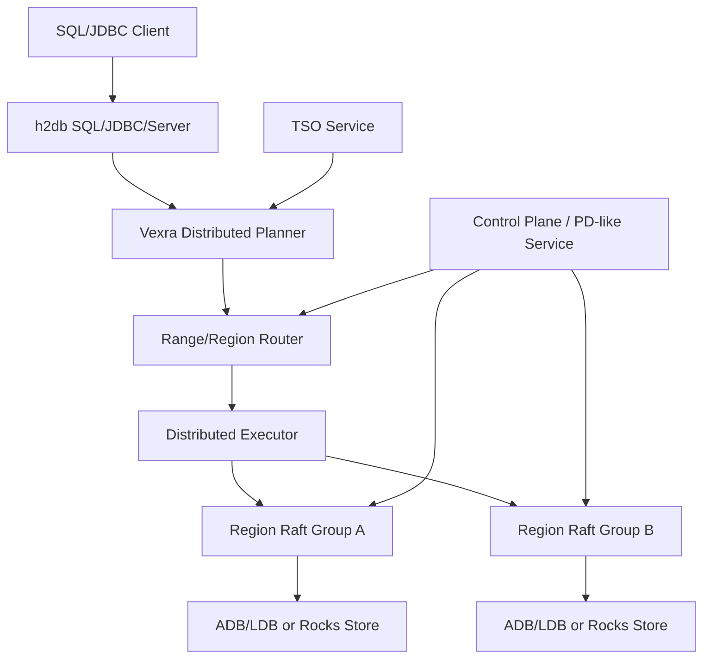

# Roadmap for a TiDB-like Distributed Database

## Background

`vexra-adb` has completed the H2 plugin migration: SQL parsing, JDBC, Server, and tools now come from `h2db`, while ADB keeps table, index, transaction-visibility, and low-level store logic. This solves the single-node SQL integration boundary, but it is still far from a TiDB-like distributed SQL database.

A TiDB-like system needs a SQL layer, distributed execution, distributed transactions, sharded storage, Raft replication, a scheduling control plane, Online DDL, backup/restore, and operational observability. Vexra already has state machine, Raft, ADB/LDB, and plugin-based SQL integration foundations, but these need to be organized into a scalable and fault-tolerant database architecture.

## Goals

- Summarize the remaining work from the current ADB/H2 plugin database to a TiDB-like distributed database.
- Split the work into reviewable and testable milestones.
- Make 2 data nodes + lightweight witness the recommended two-data-replica HA model.
- Avoid making shared storage the default HA direction.

## Non-Goals

- This document does not promise full TiDB, MySQL, or PostgreSQL compatibility.
- This document does not define a new disk format, RPC protocol, or SQL grammar.
- This document does not require all distributed database capabilities to be implemented at once.
- This document does not support pure 2-node strong-consistency automatic failover without a witness.

## Current State

| Module | Current Capability | Gap |
| --- | --- | --- |
| `h2db` | SQL parser, JDBC, Server, plugin SPI | Does not understand Vexra shards, Raft regions, or distributed execution |
| `vexra-adb` | ADB table provider, indexes, transaction visibility, LDB/Rocks adapters | Still close to a single-database/single-node execution model |
| `vexra-ldb` | Local KV store and plugin hooks | Not a distributed region store yet |
| Vexra state machine/Raft | State-machine and consensus foundations | Needs region groups, control plane, and multi-group scheduling |

## Core Constraints

- Strongly consistent writes require quorum or equivalent fencing/lease protection.
- Automatic failover with 2 data nodes and no shared storage requires a witness or external arbiter.
- SQL execution cannot assume all data is local.
- ADB key encoding, MVCC, checkpoint, and restore must remain backward-compatible.
- h2db table/index internals remain managed migration APIs and require contract tests before upgrades.

## Target Architecture

## Remaining Work

| Area | Required Capability | Notes |
| --- | --- | --- |
| SQL | Distributed planner, distributed explain, statistics | h2db plans need to map to Vexra region tasks |
| Execution | scan/filter/limit/count pushdown, later agg/join/sort | Start small instead of building full MPP immediately |
| Routing | table/index key range to region mapping | All reads and writes go through a region router |
| Storage | region split/merge, range scan, snapshot install | Evolve from one DB store to movable regions |
| Replication | one Raft group or equivalent group per region | Define leader, term, epoch, and commit index |
| Transactions | TSO, MVCC, 2PC, lock resolve, GC safe point | This is the core complexity |
| Control plane | PD-like metadata, scheduling, health, placement rules | Manage regions, nodes, leaders, TSO, and scheduling |
| Online DDL | schema version, backfill, recovery | Support long-running DDL such as add/drop index |
| Operations | metrics, tracing, slow query, admin commands | Required for production use |
| Security | users, roles, privileges, TLS, audit | Can be phased by product goal |

## Key Design Tasks

### SQL and Execution

- Define `DistributedPlan` for region tasks, pushed predicates, returned schema, and merge strategy.
- Define `RegionScanTask` with key range, projection, filter, limit, and read timestamp.
- Implement minimal pushdown first: primary-key point lookup, range scan, secondary-index range scan, count.
- Add `EXPLAIN DISTRIBUTED` or equivalent diagnostics.
- Build statistics for row count, region size, and index cardinality.

### Sharding and Replication

- Define region metadata: `regionId`, `startKey`, `endKey`, `epoch`, `replicas`, `leader`.
- Support region split/merge and route epoch updates.
- Define replica roles: data voter, witness voter, learner.
- Support snapshot install, leader transfer, membership changes, and replica repair.
- Start with leader reads, then evaluate read index and follower reads.

### Distributed Transactions

- Add a global TSO service with monotonic `startTs` and `commitTs`.
- Define MVCC write/default/lock semantics or map existing ADB structures explicitly.
- Implement 2PC: prewrite, commit, rollback, lock resolve.
- Clean locks after timeout or client disconnect.
- Define GC safe point to protect long transactions and backup.
- Start with Snapshot Isolation unless a stronger level is explicitly required.

### Control Plane

- Build a PD-like service for cluster membership, region metadata, TSO, and scheduling.
- Support node join/leave, health checks, leader scheduling, and hotspot detection.
- Expose system tables or admin APIs for nodes, regions, locks, transactions, and plugins.
- Make the control plane highly available, preferably on the Vexra Raft state machine.

### DDL and Operations

- Define DDL job states: pending, running, backfilling, public, rollback, failed.
- Bind SQL sessions to schema versions to handle DDL/transaction concurrency.
- Support resumable and rate-limited index backfill.
- Define backup/restore semantics for full, incremental, point-in-time restore, and region checksums.

## 2 Data Nodes + Witness Conclusion

Pure 2 data nodes without shared storage cannot safely provide strong-consistency automatic failover. The recommended model is:

- 2 data nodes keep full data replicas.
- 1 lightweight witness only participates in voting, term/epoch/lease arbitration, and does not store business data.
- Writes require quorum: `A+B`, `A+W`, or `B+W`.
- Without quorum, writes are forbidden; the system can degrade to read-only or unavailable.
- Shared-storage mode remains available but disabled by default as a compatibility/transition mode.

See `docs/two-data-node-witness-ha-design.md` for the dedicated design.

## Milestones

| Phase | Name | Deliverable | Acceptance |
| --- | --- | --- | --- |
| ADB-Cluster-01 | Region metadata and range routing | region metadata, router, system table | A primary-key range routes to regions |
| ADB-Cluster-02 | Region Raft storage | region group, leader, snapshot, membership change | Single-region failure recovery and snapshot install pass |
| ADB-Cluster-03 | 2 data nodes + witness HA | witness voter, fencing, quorum writes | One data-node failure still allows data+witness writes |
| ADB-Cluster-04 | Minimal distributed transaction loop | TSO, MVCC, 2PC, lock resolve | Cross-region commit/rollback is consistent |
| ADB-Cluster-05 | Distributed SQL execution | region scan task, filter/count pushdown | SQL can merge results across regions |
| ADB-Cluster-06 | Online DDL | schema version, index backfill | add index does not block reads/writes and can recover |
| ADB-Cluster-07 | Operations and release | metrics, admin, backup/restore, upgrade flow | rolling upgrade and disaster recovery drills pass |

## Milestone Status

| Phase | Status | Deliverables |
| --- | --- | --- |
| ADB-Cluster-01 | Done | `KeyRange`, `RegionMetadata`, and `RegionRouter` provide byte-order range metadata, point/range routing, overlap validation, and system-table rows. |
| ADB-Cluster-02 | Done | `RegionRaftGroupFactory`, `RegionRaftGroupDescriptor`, `RegionMembershipChangePlan`, and `RegionSnapshotInstallPlan` bind region metadata to the existing RaftGroup, SetConfiguration, learner/listener, witness metadata, and snapshot install planning model. |
| ADB-Cluster-03 | Done | `RegionWitnessBinding` binds region metadata to quorum write fencing, failover planning, and durable witness vote state. The dedicated witness HA model is complete through HA-01 to HA-06. |
| ADB-Cluster-04 | Done | `TimestampOracle`, `InMemoryTimestampOracle`, `TwoPhaseCommitContext`, `TxnParticipant`, `TwoPhaseCommitState`, and `TxnLock` provide monotonic TSO, 2PC state transitions, primary participant validation, commit timestamp checks, rollback constraints, and lock-expiration semantics. |
| ADB-Cluster-05 | Done | `RegionScanTask`, `DistributedPlan`, `RegionQueryResult`, and `DistributedResultMerger` describe region scan pushdown, projection/filter/limit/readTs, count-only plans, row merging, and count aggregation across regions. |
| ADB-Cluster-06 | Done | `DdlJob`, `DdlJobState`, `DdlJobStateMachine`, `SchemaVersion`, and `IndexBackfillProgress` provide Online DDL state transitions, schema-version advancement, rollback/failure paths, and resumable index backfill progress. |
| ADB-Cluster-07 | Done | `ClusterOperationsSnapshot`, `ClusterHealthStatus`, `RollingUpgradePlan`, `BackupRestoreMode`, and `BackupRestorePlan` provide operations metrics/system rows, rolling upgrade sequencing, and backup/restore planning. |

## Runtime Integration Point: ADB Region Write Gate

The next step is to connect the completed region routing and witness quorum-write constraints to the real `vexra-adb` commit path:

- `TxnManager.commit(...)` calls an optional `AdbRegionWriteGate` before allocating `commitTs` and before durable commit.
- The default gate is no-op, preserving single-node ADB/H2 plugin mode and existing `jdbc:adb:*` behavior.
- Distributed mode can install a region-aware gate that maps ADB write-set `DataKey` values through `RegionRouter`, then uses `RegionWitnessBinding` for quorum fencing.
- If the gate fails, the transaction must not enter durable commit; rollback is to remove the gate or switch back to the no-op gate.
- This integration point does not change ADB key encoding, disk format, or the existing store API, and can later be replaced by the real region Raft write path.

## Runtime Integration Point: ADB Region Read Routing

After the write gate, the read path needs a pluggable region-routing entry point before it can evolve into mixed local/remote execution:

- `TxnManager.getVisible(...)`, `entryIterator(...)`, and `indexScanIterator(...)` call an optional `AdbRegionReadRouter` before local store reads.
- The default read router is no-op, preserving the current single-node read path and H2 table/index behavior.
- A region-aware read router only maps point reads, primary-table range scans, and index range scans to regions, and can notify diagnostics/observability components.
- This phase does not change scan cursors, the store API, or result merging; later work can replace this entry point with `RegionScanTask` and a remote executor.
- If the read router fails, the read operation fails; rollback is to remove the router or switch back to the no-op router.

## Remaining Implementation Phases

At the current state, the public models for ADB-Cluster-01 through ADB-Cluster-07 are complete. The real `vexra-adb` write path also has a region write gate, and the real read path has a region read router. The remaining work is no longer model definition; it is wiring those models into runnable distributed execution, replication, transactions, and operations.

ADB-Runtime-01 through ADB-Runtime-11 in the current roadmap are complete. If only Runtime phases are counted, there are 0 remaining implementation phases. The follow-up Post-Runtime production phases are also complete; by phase acceptance status, 0 production phases remain.

### Current Phase Count Snapshot

As of 2026-06-20, the plan has completed `ADB-Runtime-01` through `ADB-Runtime-11`, production phases `ADB-Prod-01` through `ADB-Prod-06`, and runnable hardening phases `ADB-Run-01` through `ADB-Run-10`. Therefore, the current roadmap has 2 remaining phases to complete: `ADB-Run-11` through `ADB-Run-12`. If new phases are added later, this snapshot, the phase tables below, and the phase status notes must be updated together and committed locally.

| Counting Scope | Remaining Phases | Current Status | Tracking Location |
| --- | --- | --- | --- |
| Runtime integration phases | 0 | `ADB-Runtime-01` through `ADB-Runtime-11` are complete | Kept as historical completion records |
| Post-Runtime production phases | 0 | `ADB-Prod-01` through `ADB-Prod-06` are complete | See "Post-Runtime Production Phases" |
| Runnable Cluster Hardening phases | 2 | `ADB-Run-01` through `ADB-Run-10` are complete; `ADB-Run-11` through `ADB-Run-12` continue to track TiDB-like productization gaps | See "Runnable Cluster Hardening Phases" |

The roadmap now adds 5 runnable productization phases, and `ADB-Run-10` is complete. The next priority is `ADB-Run-11`, which adds installer templates, authentication/TLS, and secure defaults. The later phase covers the end-to-end cluster stress gate.

### ADB-Runtime-03 Implementation Scope

`ADB-Runtime-03` has completed the local `RegionScanTask` adapter:

- The input is a `Transaction2` and a single `RegionScanTask`; the output is a `RegionQueryResult`.
- The adapter uses `RegionScanTask.keyRange` to scan ADB version keys by range and deduplicates by logical `DataKey`.
- Primary-table row scans use `DefaultVisibleRowResolver`; index scans first use `DefaultVisibleIndexResolver` to validate visible index entries, then look up the primary row.
- This phase returns minimal diagnostic fields: `row_id`, `payload`, and `key_hex`; index scans also return `index_id` and `index_hex`.
- This phase does not implement remote RPC, SQL planner rewrites, store API changes, or disk-format changes.
- The implementation is `AdbLocalRegionScanExecutor`, covered by `AdbLocalRegionScanExecutorTest`.

### ADB-Runtime-04 Implementation Scope

`ADB-Runtime-04` has completed the replaceable boundary for a remote region scan executor:

- Define a region scan request object carrying `RegionScanTask`, transaction ID, read timestamp, count-only flag, and timeout.
- Define an asynchronous scan client interface shared by real RPC, in-process fakes, and the local bridge.
- The distributed executor dispatches multiple region scan requests concurrently and uses `DistributedResultMerger` to merge rows or counts.
- Remote failures, timeouts, and interruption must map to `SQLException`, with regionId included in diagnostic messages.
- This phase does not implement the real network protocol and does not change the public `RegionScanTask` / `RegionQueryResult` models.
- The implementation includes `AdbRegionScanRequest`, `AdbRegionScanClient`, `AdbLocalRegionScanClient`, and `AdbDistributedRegionScanExecutor`, covered by `AdbDistributedRegionScanExecutorTest`.

### ADB-Runtime-05 Implementation Scope

`ADB-Runtime-05` has connected the ADB commit path to a replaceable region commit client:

- After the write gate passes and `commitTs` is allocated, `TxnManager.commit(...)` can call a region commit coordinator instead of directly calling local `DbStore.commitAsync`.
- The coordinator routes the current transaction write set to regions. The first runtime step only allows single-region commits; cross-region commit is deferred to ADB-Runtime-07 2PC.
- The coordinator validates region leader, epoch, and routing results. If validation fails, the transaction must not remain in `COMMITTING`.
- The commit client abstracts real region Raft apply. This phase provides a local bridge client reusing existing `DbStore.commitAsync`; later work can replace it with a real Raft/RPC client.
- This phase does not change the ADB intent/version disk format or the public `DbStore` interface.
- The implementation includes `AdbRegionCommitRequest`, `AdbRegionCommitClient`, `AdbLocalRegionCommitClient`, and `AdbRegionCommitCoordinator`, covered by `AdbRegionCommitCoordinatorTest`.

### ADB-Runtime-06 Implementation Scope

`ADB-Runtime-06` has wired control-plane region metadata snapshots and global TSO into ADB runtime:

- Define an ADB control-plane client that provides region route snapshots and global timestamp allocation.
- Define a session/runtime context that installs the route snapshot into `TxnManager` read router, write commit coordinator, and later extensibility points.
- `TxnManager` supports an optional external timestamp provider. When enabled, `startTs` and `commitTs` come from the control-plane TSO; when disabled, existing single-node counters remain unchanged.
- Route snapshots carry an epoch. A session can refresh explicitly, and new transactions use the refreshed region router.
- This phase does not implement a standalone PD process, does not change JDBC URL semantics, and does not enable distributed mode by default.
- The implementation includes `AdbControlPlaneClient`, `AdbControlPlaneSnapshot`, `InMemoryAdbControlPlaneClient`, `AdbControlPlaneTimestampProvider`, `AdbTimestampProvider`, and `AdbRuntimeSessionContext`, covered by `AdbRuntimeSessionContextTest`.

### ADB-Runtime-07 Implementation Scope

`ADB-Runtime-07` has extended cross-region writes from single-region commit to minimal 2PC orchestration:

- `AdbRegionCommitClient` now has three phases: `prewriteAsync`, `commitAsync`, and `rollbackAsync`. A real Raft/RPC client will implement region-local lock writes, commits, and rollbacks at this boundary.
- `AdbRegionCommitCoordinator` now routes and groups the write set by region. Single-region transactions keep the existing fast path; cross-region transactions choose the region containing the first written key as the primary participant.
- Cross-region transactions prewrite every participant first. After all prewrites succeed, they commit primary first and then secondary participants. A prewrite failure rolls back every participant that has already prewritten.
- If the primary has already committed and a secondary commit fails, the coordinator must not pretend the transaction fully rolled back. It surfaces the failure to the caller; later lock resolve/background cleanup must finish or repair the secondary.
- This phase completed coordinator-level 2PC orchestration, primary participant validation, failure rollback, and fault-injection tests. Real MVCC lock columns, background lock resolve workers, timeout cleanup, and idempotent recovery remain follow-up increments.
- The implementation touches `AdbRegionCommitClient`, `AdbRegionCommitRequest`, `AdbLocalRegionCommitClient`, and `AdbRegionCommitCoordinator`, covered by `AdbRegionCommitCoordinatorTest`.

### ADB-Runtime-08 Implementation Scope

`ADB-Runtime-08` has wired region split/merge and snapshot install into the ADB runtime boundary:

- Defined a control-plane interface that can publish route snapshots, so split/merge can advance route epochs without depending on the in-memory implementation type.
- Provided a minimal region topology manager: generate left/right child regions from a parent region and split key, then publish the new region metadata snapshot. Merge is limited to adjacent-region metadata merge first and does not move data files.
- Provided an ADB region snapshot installer bridge: accept `RegionSnapshotInstallPlan`, validate the target replica, and call `DbStore.restore(...)` to install the snapshot directory.
- This phase reuses the existing `DbStore.checkpoint(...)` / `restore(...)` capability, does not change the LDB/RocksDB disk format, and does not implement real Raft snapshot chunk transfer.
- Validation covers route epoch advancement and correct post-split routing, plus data readability after installing a checkpoint snapshot.
- The implementation touches `AdbRouteSnapshotPublisher`, `AdbRegionTopologyManager`, `AdbRegionSnapshotInstaller`, and `InMemoryAdbControlPlaneClient`, covered by `AdbRegionTopologyManagerTest`.

### ADB-Runtime-09 Implementation Scope

`ADB-Runtime-09` has converted h2db/ADB local scan intent into a distributed execution plan:

- Provided an ADB distributed plan adapter that converts table ID, rowId range, projections, filters, limit, and read timestamp for a table row scan into a region-split `DistributedPlan`.
- The adapter uses the current route snapshot's `RegionRouter` to compute intersections between the scan range and region ranges, so every `RegionScanTask` scans only the key range owned by that region.
- Provided `EXPLAIN DISTRIBUTED`-style plan text including regionId, key range, limit, read timestamp, and count-only flag. This starts as an internal diagnostic API and does not change h2db SQL syntax.
- This phase reuses `AdbDistributedRegionScanExecutor` and `AdbLocalRegionScanClient` to validate basic pushdown execution. Real h2db optimizer rules, statistics-based cost selection, and SQL syntax extensions remain follow-up increments.
- The implementation touches `AdbDistributedPlanAdapter`, covered by `AdbDistributedPlanAdapterTest`.

### ADB-Runtime-10 Implementation Scope

`ADB-Runtime-10` has wired the Online DDL public model into the ADB runtime:

- Provided an ADB Online DDL runtime controller that reuses `DdlJobStateMachine`, `SchemaVersion`, and `IndexBackfillProgress` to manage the ADD_INDEX job lifecycle.
- During RUNNING, the controller marks the target index as `BUILDING`; during PUBLIC, it marks the index as `READY`. Schema version advancement protects sessions from reading inconsistent metadata.
- Backfill exposes a recoverable progress-advance API that records lastCompletedKey and completedRows, allowing a rebuilt controller to resume from an existing job.
- This phase does not implement the real index KV backfill scanner and does not change h2db DDL syntax. Real backfill workers and failure compensation remain follow-up increments.
- The implementation touches `AdbOnlineDdlRuntimeController`, covered by `AdbOnlineDdlRuntimeControllerTest`.

### ADB-Runtime-11 Implementation Scope

`ADB-Runtime-11` has wired the production operations and security loop to the minimal verifiable ADB runtime boundary:

- Provided an ADB runtime operations bridge that emits `ClusterOperationsSnapshot`, system table rows, and metrics from the control-plane route snapshot.
- Provided a backup/restore drill bridge that reuses `BackupRestorePlan` and `DbStore.checkpoint(...)` / `restore(...)` to run local full backup/restore drills.
- Provided distributed runtime options. Distributed mode is disabled by default; explicitly enabling it requires TLS and least-privilege flags to be enabled together, preventing test settings from silently becoming production settings.
- This phase does not implement real multi-node deployment scripts, certificate issuance, a privilege system, or a rolling-upgrade executor. Those are production release-engineering work, but the runtime facade can host later integrations.
- The implementation touches `AdbDistributedRuntimeOptions` and `AdbRuntimeOperationsBridge`, covered by `AdbRuntimeOperationsBridgeTest`.

## Remaining Production Work After This Roadmap

The current phases 1-11 have landed the key runtime boundaries required by a TiDB-like distributed database, with code and tests. Production readiness still requires follow-up engineering and verification:

- All production phases in the current roadmap are complete.
- Real certificate issuance, external service discovery, operating-system service installation, real connection-pool lifecycle management, and external long-duration stress-platform integration remain deployment-system integration work and are not acceptance items for the current in-code phases.

## Post-Runtime Production Phases

After the current phases 1-11, production work continues through the following phases. As of 2026-06-13, by phase acceptance status, there are 6 production phases in total: 6 completed, 0 in progress, and 0 not started. Therefore, if the question is "how many phases still need to reach acceptance", 0 phases remain in the current roadmap. `ADB-Prod-01` now has OS-level multi-process multi-node smoke coverage, `ADB-Prod-02` has met the lock-resolve and GC acceptance criteria, `ADB-Prod-03` has met the real SQL path acceptance criteria, `ADB-Prod-04` has met the Online DDL index backfill worker acceptance criteria, `ADB-Prod-05` has met the multi-node deployment and security drill acceptance criteria, and `ADB-Prod-06` has met the long-running and fault-injection report gate acceptance criteria.

The plan has no remaining production phases. Future phases should still follow the document-first, implementation, test, and local-commit flow.

| Counting Scope | Count | Notes |
| --- | --- | --- |
| Completed production phases | 6 | `ADB-Prod-01` has passed real Raft/RPC client tests, same-JVM real RaftServer/GRPC smoke, and OS-level multi-process multi-node smoke; `ADB-Prod-02` has a local acceptance loop for lock expiration handling, partial-commit roll-forward, long-transaction safe-point protection, and the lease-protected cluster GC cycle; `ADB-Prod-03` has passed JDBC SQL distributed-scan execution and EXPLAIN diagnostics; `ADB-Prod-04` has passed Online DDL index backfill worker acceptance for batched backfill, checkpoint resume, failure marking, and READY publication; `ADB-Prod-05` has passed deployment-plan, security-gate, RClient registry preflight, system row/metrics, backup/restore drill, and rolling-upgrade drill acceptance; `ADB-Prod-06` has passed long-running report model, fault-injection scenario, and release-gate evaluation acceptance. |
| In-progress production phases | 0 | No production phase is currently in progress. |
| Not-started production phases | 0 | No production phase remains not started in the current roadmap. |
| Production phases still to finish | 0 | No production phase remains in the current roadmap. |

| Order | Phase | Status | Goal | Main Deliverables | Acceptance |
| --- | --- | --- | --- | --- | --- |
| 1 | ADB-Prod-01 | Done | Region Raft/RPC client integration | commit/scan transports, request/response models, timeout and error mapping, OS-level multi-process smoke | The 2PC coordinator can use a replaceable RPC client, with failure, timeout, and multi-process Raft/RPC smoke tests passing |
| 2 | ADB-Prod-02 | Done | Real MVCC lock resolve and GC | lock columns, primary/secondary resolve, safe point, committed-version GC cleaner, background committed-version GC worker | Partial commit, lock expiration, long-transaction GC protection, and cluster-level background cleanup tests pass |
| 3 | ADB-Prod-03 | Done | Real SQL path integration | h2db table/index SPI adapter, JDBC `EXPLAIN SELECT` distributed diagnostics, region-count statistics | JDBC SQL can produce and execute distributed plans |
| 4 | ADB-Prod-04 | Done | Online DDL backfill worker | index KV backfill, resumable progress, failure compensation | add index can recover and eventually become READY |
| 5 | ADB-Prod-05 | Done | Multi-node deployment and security | startup scripts, TLS/privileges, system tables, rolling upgrade | Multi-process smoke, backup/restore drill, and rolling-upgrade drill pass |
| 6 | ADB-Prod-06 | Done | Long-running and fault injection | network partition, leader transfer, disk faults, stress report | Long-running and fault-injection reports meet release criteria |

## Runnable Cluster Hardening Phases

The production roadmap is complete. `ADB-Run-*` phases track real process entry points, startup commands, runbooks, and end-to-end smoke coverage. There are currently 12 runnable hardening phases planned. `ADB-Run-01` through `ADB-Run-10` are complete, and `ADB-Run-11` through `ADB-Run-12` track the remaining productization gaps toward TiDB-like capability. The remaining count for this group is 2.

| Counting Scope | Count | Notes |
| --- | --- | --- |
| Completed runnable hardening phases | 10 | `ADB-Run-01` has passed acceptance for the main-package ADB region node product entry point; `ADB-Run-02` has passed product-main-class OS-level multi-process Raft/GRPC smoke; `ADB-Run-03` has passed the SQL server product entry point and TCP/JDBC smoke; `ADB-Run-04` has passed runtime distribution and dual-entry startup script acceptance; `ADB-Run-05` has passed runtime-zip extraction plus SQL/JDBC startup smoke through the packaged script; `ADB-Run-06` has passed runtime-zip extraction plus region-node script-level multi-process Raft/GRPC smoke; `ADB-Run-07` has passed SQL server remote Raft region scan smoke; `ADB-Run-08` has passed SQL server remote Raft region write smoke; `ADB-Run-09` has passed the SQL server shared catalog/TSO prototype gate; `ADB-Run-10` has passed the SQL-server-to-region-node orchestration prototype gate. |
| Runnable hardening phases in progress | 0 | There are no `ADB-Run-*` phases currently in progress. |
| Not-started runnable hardening phases | 2 | `ADB-Run-11` through `ADB-Run-12` are not started. |
| Remaining runnable hardening phases | 2 | The newly added runnable productization phases have 2 phases remaining. |

| Order | Phase | Status | Goal | Main Deliverables | Acceptance |
| --- | --- | --- | --- | --- | --- |
| 1 | ADB-Run-01 | Done | Runnable ADB region node entry point | main-package startup class, argument parser, RaftServer factory, deployment command integration | Deployment-plan commands target a real main class, and argument parsing plus server construction tests pass |
| 2 | ADB-Run-02 | Done | Product-entry multi-process smoke | OS-level multi-process test switched to `AdbRegionNodeMain`, host argument added, failure-log diagnostics | 3 independent JVMs start with the product main class, and Raft/GRPC prewrite, commit, and scan smoke passes |
| 3 | ADB-Run-03 | Done | SQL server product entry point | ADB SQL server main, argument parser, ready/stop hooks, TCP/JDBC smoke | An independent JVM starts h2db TCP Server, and a client completes create-table, insert, and query through `jdbc:adb:tcp://...` |
| 4 | ADB-Run-04 | Done | Runtime distribution | Gradle start scripts, SQL server script, region node script, runtime zip | `:vexra-adb:adbRuntimeDist` produces a runnable archive containing `bin/` and `lib/` |
| 5 | ADB-Run-05 | Done | Runtime script-level smoke | extract runtime zip, execute packaged SQL server script, TCP/JDBC verification, process cleanup | `:vexra-adb:test` covers SQL server startup through the packaged script and completes JDBC create-table/write/read |
| 6 | ADB-Run-06 | Done | Region-node script-level multi-process smoke | extract runtime zip, execute packaged region node script, Raft/GRPC verification, process cleanup | `:vexra-adb:test` covers 3 region nodes started through packaged scripts and completes prewrite, commit, and scan |
| 7 | ADB-Run-07 | Done | SQL server remote region read path | table-engine remote scan parameters, Raft scan client selection, SQL/JDBC smoke against forked region nodes | SQL can opt in to remote Raft region scan and read a row committed through the region-node data path |
| 8 | ADB-Run-08 | Done | SQL server remote region write path | table-engine remote write parameters, Raft commit client wiring, SQL/JDBC write-then-remote-read smoke | SQL can explicitly opt in to INSERT into remote region nodes and read the row back through remote scan |
| 9 | ADB-Run-09 | Done | SQL server shared catalog/TSO prototype | table id/epoch/catalog snapshot, read/write timestamp source, reduced explicit parameters | SQL no longer depends on manual table id or readTs parameters for the read/write loop |
| 10 | ADB-Run-10 | Done | Automatic SQL-server-to-region-node orchestration | peers/group discovery, runtime config generation, connection preflight | A runtime distribution can start SQL and region nodes from one cluster config |
| 11 | ADB-Run-11 | Not started | Installer and secure defaults | service installation templates, auth/TLS config, least-privilege startup | SQL/region smoke passes with secure defaults |
| 12 | ADB-Run-12 | Not started | End-to-end cluster stress gate | long-running stress scripts, fault-injection matrix, release report | Cluster read/write, recovery, and rolling-upgrade reports meet the gate |

### ADB-Run-01 Implementation Scope

`ADB-Run-01` promotes the test-only `AdbRaftRegionServerProcess` capability from `ADB-Prod-01` into a reusable main-package node entry point:

- Add a main-package ADB region node startup class supporting `--group`, `--node`, `--peers`, `--host`, `--port`, `--storage`, `--cache`, `--ready`, and `--stop` arguments.
- Add a testable startup configuration object and RaftServer factory method, reusing `AdbStateMachine`, GRPC RPC type, storage/cache configuration, and the existing peer parser.
- Keep `--ready` and `--stop` as optional operations hooks: local smoke can use a ready file to confirm startup and a stop file for graceful exit, while production process managers can omit them.
- Change `AdbDeploymentNodeSpec.startupCommand(...)` to generate `java -cp <classpath> <mainClass> ...` commands with real region-node startup arguments instead of a placeholder `-jar` command without a main target.
- This phase does not implement TLS certificate loading, external service discovery, systemd/container templates, or automatic multi-region orchestration; those remain deployment-system integration work.
- Phase acceptance requires JUnit coverage for startup argument parsing, deployment command generation, RaftServer construction, and missing-argument rejection.

`ADB-Run-01` is complete:

- Main package now includes `AdbRegionNodeConfig` and `AdbRegionNodeMain` for real ADB region node argument parsing, RaftServer construction, and ready/stop operations hooks.
- `AdbDeploymentPlan` now has groupId, classpath, mainClass, and peers aggregation; `AdbDeploymentNodeSpec` emits `java -cp ... net.xdob.vexra.adb.ha2.AdbRegionNodeMain ...` commands.
- Test coverage includes `AdbRegionNodeConfigTest`, `AdbDeploymentPlanTest`, and `AdbDeploymentDrillTest`.

### ADB-Run-02 Implementation Scope

`ADB-Run-02` moves the OS-level multi-process Raft/GRPC smoke from the test-only entry point used by `ADB-Prod-01` to the product main class:

- `AdbMultiProcessRaftRegionRpcSmokeTest` forks child JVMs with `AdbRegionNodeMain.MAIN_CLASS` instead of `AdbRaftRegionServerProcess`.
- Child-process arguments include `--host`, matching the required product-entry arguments in `AdbRegionNodeConfig`.
- Keep ready/stop files, process-log reader, all-process logs on failure, and forced cleanup logic so smoke failures remain diagnosable and do not leak JVMs.
- Phase acceptance requires `AdbMultiProcessRaftRegionRpcSmokeTest` to start 3 independent JVMs and complete prewrite, commit, and region scan through the real Raft/GRPC client.

`ADB-Run-02` is complete:

- Child JVMs in `AdbMultiProcessRaftRegionRpcSmokeTest` now use `AdbRegionNodeMain.MAIN_CLASS`.
- Child-process arguments now include `--host 127.0.0.1`, matching the required arguments for the main-package product entry point.
- `AdbMultiProcessRaftRegionRpcSmokeTest` passes product-entry multi-process Raft/GRPC prewrite, commit, and scan smoke.

### ADB-Run-03 Implementation Scope

`ADB-Run-03` adds a product-level JVM entry point for the ADB SQL/JDBC service:

- Add a main-package SQL server startup configuration and main class supporting `--port`, `--baseDir`, `--tcpAllowOthers`, `--ifNotExists`, `--ready`, and `--stop` arguments.
- Internally reuse h2db `org.h2.tools.Server.createTcpServer(...)`; do not copy SQL parser, JDBC driver, or h2db Server code.
- Keep ready/stop file hooks so local smoke and later deployment scripts can detect startup and shut the server down gracefully.
- This phase does not implement authentication, TLS, automatic SQL-server-to-region-node orchestration, or any change to the `jdbc:adb:*` URL mapping rules.
- Phase acceptance requires forking an independent JVM for the SQL server and then using `jdbc:adb:tcp://127.0.0.1:<port>/...` to create an ADB table, insert rows, query rows, and clean up the child process.

`ADB-Run-03` is complete:

- Main package now includes `AdbSqlServerConfig` and `AdbSqlServerMain`, supporting h2db TCP Server startup arguments, ready/stop operations hooks, and unstarted-server construction tests.
- `AdbSqlServerMainTest` forks an independent JVM for the SQL server and uses `jdbc:adb:tcp://127.0.0.1:<port>/...` to create an ADB table, insert rows, and query rows.

### ADB-Run-04 Implementation Scope

`ADB-Run-04` turns the main-package product entry points into a distributable and executable runtime artifact:

- Add two `CreateStartScripts` tasks in the `vexra-adb` Gradle build: one for the SQL server and one for the region node.
- Add a runtime zip task that packages the `vexra-adb` jar, runtimeClasspath dependencies, and both startup scripts into `lib/` and `bin/`.
- Startup scripts only pin the classpath and main class into the distribution; they do not embed production parameters, TLS, authentication, or service orchestration.
- Phase acceptance requires `:vexra-adb:adbRuntimeDist` to generate a zip containing `bin/adb-sql-server`, `bin/adb-region-node`, and `lib/vexra-adb-*.jar`.

`ADB-Run-04` is complete:

- `vexra-adb` now has `adbSqlServerStartScripts`, `adbRegionNodeStartScripts`, and `adbRuntimeDist` Gradle tasks.
- `:vexra-adb:adbRuntimeDist` generated `vexra-adb-0.1.0-SNAPSHOT-runtime.zip`.
- The zip contents were verified to include `bin/adb-sql-server`, `bin/adb-sql-server.bat`, `bin/adb-region-node`, `bin/adb-region-node.bat`, and `lib/vexra-adb-0.1.0-SNAPSHOT.jar`.

### ADB-Run-05 Implementation Scope

`ADB-Run-05` verifies that the runtime distribution scripts themselves are runnable:

- Make `:vexra-adb:test` depend on `:vexra-adb:adbRuntimeDist`, so script-level smoke uses the latest runtime zip.
- Add a test that extracts the runtime zip into a temporary directory and starts an independent SQL server process through `bin/adb-sql-server` or `bin/adb-sql-server.bat`.
- The test uses `jdbc:adb:tcp://127.0.0.1:<port>/...` to create an ADB table, insert rows, query rows, and then shuts down the script-started process via the stop file.
- This phase validates SQL server script-level runnability only; region node multi-process runnability continues to be covered by the product-main-class smoke from `ADB-Run-02`.

`ADB-Run-05` is complete:

- The `vexra-adb` `test` task now depends on `adbRuntimeDist`, ensuring script-level smoke uses the latest runtime zip.
- `AdbRuntimeDistributionSmokeTest` extracts the runtime zip and starts SQL server through the packaged `bin/adb-sql-server` or `bin/adb-sql-server.bat` script.
- The test completes ADB table create, insert, select, and stop-file shutdown through `jdbc:adb:tcp://127.0.0.1:<port>/...`.

### ADB-Run-06 Implementation Scope

`ADB-Run-06` verifies that the region node script inside the runtime distribution is runnable:

- Add a test that extracts the runtime zip into a temporary directory and starts 3 independent region node processes through `bin/adb-region-node` or `bin/adb-region-node.bat`.
- Each process uses `--group`, `--node`, `--peers`, `--host`, `--port`, `--storage`, `--cache`, `--ready`, and `--stop` arguments, covering the full packaged-script-to-`AdbRegionNodeMain` argument path.
- The test uses real `RaftRClient`, `AdbRpcRegionCommitClient`, and `AdbRaftRegionScanClient` to complete prewrite, commit, and region scan, then cleans up child processes through stop files.
- This phase does not implement automatic SQL-server-to-region-node orchestration; it only proves the packaged region node script is runnable and can serve the Raft/GRPC data path.

`ADB-Run-06` is complete:

- `AdbRuntimeRegionNodeDistributionSmokeTest` extracts the runtime zip and starts 3 region node processes through the packaged `bin/adb-region-node` or `bin/adb-region-node.bat` script.
- The test completes prewrite, commit, and region scan through real `RaftRClient`, `AdbRpcRegionCommitClient`, and `AdbRaftRegionScanClient`.
- Windows test cleanup now terminates leftover Java child processes by runtime extraction directory, preventing script smoke from locking distribution jars.

### ADB-Run-07 Implementation Scope

`ADB-Run-07` connects the opt-in SQL distributed scan path to remote Raft region nodes:

- Extend table-engine `WITH` parameters with an explicit remote scan client mode, remote table id/epoch mapping, Raft group id, peer list, and optional fixed read timestamp, while keeping local scan as the default.
- When a table opts in to remote scan, `AdbSqlDistributedScanRuntime` builds an `AdbRaftRegionScanClient` backed by `RaftRClient`; local scan remains unchanged for existing databases.
- Add lifecycle cleanup so the SQL distributed scan runtime closes the remote Raft client when the ADB table is closed or removed.
- Add a SQL/JDBC smoke that starts forked region nodes, commits a row through the region-node commit path, creates an ADB table with remote scan parameters, and verifies SQL can read the remote row.
- This phase only closes the SQL read path. SQL writes still use the existing local ADB table commit path unless a later phase wires table writes to the region commit coordinator. Until SQL server and region nodes share a real catalog/TSO, remote scan tests use explicit table-id and read-timestamp parameters.

`ADB-Run-07` acceptance requires:

- Unit coverage for the remote scan table-engine parameter parser and validation.
- Integration coverage showing `EXPLAIN SELECT` reports the remote scan mode.
- A forked-process smoke proving SQL can read data served by real Raft/GRPC region nodes.

`ADB-Run-07` is complete:

- `AdbSqlDistributedScanConfig` parses remote scan client, remote table id/epoch, explicit read timestamp, Raft group, peers, and db name from table-engine parameters.
- `AdbSqlDistributedScanRuntime` selects `AdbRaftRegionScanClient` for `client=raft`, closes the underlying `RaftRClient` through table lifecycle cleanup, and reports the remote mode in the plan marker.
- `AdbDistributedRegionScanExecutor` now dispatches each scan request with the task read timestamp, so explicit read timestamps and later control-plane TSO timestamps are honored by remote clients.
- `AdbSqlServerRemoteRegionScanSmokeTest` starts forked region nodes and a forked SQL server, commits a row through the region-node path, validates direct Raft scan, and verifies SQL/JDBC can read it through remote distributed scan.

### ADB-Run-08 Implementation Scope

`ADB-Run-08` connects explicitly opted-in SQL writes to remote Raft region nodes:

- Table-engine parameters now include `adb.distributed.write.client=raft` and `adb.distributed.write.timeoutMillis`; local writes remain the default and existing `jdbc:adb:*` behavior is unchanged.
- `AdbSqlDistributedWriteRuntime` reuses `AdbRpcRegionCommitClient` and `AdbRaftRegionCommitTransport` to submit SQL table writes to region nodes.
- `AdbRegionCommitCoordinator` now supports an optional key mapper, allowing the SQL server to explicitly map a local table id/epoch to a remote region table id/epoch until SQL server and region nodes share a real catalog.
- For remote Raft writes, single-region transactions also force PREWRITE + COMMIT so the local-bridge single-region commit fast path cannot bypass durable intents.
- `AdbSqlDistributedTimestampProvider` acts as a temporary TSO bridge and keeps `startTs < commitTs < readTs` for fixed-readTs tests. The real shared catalog/TSO path remains in `ADB-Run-09`.

`ADB-Run-08` is complete:

- `AdbTableProvider` installs the SQL distributed write runtime, timestamp provider, and region commit coordinator when the table explicitly enables the raft write client.
- `AdbSqlServerRemoteRegionScanSmokeTest` now starts a forked SQL server, writes to a remote region node through SQL `INSERT`, and reads the row back through both SQL remote scan and direct Raft scan.
- Test coverage includes `AdbSqlDistributedScanConfigTest`, `AdbSqlDistributedTimestampProviderTest`, `AdbRegionCommitCoordinatorTest`, and `AdbSqlServerRemoteRegionScanSmokeTest`.

### ADB-Run-09 Implementation Scope

`ADB-Run-09` reduces explicit table id, table epoch, Raft target, and fixed readTs parameters into a shared catalog/TSO prototype:

- Add a UTF-8 properties shared catalog snapshot containing `adb.catalog.raft.*`, `adb.catalog.tso.*`, and `adb.catalog.table.<name>.*`.
- Add table-engine parameters `adb.distributed.catalog.path` and `adb.distributed.catalog.table`. When table id, table epoch, Raft group, peers, dbName, or readTs are not explicit, they are resolved from the catalog snapshot.
- `AdbTableProvider` resolves catalog entries by the current SQL table name, so remote SQL read/write table creation no longer depends on manual `adb.distributed.table.id`, `adb.distributed.table.epoch`, or `adb.distributed.scan.readTs`.

`ADB-Run-09` is complete:

- `AdbSqlSharedCatalogSnapshot` provides shared catalog/TSO snapshot parsing and table binding validation.
- `AdbSqlDistributedScanConfigTest` covers catalog parameter resolution.
- `AdbSqlServerRemoteRegionScanSmokeTest` now completes the SQL-server-to-remote-region read/write loop through a catalog file.

### ADB-Run-10 Implementation Scope

`ADB-Run-10` reduces manual SQL server and region node startup parameters into one cluster properties configuration:

- Add `AdbClusterOrchestrationConfig` to parse the runtime directory, SQL server, region nodes, Raft group, shared catalog path, and catalog table/TSO metadata.
- Add `AdbClusterOrchestrationPlan` to generate SQL server commands, region node commands, the shared catalog file, and preflight diagnostics from one configuration.
- Add `AdbClusterPlanMain` and the runtime script `adb-cluster-plan`, so the runtime package can read `--config`, render the orchestration plan, and write the catalog with `--writeCatalog true`.

`ADB-Run-10` is complete:

- `AdbClusterOrchestrationConfigTest` covers one-config SQL/region/catalog plan generation, catalog writing, and duplicate endpoint preflight rejection.
- `:vexra-adb:adbRuntimeDist` now includes `bin/adb-cluster-plan.bat`.

### ADB-Prod-03 Current Progress

`ADB-Prod-03` has completed real SQL path integration through the h2db table/index SPI that is currently exposed, without requiring h2db to expose parser or optimizer internals:

- The current h2db plugin guide still states that parser, optimizer, and JDBC server internals are not exposed as plugin APIs, so this phase does not add a real `EXPLAIN DISTRIBUTED` SQL grammar.
- ADB tables can explicitly opt in to distributed SQL scan through table-engine `WITH` parameters; when disabled, the existing single-node ADB/H2 behavior is preserved.
- When enabled, `AdbPrimaryIndex.find(...)` converts the primary-key range provided by H2 into a `DistributedPlan`, executes region scans through `AdbDistributedRegionScanExecutor`, and restores H2 `Row` objects from the ADB row payload returned by regions.
- Standard JDBC `EXPLAIN SELECT ...` emits an ADB distributed scan marker through index plan SQL, serving as the equivalent diagnostic until native `EXPLAIN DISTRIBUTED` grammar is exposed.
- EXPLAIN diagnostics include minimal region-count statistics. H2 still uses the existing row-count and index-cost interfaces for plan selection; persistent statistics and more complex cost models can be added later as optimizations and do not block this phase's acceptance.

`ADB-Prod-03` phase acceptance status:

- This phase is complete. Phase acceptance is covered by `AdbTableProviderIntegrationTest`, `AdbDistributedPlanAdapterTest`, `AdbDistributedRegionScanExecutorTest`, `AdbLocalRegionScanExecutorTest`, and `AdbRaftRegionScanClientTest`.
- Acceptance covers opt-in distributed SQL scan in JDBC table creation, normal `SELECT` primary-key range reads, `COUNT(*)`, standard `EXPLAIN SELECT` output with `ADB_DISTRIBUTED_SCAN` and region counts, adapter-generated region-split `DistributedPlan`, local bridge execution, and Raft region-scan client result adaptation.
- Native h2db `EXPLAIN DISTRIBUTED` grammar, parser/optimizer internal rules, and persistent statistics can be extended after h2db exposes new SPIs. This phase uses the equivalent diagnostics available through h2db's current table/index SPI.

### ADB-Prod-04 Implementation Scope

`ADB-Prod-04` connects the Online DDL state machine from `ADB-Runtime-10` to real index-KV backfill for a recoverable ADD_INDEX worker:

- Add an Online DDL backfill worker that scans visible primary-table rows in `RowKey` order and generates secondary-index KV entries using the same `SearchRowCodec` and `IndexKey` format as `AdbSecondaryIndex`.
- The worker writes index entries through `TxnManager.addIndexBatch(...)`, avoiding any new disk format and preserving the existing index-visibility resolver.
- The backfill checkpoint stores the last completed primary row key in `IndexBackfillProgress.lastCompletedKey`. On resume, the worker scans from the following rowId to avoid repeating an already completed batch.
- The worker uses a batch size to bound each execution round and exposes both single-batch and run-to-completion entry points. Run-to-completion publishes the ADD_INDEX job through `AdbOnlineDdlRuntimeController.publishAddIndex(...)`, making the index `READY`.
- Failure compensation is explicit: backfill exceptions are surfaced to the caller, and the worker provides a failure-marking entry point that moves the job to `FAILED`; a later retry can recreate or resume from the last checkpoint.
- This phase does not change h2db DDL grammar and does not implement distributed DDL scheduling, rate-limit leases, a persistent background task queue, or cross-node task takeover. Those remain under `ADB-Prod-05` and `ADB-Prod-06`.
- Phase acceptance requires JUnit coverage for batched backfill, checkpoint resume, final `READY` publication, index-scan visibility, and failure marking after an encoding failure.

`ADB-Prod-04` phase acceptance status:

- This phase is complete. Phase acceptance is covered by `AdbOnlineDdlBackfillWorkerTest`, `AdbOnlineDdlRuntimeControllerTest`, and `AdbLocalRegionScanExecutorTest`.
- The implementation adds `AdbOnlineDdlBackfillWorker` and `AdbOnlineDdlBackfillResult`. The worker generates secondary-index KV entries from visible primary-table rows and reuses `TxnManager.addIndexBatch(...)` to write index entries.
- `TxnManager.addIndexBatch(...)` now allocates a real commitTs for index committed versions, preventing later backfill batches from being invisible to subsequent transactions.
- Acceptance covers batched backfill, checkpoint resume through `lastCompletedKey`, final `PUBLIC`/`READY` publication, index-scan visibility, and `FAILED` marking after an encoding failure.
- Production-grade background scheduling, lease takeover, cross-node takeover, DDL worker system tables, and long-running stress tests are not part of `ADB-Prod-04`; they continue under `ADB-Prod-05` and `ADB-Prod-06`.

### ADB-Prod-05 Implementation Scope

`ADB-Prod-05` organizes the existing runtime facades into an executable multi-node deployment and security acceptance package:

- Add ADB deployment node descriptors and a deployment plan describing nodeId, host, port, data directory, role, and security material locations, and generate an auditable startup command list.
- The deployment plan must reuse the security gate in `AdbDistributedRuntimeOptions`: distributed mode requires TLS and least privilege. It must also reject conflicting nodeIds, ports, and data directories.
- Add a deployment preflight/drill facade that refreshes `AdbRClientRegistry` from the control-plane snapshot, verifies that region leader clients can be registered, and emits operations system rows/metrics as deployment evidence.
- Backup/restore drills continue to reuse FULL backup/restore support in `AdbRuntimeOperationsBridge`. This phase only wires the drill into deployment acceptance and does not extend PITR or object storage support.
- Rolling-upgrade drills reuse `RollingUpgradePlan`, mark nodes upgraded one by one, and require writable regions at every step so an unavailable cluster is never marked upgradeable.
- This phase does not issue real certificates, install operating-system services, implement external service discovery, own real remote connection-pool lifecycles, or run long-duration fault injection. Those remain under `ADB-Prod-06` or deployment-system integration.
- Phase acceptance requires JUnit coverage for security rejection, startup manifest generation, RClient registry refresh, system row/metrics exposure, backup/restore drill, and rolling-upgrade drill.

`ADB-Prod-05` phase acceptance status:

- This phase is complete. Phase acceptance is covered by `AdbDeploymentPlanTest`, `AdbDeploymentDrillTest`, and `AdbRuntimeOperationsBridgeTest`.
- The implementation adds `AdbDeploymentNodeSpec`, `AdbDeploymentPlan`, `AdbDeploymentDrill`, and `AdbDeploymentPreflightResult`, forming a minimal loop for auditable startup commands, deployment preflight, registry refresh, system row/metrics, backup/restore drills, and rolling-upgrade drills.
- Acceptance covers distributed security-gate rejection, the 2 data + 1 witness topology constraint, duplicate endpoint/data-directory rejection, automatic leader RClient registration, health snapshot output, FULL backup/restore drills, and rolling-upgrade drills on a writable cluster.
- Real certificate issuance, external service discovery, operating-system service installation, real connection-pool lifecycle management, and long-duration fault injection are not part of `ADB-Prod-05`; they continue under `ADB-Prod-06` or deployment-system integration.

### ADB-Prod-06 Implementation Scope

`ADB-Prod-06` turns long-running and fault-injection requirements into an inspectable report format and release gate:

- Add a long-running stress report model that records workload name, duration, total operations, failed operations, throughput, P95/P99 latency, checkpoint/backup/restore/GC cycle counts, and fault-injection results.
- Add a fault-injection scenario model covering network partition, leader transfer, disk fault, node restart, and witness loss, with injected count, recovered count, pass/fail state, and diagnostic notes.
- Add acceptance criteria that define minimum duration, minimum operations, maximum failure rate, maximum P99 latency, and required fault types.
- Add an evaluator that consumes one report and returns pass/fail plus failure reasons, making it usable as an automated pre-release gate.
- In-code acceptance uses deterministic short-run reports and fault-injection reports to verify gate behavior. Real multi-hour or multi-day external stress runs can reuse the same report model, but are not executed as long-running local JUnit tests.
- Phase acceptance requires JUnit coverage for a complete passing report, missing fault scenarios, excessive failure rate, excessive P99 latency, and unrecovered faults.

`ADB-Prod-06` phase acceptance status:

- This phase is complete. Phase acceptance is covered by `AdbLongRunStressEvaluatorTest`.
- The implementation adds `AdbLongRunStressReport`, `AdbFaultInjectionResult`, `AdbLongRunAcceptanceCriteria`, `AdbLongRunStressEvaluator`, and `AdbLongRunStressEvaluation`, turning long-running stress and fault-injection results into an inspectable release gate.
- Acceptance covers a complete passing report, failure on a missing witness-loss scenario, failure on excessive failure rate, failure on excessive P99 latency, and failure on unrecovered leader transfer.
- Local JUnit does not run multi-hour or multi-day stress tests; external long-running platforms can reuse the same report model as release evidence input.

### ADB-Prod-01 Current Progress

`ADB-Prod-01` has completed the first real integration boundary for the region commit RPC client and the region scan RPC transport:

- `AdbRpcRegionCommitClient` maps 2PC prewrite/commit/rollback phases to a replaceable `AdbRegionCommitTransport` and consistently handles failed responses, transport exceptions, and client-side timeouts.
- `AdbRaftRegionCommitTransport` now uses the existing `RClient` / `RaftRClient` write path: `PREWRITE` maps to the ADB proto `Prewrite`, `COMMIT` maps to `Commit`, and `ROLLBACK` maps to `Rollback`.
- `AdbSMPlugin` now handles `Rollback` write requests, so `RaftStore.rollbackAsync(...)` no longer becomes a no-op at the state machine.
- `AdbRaftRegionScanClient` now reads region key ranges through the existing `RClient` / `ReadRequest.RegionScan` path, covering pagination, count-only results, and failed-response mapping to `SQLException`; raw `Scan` remains as a low-level KV capability.
- `Prewrite` / `PrewriteMutation` proto support is now in place. The PREWRITE phase sends real prewrite requests, and `AdbSMPlugin` persists each mutation as existing ADB uncommitted `VersionKey` intents and `TxnRefKey` references.
- `RegionScan` / `RegionScanResult` proto support is now in place. `AdbRegionScanReader` performs minimal MVCC visibility merging in the region state machine, and `AdbRaftRegionScanClient` now sends the dedicated region scan request.
- `LocalRClient` now supports `Prewrite`, `Commit`, `Rollback`, `RegionScan`, and async methods. `AdbRegionRpcSmokeTest` covers the commit/scan RClient protocol loop.
- `AdbRealRaftRegionRpcSmokeTest` now starts 3 real `RaftServer` + GRPC nodes and uses `RaftRClient` to cover the multi-node Raft/RPC protocol path for prewrite, commit, and region scan.
- `AdbMultiProcessRaftRegionRpcSmokeTest` now forks 3 independent JVMs, starts real `RaftServer` + GRPC nodes, and uses the parent-process `RaftRClient` to cover the OS-level multi-process path for prewrite, commit, and region scan.

This `ADB-Prod-01` prewrite increment uses this scope:

- Add a backward-compatible `Prewrite` oneof branch to the ADB proto, carrying txnId, startTs, primary lock metadata, TTL, and the mutation list for the current region.
- Make `AdbRaftRegionCommitTransport` send `Prewrite` for the PREWRITE phase instead of the previous empty batch.
- When the state machine receives `Prewrite`, reuse the existing ADB intent/ref disk semantics: write uncommitted `VersionKey` entries and `TxnRefKey` references, while `Commit` / `Rollback` continue to use the current `DbStore.commitAsync` / `rollbackAsync` paths.
- This increment only delivers real prewrite requests and durable intent writes. Lock timeout resolution, primary/secondary resolve, GC safe points, and background cleanup remain part of `ADB-Prod-02`.

This `ADB-Prod-01` region scan proto pushdown uses this scope:

- Add `RegionScan` / `RegionScanResult` to the ADB proto so the region state machine receives the read timestamp, limit, count-only flag, and key range directly.
- Perform minimal MVCC visibility merging inside the region state machine and return visible row payloads/counts instead of exposing raw version KVs to the client.
- Make `AdbRaftRegionScanClient` send the dedicated `RegionScan` request while keeping raw `Scan` as a low-level KV capability and rollback path.
- This increment does not introduce full filter/projection proto support. Complex SQL pushdown and finer-grained cost selection continue as follow-up optimizations after `ADB-Prod-03` acceptance.

This `ADB-Prod-01` smoke baseline uses this scope:

- Extend `LocalRClient` to support `Prewrite`, `Commit`, `Rollback`, `RegionScan`, and async methods so single-process smoke tests use the same ADB proto as Raft/RPC.
- Add an ADB region RPC smoke test covering prewrite and commit through `AdbRpcRegionCommitClient` + `AdbRaftRegionCommitTransport`, followed by visible-row reads through `AdbRaftRegionScanClient`.
- This smoke baseline only proves the RClient protocol loop. Real multi-process multi-node startup, leader discovery, port allocation, log-directory isolation, and process cleanup still need follow-up scripted verification.

This `ADB-Prod-01` real RaftServer/GRPC smoke baseline uses this scope:

- Start 3 real `RaftServer` instances inside JUnit, each with an isolated GRPC port, storage directory, cache directory, and `AdbStateMachine`.
- Send ADB proto through the real GRPC Raft client path via `RaftRClient`, covering prewrite, commit, and region scan.
- This baseline verifies the multi-node Raft/RPC protocol chain and ADB state-machine integration. It is not the same as OS-level multi-process deployment acceptance; that gap is closed by the later OS-level multi-process smoke increment.

This `ADB-Prod-01` OS-level multi-process smoke increment uses this scope:

- Add a test-only ADB Raft region server subprocess entry point. JUnit forks 3 independent JVMs on the current test classpath; each JVM starts 1 real `RaftServer` with an isolated GRPC port, storage directory, and cache directory, and uses ready/stop files for startup synchronization and cleanup.
- The parent process connects to the 3 OS processes as one Raft group through `RaftRClient`, then reuses `AdbRpcRegionCommitClient`, `AdbRaftRegionCommitTransport`, and `AdbRaftRegionScanClient` to cover prewrite, commit, and region scan.
- This smoke proves that the real Raft/RPC/ADB state-machine path in `ADB-Prod-01` works across OS processes, and it adds a test loop for port allocation, log-directory isolation, subprocess output logs, and failed-process cleanup.
- This increment is still a test-level deployment acceptance boundary. Production launch scripts, TLS/privileges, service discovery, rolling upgrades, and long-running stress tests remain in `ADB-Prod-05` and `ADB-Prod-06`.

`ADB-Prod-01` phase acceptance status:

- This phase is complete. Phase acceptance is covered by `AdbRpcRegionCommitClientTest`, `AdbRaftRegionCommitTransportTest`, `AdbRaftRegionScanClientTest`, `AdbRegionRpcSmokeTest`, `AdbRealRaftRegionRpcSmokeTest`, and `AdbMultiProcessRaftRegionRpcSmokeTest`.
- Acceptance covers RPC commit-client phase mapping, failed responses, transport exceptions, client-side timeouts, region-scan failure mapping, the single-process RClient protocol loop, the same-JVM real RaftServer/GRPC path, and the real Raft/RPC/ADB state-machine path across 3 OS processes.
- Production launch scripts, TLS/privileges, service discovery, rolling upgrades, and long-running stress tests are not part of `ADB-Prod-01`; they continue under `ADB-Prod-05` and `ADB-Prod-06`.

### ADB-Prod-02 Current Progress

The first `ADB-Prod-02` increment has added runtime entry points for real lock resolve and GC safe points:

- `AdbTxnLock` adds an ADB-specific lock record. In addition to the key, primary key, startTs, region, and TTL carried by common `TxnLock`, it includes the txnId required for rollback.
- `AdbLockResolver` adds a lock resolver that initially resolves expired locks by calling the existing `DbStore.rollbackAsync(txnId)` path, cleaning durable intents and `TxnRefKey` entries.
- `AdbGcSafePointManager` adds a GC safe point manager that advances safe points monotonically and blocks advancement when active long transactions would make the new safe point unsafe for snapshot reads.
- `AdbLockResolverTest` and `AdbGcSafePointManagerTest` cover expired-lock rollback, unexpired-lock wait, monotonic safe-point advancement, long-transaction protection, and collectable-version checks.

This `ADB-Prod-02` durable lock record increment uses this scope:

- Add `PrewriteLock` to the ADB proto so PREWRITE requests explicitly carry txnId, lock key, primary key, startTs, regionId, and TTL.
- Add `TxnKeyType.LOCK` records in the TXN CF. The key is txnId + LOCK + cfId + logical key, and the value is the encoded `AdbTxnLock`, providing a scan entry point for later primary/secondary resolve and background workers.
- Make `AdbPrewriteApplicator` write lock records in the same write batch as durable intents and `TxnRefKey` entries, preserving prewrite atomicity.
- Make `LdbStore` and `RocksStore` delete lock records for the same txnId during commit/rollback, preventing finished transactions from leaving stale locks that a resolver could misread.
- This increment still does not start a background lock-resolve/GC worker and does not delete historical committed versions. Primary/secondary resolve and the GC worker remain follow-up work inside `ADB-Prod-02`.

This `ADB-Prod-02` lock scanning and batch resolve increment uses this scope:

- Add a store-agnostic TXN CF lock scanner that scans `TxnKeyType.LOCK` records and decodes them into `AdbTxnLock`, so background workers, diagnostic tools, and manual recovery commands can share the same entry point.
- Extend `AdbLockResolver` with a batch scanning entry point in addition to single-lock resolve. It checks TTL expiration and reuses `DbStore.rollbackAsync(txnId)` to clean the durable intent, `TxnRefKey`, and lock record.
- This increment still handles only the expired-lock rollback path. Secondary roll-forward when the primary lock has committed, cross-region primary lookups, and periodic background scheduling remain follow-up work.

This `ADB-Prod-02` primary-committed secondary roll-forward increment uses this scope:

- When `AdbLockResolver` handles an expired lock, it first checks whether the primary key has a committed version for the same txnId. If the primary has committed, it reuses `DbStore.commitAsync(txnId, primaryCommitTs, emptyMetas)` to roll forward remaining secondary intents in the current store.
- The batch resolve result now includes a roll-forward count, so background workers and manual recovery commands can distinguish rollback from roll-forward effects.
- This increment only handles cases where the primary committed version is visible from the resolver's current store. Cross-region primary lookups, primary-state caching, and periodic scheduling remain follow-up work.

This `ADB-Prod-02` background lock resolve worker increment uses this scope:

- Add a startable and closeable `AdbLockResolveWorker` that periodically calls `AdbLockResolver.resolveExpiredLocks(...)`, while keeping `resolveOnce()` as the test, diagnostic, and manual recovery entry point.
- The worker records the latest batch result and latest failure, so runtime operations bridges or later admin/system tables can expose the state.
- This increment only schedules expired locks resolvable from the current store. Cross-region primary lookups, GC deletion of historical versions, and cluster-level worker sharding remain follow-up work.

This `ADB-Prod-02` primary-status lookup boundary increment uses this scope:

- Add a pluggable `AdbPrimaryLockStatusReader`, and make `AdbLockResolver` query primary commit state through this interface.
- The default implementation still reads committed versions from the current store, preserving existing single-node and same-region behavior. Later cross-region/RPC lookup can replace this interface implementation.
- This increment does not reuse the current `RegionScan` visible-row result as primary status, because the current region scan proto does not return source txnId/commitTs. A dedicated primary-status RPC or extended fields remain follow-up work.

This `ADB-Prod-02` primary-status read path increment uses this scope:

- Add `PrimaryLockStatusRequest` / `PrimaryLockStatusResult` to the ADB read proto so the primary region can return committed/unknown and commitTs by txnId and primary logical key.
- `AdbSMPlugin` and `LocalRClient` share the same `AdbPrimaryLockStatusProto` adapter. The server-side decision still uses `LocalAdbPrimaryLockStatusReader`, so visible-row region scan semantics are not mixed with primary-status semantics.
- Add `AdbRaftPrimaryLockStatusReader`, mapping the resolver's `AdbPrimaryLockStatusReader` interface to the existing `RClient` read path. Later work only needs the control plane to select the `RClient` for the primary region.
- This increment does not implement control-plane routing, leader discovery, primary-status caching, or retry policy. Those remain part of the cluster-level primary lookup closure.

This `ADB-Prod-02` control-plane-routed primary-status reader increment uses this scope:

- Add `AdbRClientRegistry`, mapping replica/leader ids to `RClient` instances. The registry does not own client lifecycles; deployment code remains responsible for creating and closing real connections.
- Add `AdbRoutedPrimaryLockStatusReader`, which routes the primary logical key through the current `AdbControlPlaneSnapshot` / `RegionRouter`, reads the region leaderId, selects the matching `RClient` from the registry, and reuses `AdbRaftPrimaryLockStatusReader` to issue the primary-status read.
- If the primary key cannot be routed, the region has no leader, or the leader client is not registered, the reader returns `SQLException` so the resolver does not treat an uncertain state as unknown and roll back a secondary.
- This increment still does not implement deployment-level auto-registration, leader-change subscriptions, primary-status caching, retry/backoff, or old-leader forwarding. These do not block `ADB-Prod-02` acceptance and continue under `ADB-Prod-05` deployment integration and operational connection management.

This `ADB-Prod-02` RClient registry refresher increment uses this scope:

- Add `AdbRClientFactory` and `AdbRClientRegistryRefresher`. Deployment code supplies a `replicaId -> RClient` factory, and the refresher reads the current region leaders from `AdbControlPlaneSnapshot` and registers them into `AdbRClientRegistry`.
- The refresher only manages leader ids it registered itself: new leaders call the factory to create or fetch clients, still-present leaders are retained, and old leaders no longer present in the current snapshot are removed from the registry.
- The refresher does not own client lifecycles and does not close old clients. Real connection pools, authentication, TLS, address discovery, and retry policy remain deployment responsibilities.
- This increment only connects control-plane snapshots to the primary-status reader registration loop. It does not implement multi-process startup scripts or real address service discovery.

This `ADB-Prod-02` committed-version GC increment uses this scope:

- Add a conservative committed-version GC cleaner that scans committed versions in the DEFAULT CF and deletes old historical versions before the GC safe point.
- The cleaner must keep the latest committed version for every logical key, even when that version is older than the safe point, so current visible data is not removed.
- This increment does not delete intents, lock records, or cross-region historical versions, and it does not add long-running scheduling yet. Cluster-level GC workers and region sharding remain follow-up work.

This `ADB-Prod-02` background committed-version GC worker increment uses this scope:

- Add a startable and closeable `AdbCommittedVersionGcWorker` that periodically calls `AdbCommittedVersionGcCleaner.cleanOnce(...)`, while keeping `cleanOnce()` as the test, diagnostic, and manual recovery entry point.
- The worker records the latest successful GC result and latest failure, so later runtime operations bridges, admin APIs, or system tables can expose the state.
- This increment only schedules committed-version GC for the current store. It does not handle cross-region sharding, global safe-point advancement, leader election, or worker leases. Cluster-level GC worker scheduling remains follow-up work.

This `ADB-Prod-02` cluster-level GC sharding increment uses this scope:

- Add `AdbClusterCommittedVersionGcScheduler`, which reads the current `AdbControlPlaneSnapshot`, creates one GC request per region, and passes `regionId`, `regionEpoch`, `leaderId`, `routeEpoch`, `KeyRange`, `safePoint`, `limit`, and `timeoutMillis` to an async `AdbRegionCommittedVersionGcClient`.
- The scheduler only handles sharded dispatch, no-leader skips, timeout/failure mapping, and result aggregation. Real transport, worker leases, leader fencing, connection pools, and authentication remain responsibilities of deployment code or later RPC clients.
- This increment does not change the local scan semantics of `AdbCommittedVersionGcCleaner` and does not yet implement true region-key-range-limited historical-version deletion. A region-scoped cleaner, global safe-point advancement, and multi-worker leases remain follow-up acceptance items.

This `ADB-Prod-02` region-scoped cleaner increment uses this scope:

- `AdbCommittedVersionGcCleaner` adds a `KeyRange`-scoped cleanup overload and can execute an `AdbRegionCommittedVersionGcRequest` directly. Cleanup only covers the region's logical-key range.
- `AdbLocalRegionCommittedVersionGcClient` bridges cluster-scheduler region GC requests to the local cleaner for single-process use, tests, and later real RPC server-side reuse.
- Range cleanup still preserves the safety rule that each logical key keeps at least its latest committed version, and it does not delete intents or lock records. Global safe-point advancement, multi-worker leases, real remote transport, and long-transaction/partial-commit acceptance remain follow-up work.

This `ADB-Prod-02` global safe-point advancement increment uses this scope:

- `TxnManager` records startTs values for transactions that have begun but have not yet committed or rolled back successfully, and exposes a read-only snapshot so GC safe-point advancement can protect long transactions.
- Add `AdbGlobalSafePointAdvancer`, which computes a candidate safe point from the control-plane TSO or a replaceable candidate timestamp supplier, then calls `AdbGcSafePointManager.advanceTo(...)` so the safe point remains monotonic and never covers active transactions.
- This increment does not persist the safe point, implement PD/etcd-level leases, backup safe points, cross-process active-transaction aggregation, or safe-point broadcast. Those remain follow-up work for the `ADB-Prod-02` cluster acceptance loop.

This `ADB-Prod-02` local safe-point persistence/lease increment uses this scope:

- Add `AdbSafePointLeaseStore` and `AdbSafePointLeaseRecord`, encoding the global safe point, lease owner, and lease expiration into the META CF as the local boundary for later control-plane replication or system-table exposure.
- The local lease supports same-owner renewal, rejection of unexpired competing owners, takeover after expiration, monotonic safe-point advancement by the holder, and lease release.
- This increment only provides single-store persistence and lease semantics. It does not provide cross-process linearizable CAS, PD/etcd-level leases, backup safe points, cross-node active-transaction aggregation, or safe-point broadcast.

This `ADB-Prod-02` lease-aware safe-point advancer increment uses this scope:

- Add `AdbLeasedGlobalSafePointAdvancer`, which acquires or renews the local safe-point lease through `AdbSafePointLeaseStore` before calling `AdbGlobalSafePointAdvancer.advanceOnce()`.
- Only the owner that obtains the lease can advance the safe point and persist the resulting safe point back to the META CF. If the lease is held by another owner, the advancer returns a skipped result and does not call the underlying advancer, avoiding concurrent GC workers advancing independently.
- Persistence uses the greater value between this round's advancement result and the safe point already stored in the lease record, preserving local monotonicity. If a long transaction blocks advancement, the current safe point and renewed lease are still retained.
- This increment is still a single-store worker-fencing boundary. It does not provide PD/etcd-level linearizable leases, cross-node active-transaction aggregation, backup safe points, or safe-point broadcast.

This `ADB-Prod-02` lease-protected cluster GC cycle increment uses this scope:

- Add a single GC-cycle orchestration boundary: first run lease-aware safe-point advancement, then trigger cluster-level committed-version GC sharding only when this worker obtains the lease.
- `AdbClusterCommittedVersionGcScheduler` can run a single scheduling round with an explicit safe point. The cycle dispatches region GC with the safe point persisted by this round, avoiding drift between advancement and cleanup.
- If the worker does not obtain the safe-point lease, the cycle returns a skipped result and dispatches no region GC requests. If the lease is obtained but safe-point advancement is blocked by a long transaction, the cycle still schedules with the current persisted safe point, keeping cleanup conservative.
- This increment only provides a single-process/single-store verifiable GC loop. It does not replace real remote transport, leader fencing, PD/etcd leases, or cross-node active-transaction aggregation.

This `ADB-Prod-02` partial-commit and long-transaction GC acceptance increment uses this scope:

- Add an acceptance-level JUnit scenario that combines a committed primary, a leftover secondary lock, cross-region primary-status results, secondary roll-forward, long-transaction safe-point blocking, and the lease-protected cluster GC cycle in one flow.
- The scenario requires the resolver to roll forward the secondary when the primary is committed, and requires the following GC cycle to preserve historical versions still reachable by an active snapshot when active startTs blocks safe-point advancement.
- The acceptance scenario still runs in one process with a real LDB store and the local region GC client. It does not mean OS-level multi-process, multi-node, real Raft/RPC transport, or PD/etcd-level leases are complete.

`ADB-Prod-02` phase acceptance status:

- This phase is complete. Phase acceptance is covered by `AdbLockResolverTest`, `AdbCommittedVersionGcCleanerTest`, `AdbLeasedClusterCommittedVersionGcCycleTest`, and `AdbProd02AcceptanceTest`.
- Acceptance covers expired-lock rollback, primary-committed secondary roll-forward, long transactions blocking safe-point advancement, region-scoped committed-version GC, the lease-protected cluster GC cycle, and the combined partial-commit + long-transaction + GC loop.
- Certificates/privileges, PD/etcd-level leases, production-grade remote transport details, and long-running stress tests are no longer tracked under `ADB-Prod-02`; they continue under `ADB-Prod-05` and `ADB-Prod-06`.

## Rollback Strategy

- Every phase must keep the single-node ADB/H2 plugin mode as a rollback target.
- Do not change old data format before region metadata is versioned and migration tooling exists.
- If witness mode fails, roll back to `single` or explicit `shared-storage` mode.
- Gate distributed transactions with a feature flag before general rollout.

## Test Plan

- Unit tests: key encoding, region routing, TSO, 2PC state machine, DDL job state machine.
- Integration tests: single region, multi region, cross-node scan, leader transfer, snapshot install.
- Concurrency tests: transaction conflicts, lock cleanup, region split with concurrent reads/writes.
- Fault injection: node crash, network partition, witness loss, disk error, duplicate commit.
- Compatibility tests: old `jdbc:adb:*`, old data directory, h2db minor upgrades.
- Long-running tests: split/merge, GC, checkpoint, backup/restore loops.

## Risks

| Risk | Severity | Description | Mitigation |
| --- | --- | --- | --- |
| Distributed transaction complexity | P0 | 2PC, lock resolve, or GC bugs can break consistency | Start with minimal SI and add fault injection/model tests |
| Pure 2-node misconfiguration | P0 | Automatic failover without witness can split brain | Forbid automatic writes in this configuration |
| h2db planner mismatch | P1 | Local plan cannot represent region pushdown | Add a Vexra `DistributedPlan` layer |
| Region metadata corruption | P0 | Wrong routing can read/write wrong shard | Version, validate, replicate, and provide recovery tooling |
| Operational tooling lag | P1 | Production use is unsafe without observability and recovery | Build metrics/admin/check tools in each phase |

## Open Questions

- Should the control plane be a standalone process or reuse existing Vexra server roles?
- Should TSO live in the control plane or in a state machine plugin?
- Should the first transaction phase support only single-table transactions or cross-table transactions?
- The h2db plan to distributed plan boundary needs prototype validation.
- Does `vexra-ldb` need new plugin contracts for region snapshot, range split, and learner flows?
