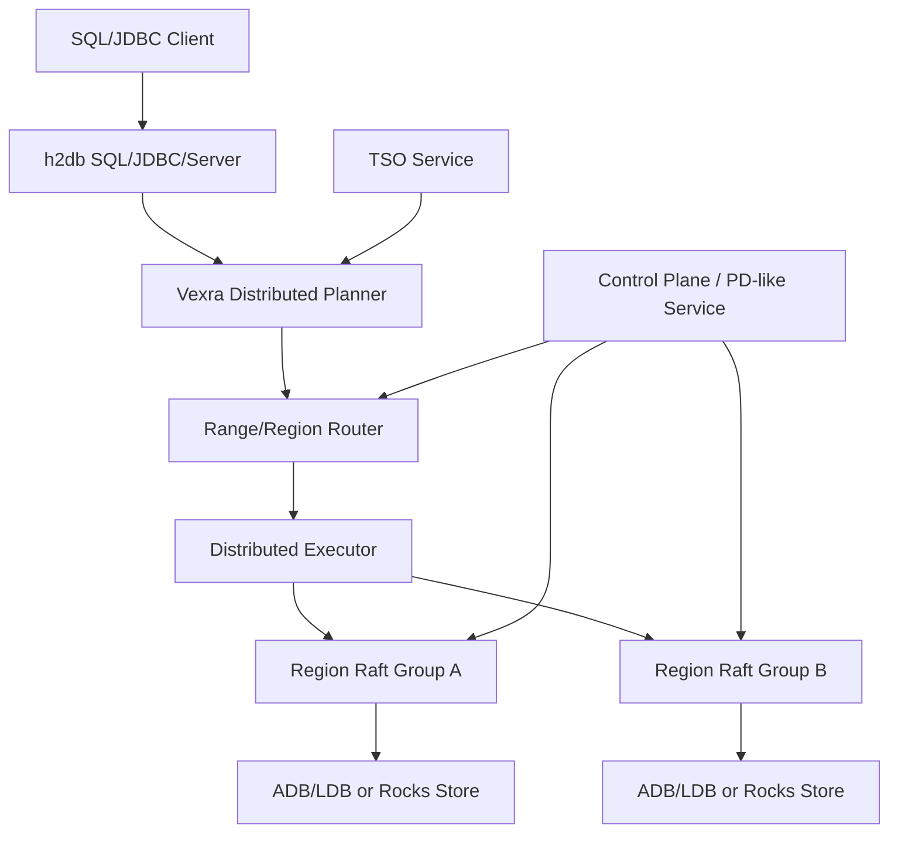

# Roadmap for a TiDB-like Distributed Database

## Background

`vexra-adb` has completed the H2 plugin migration: SQL parsing, JDBC, Server, and tools now come from `h2db`, while ADB keeps table, index, transaction-visibility, and low-level store logic. This solves the single-node SQL integration boundary, but it is still far from a TiDB-like distributed SQL database.

A TiDB-like system needs a SQL layer, distributed execution, distributed transactions, sharded storage, Raft replication, a scheduling control plane, Online DDL, backup/restore, and operational observability. Vexra already has state machine, Raft, ADB/LDB, and plugin-based SQL integration foundations, but these need to be organized into a scalable and fault-tolerant database architecture.

## Goals

- Summarize the remaining work from the current ADB/H2 plugin database to a TiDB-like distributed database.
- Split the work into reviewable and testable milestones.
- Make 2 data nodes + lightweight witness the recommended two-data-replica HA model.
- Avoid making shared storage the default HA direction.

## Non-Goals

- This document does not promise full TiDB, MySQL, or PostgreSQL compatibility.
- This document does not define a new disk format, RPC protocol, or SQL grammar.
- This document does not require all distributed database capabilities to be implemented at once.
- This document does not support pure 2-node strong-consistency automatic failover without a witness.

## Current State

| Module | Current Capability | Gap |
| --- | --- | --- |
| `h2db` | SQL parser, JDBC, Server, plugin SPI | Does not understand Vexra shards, Raft regions, or distributed execution |
| `vexra-adb` | ADB table provider, indexes, transaction visibility, LDB/Rocks adapters | Still close to a single-database/single-node execution model |
| `vexra-ldb` | Local KV store and plugin hooks | Not a distributed region store yet |
| Vexra state machine/Raft | State-machine and consensus foundations | Needs region groups, control plane, and multi-group scheduling |

## Core Constraints

- Strongly consistent writes require quorum or equivalent fencing/lease protection.
- Automatic failover with 2 data nodes and no shared storage requires a witness or external arbiter.
- SQL execution cannot assume all data is local.
- ADB key encoding, MVCC, checkpoint, and restore must remain backward-compatible.
- h2db table/index internals remain managed migration APIs and require contract tests before upgrades.

## Target Architecture

## Remaining Work

| Area | Required Capability | Notes |
| --- | --- | --- |
| SQL | Distributed planner, distributed explain, statistics | h2db plans need to map to Vexra region tasks |
| Execution | scan/filter/limit/count pushdown, later agg/join/sort | Start small instead of building full MPP immediately |
| Routing | table/index key range to region mapping | All reads and writes go through a region router |
| Storage | region split/merge, range scan, snapshot install | Evolve from one DB store to movable regions |
| Replication | one Raft group or equivalent group per region | Define leader, term, epoch, and commit index |
| Transactions | TSO, MVCC, 2PC, lock resolve, GC safe point | This is the core complexity |
| Control plane | PD-like metadata, scheduling, health, placement rules | Manage regions, nodes, leaders, TSO, and scheduling |
| Online DDL | schema version, backfill, recovery | Support long-running DDL such as add/drop index |
| Operations | metrics, tracing, slow query, admin commands | Required for production use |
| Security | users, roles, privileges, TLS, audit | Can be phased by product goal |

## Key Design Tasks

### SQL and Execution

- Define `DistributedPlan` for region tasks, pushed predicates, returned schema, and merge strategy.
- Define `RegionScanTask` with key range, projection, filter, limit, and read timestamp.
- Implement minimal pushdown first: primary-key point lookup, range scan, secondary-index range scan, count.
- Add `EXPLAIN DISTRIBUTED` or equivalent diagnostics.
- Build statistics for row count, region size, and index cardinality.

### Sharding and Replication

- Define region metadata: `regionId`, `startKey`, `endKey`, `epoch`, `replicas`, `leader`.
- Support region split/merge and route epoch updates.
- Define replica roles: data voter, witness voter, learner.
- Support snapshot install, leader transfer, membership changes, and replica repair.
- Start with leader reads, then evaluate read index and follower reads.

### Distributed Transactions

- Add a global TSO service with monotonic `startTs` and `commitTs`.
- Define MVCC write/default/lock semantics or map existing ADB structures explicitly.
- Implement 2PC: prewrite, commit, rollback, lock resolve.
- Clean locks after timeout or client disconnect.
- Define GC safe point to protect long transactions and backup.
- Start with Snapshot Isolation unless a stronger level is explicitly required.

### Control Plane

- Build a PD-like service for cluster membership, region metadata, TSO, and scheduling.
- Support node join/leave, health checks, leader scheduling, and hotspot detection.
- Expose system tables or admin APIs for nodes, regions, locks, transactions, and plugins.
- Make the control plane highly available, preferably on the Vexra Raft state machine.

### DDL and Operations

- Define DDL job states: pending, running, backfilling, public, rollback, failed.
- Bind SQL sessions to schema versions to handle DDL/transaction concurrency.
- Support resumable and rate-limited index backfill.
- Define backup/restore semantics for full, incremental, point-in-time restore, and region checksums.

## 2 Data Nodes + Witness Conclusion

Pure 2 data nodes without shared storage cannot safely provide strong-consistency automatic failover. The recommended model is:

- 2 data nodes keep full data replicas.
- 1 lightweight witness only participates in voting, term/epoch/lease arbitration, and does not store business data.
- Writes require quorum: `A+B`, `A+W`, or `B+W`.
- Without quorum, writes are forbidden; the system can degrade to read-only or unavailable.
- Shared-storage mode remains available but disabled by default as a compatibility/transition mode.

See `docs/two-data-node-witness-ha-design.md` for the dedicated design.

## Milestones

| Phase | Name | Deliverable | Acceptance |
| --- | --- | --- | --- |
| ADB-Cluster-01 | Region metadata and range routing | region metadata, router, system table | A primary-key range routes to regions |
| ADB-Cluster-02 | Region Raft storage | region group, leader, snapshot, membership change | Single-region failure recovery and snapshot install pass |
| ADB-Cluster-03 | 2 data nodes + witness HA | witness voter, fencing, quorum writes | One data-node failure still allows data+witness writes |
| ADB-Cluster-04 | Minimal distributed transaction loop | TSO, MVCC, 2PC, lock resolve | Cross-region commit/rollback is consistent |
| ADB-Cluster-05 | Distributed SQL execution | region scan task, filter/count pushdown | SQL can merge results across regions |
| ADB-Cluster-06 | Online DDL | schema version, index backfill | add index does not block reads/writes and can recover |
| ADB-Cluster-07 | Operations and release | metrics, admin, backup/restore, upgrade flow | rolling upgrade and disaster recovery drills pass |

## Milestone Status

| Phase | Status | Deliverables |
| --- | --- | --- |
| ADB-Cluster-01 | Done | `KeyRange`, `RegionMetadata`, and `RegionRouter` provide byte-order range metadata, point/range routing, overlap validation, and system-table rows. |
| ADB-Cluster-02 | Done | `RegionRaftGroupFactory`, `RegionRaftGroupDescriptor`, `RegionMembershipChangePlan`, and `RegionSnapshotInstallPlan` bind region metadata to the existing RaftGroup, SetConfiguration, learner/listener, witness metadata, and snapshot install planning model. |
| ADB-Cluster-03 | Done | `RegionWitnessBinding` binds region metadata to quorum write fencing, failover planning, and durable witness vote state. The dedicated witness HA model is complete through HA-01 to HA-06. |
| ADB-Cluster-04 | Done | `TimestampOracle`, `InMemoryTimestampOracle`, `TwoPhaseCommitContext`, `TxnParticipant`, `TwoPhaseCommitState`, and `TxnLock` provide monotonic TSO, 2PC state transitions, primary participant validation, commit timestamp checks, rollback constraints, and lock-expiration semantics. |
| ADB-Cluster-05 | Done | `RegionScanTask`, `DistributedPlan`, `RegionQueryResult`, and `DistributedResultMerger` describe region scan pushdown, projection/filter/limit/readTs, count-only plans, row merging, and count aggregation across regions. |
| ADB-Cluster-06 | Done | `DdlJob`, `DdlJobState`, `DdlJobStateMachine`, `SchemaVersion`, and `IndexBackfillProgress` provide Online DDL state transitions, schema-version advancement, rollback/failure paths, and resumable index backfill progress. |
| ADB-Cluster-07 | Done | `ClusterOperationsSnapshot`, `ClusterHealthStatus`, `RollingUpgradePlan`, `BackupRestoreMode`, and `BackupRestorePlan` provide operations metrics/system rows, rolling upgrade sequencing, and backup/restore planning. |

## Runtime Integration Point: ADB Region Write Gate

The next step is to connect the completed region routing and witness quorum-write constraints to the real `vexra-adb` commit path:

- `TxnManager.commit(...)` calls an optional `AdbRegionWriteGate` before allocating `commitTs` and before durable commit.
- The default gate is no-op, preserving single-node ADB/H2 plugin mode and existing `jdbc:adb:*` behavior.
- Distributed mode can install a region-aware gate that maps ADB write-set `DataKey` values through `RegionRouter`, then uses `RegionWitnessBinding` for quorum fencing.
- If the gate fails, the transaction must not enter durable commit; rollback is to remove the gate or switch back to the no-op gate.
- This integration point does not change ADB key encoding, disk format, or the existing store API, and can later be replaced by the real region Raft write path.

## Runtime Integration Point: ADB Region Read Routing

After the write gate, the read path needs a pluggable region-routing entry point before it can evolve into mixed local/remote execution:

- `TxnManager.getVisible(...)`, `entryIterator(...)`, and `indexScanIterator(...)` call an optional `AdbRegionReadRouter` before local store reads.
- The default read router is no-op, preserving the current single-node read path and H2 table/index behavior.
- A region-aware read router only maps point reads, primary-table range scans, and index range scans to regions, and can notify diagnostics/observability components.
- This phase does not change scan cursors, the store API, or result merging; later work can replace this entry point with `RegionScanTask` and a remote executor.
- If the read router fails, the read operation fails; rollback is to remove the router or switch back to the no-op router.

## Remaining Implementation Phases

At the current state, the public models for ADB-Cluster-01 through ADB-Cluster-07 are complete. The real `vexra-adb` write path also has a region write gate, and the real read path has a region read router. The remaining work is no longer model definition; it is wiring those models into runnable distributed execution, replication, transactions, and operations.

There are 2 remaining implementation phases:

| Order | Phase | Goal | Main Deliverables | Acceptance |
| --- | --- | --- | --- | --- |
| 1 | ADB-Runtime-10 | Online DDL runtime integration | schema-version binding, index backfill execution, and failure recovery | add index does not block reads/writes, and backfill can resume |
| 2 | ADB-Runtime-11 | Production operations and security loop | metrics, admin/system tables, backup/restore, rolling upgrade, minimal privileges/TLS | Multi-node smoke, backup/restore drill, and rolling-upgrade drill pass |

The next highest-priority implementation step is Online DDL runtime integration.

### ADB-Runtime-03 Implementation Scope

`ADB-Runtime-03` has completed the local `RegionScanTask` adapter:

- The input is a `Transaction2` and a single `RegionScanTask`; the output is a `RegionQueryResult`.
- The adapter uses `RegionScanTask.keyRange` to scan ADB version keys by range and deduplicates by logical `DataKey`.
- Primary-table row scans use `DefaultVisibleRowResolver`; index scans first use `DefaultVisibleIndexResolver` to validate visible index entries, then look up the primary row.
- This phase returns minimal diagnostic fields: `row_id`, `payload`, and `key_hex`; index scans also return `index_id` and `index_hex`.
- This phase does not implement remote RPC, SQL planner rewrites, store API changes, or disk-format changes.
- The implementation is `AdbLocalRegionScanExecutor`, covered by `AdbLocalRegionScanExecutorTest`.

### ADB-Runtime-04 Implementation Scope

`ADB-Runtime-04` has completed the replaceable boundary for a remote region scan executor:

- Define a region scan request object carrying `RegionScanTask`, transaction ID, read timestamp, count-only flag, and timeout.
- Define an asynchronous scan client interface shared by real RPC, in-process fakes, and the local bridge.
- The distributed executor dispatches multiple region scan requests concurrently and uses `DistributedResultMerger` to merge rows or counts.
- Remote failures, timeouts, and interruption must map to `SQLException`, with regionId included in diagnostic messages.
- This phase does not implement the real network protocol and does not change the public `RegionScanTask` / `RegionQueryResult` models.
- The implementation includes `AdbRegionScanRequest`, `AdbRegionScanClient`, `AdbLocalRegionScanClient`, and `AdbDistributedRegionScanExecutor`, covered by `AdbDistributedRegionScanExecutorTest`.

### ADB-Runtime-05 Implementation Scope

`ADB-Runtime-05` has connected the ADB commit path to a replaceable region commit client:

- After the write gate passes and `commitTs` is allocated, `TxnManager.commit(...)` can call a region commit coordinator instead of directly calling local `DbStore.commitAsync`.
- The coordinator routes the current transaction write set to regions. The first runtime step only allows single-region commits; cross-region commit is deferred to ADB-Runtime-07 2PC.
- The coordinator validates region leader, epoch, and routing results. If validation fails, the transaction must not remain in `COMMITTING`.
- The commit client abstracts real region Raft apply. This phase provides a local bridge client reusing existing `DbStore.commitAsync`; later work can replace it with a real Raft/RPC client.
- This phase does not change the ADB intent/version disk format or the public `DbStore` interface.
- The implementation includes `AdbRegionCommitRequest`, `AdbRegionCommitClient`, `AdbLocalRegionCommitClient`, and `AdbRegionCommitCoordinator`, covered by `AdbRegionCommitCoordinatorTest`.

### ADB-Runtime-06 Implementation Scope

`ADB-Runtime-06` has wired control-plane region metadata snapshots and global TSO into ADB runtime:

- Define an ADB control-plane client that provides region route snapshots and global timestamp allocation.
- Define a session/runtime context that installs the route snapshot into `TxnManager` read router, write commit coordinator, and later extensibility points.
- `TxnManager` supports an optional external timestamp provider. When enabled, `startTs` and `commitTs` come from the control-plane TSO; when disabled, existing single-node counters remain unchanged.
- Route snapshots carry an epoch. A session can refresh explicitly, and new transactions use the refreshed region router.
- This phase does not implement a standalone PD process, does not change JDBC URL semantics, and does not enable distributed mode by default.
- The implementation includes `AdbControlPlaneClient`, `AdbControlPlaneSnapshot`, `InMemoryAdbControlPlaneClient`, `AdbControlPlaneTimestampProvider`, `AdbTimestampProvider`, and `AdbRuntimeSessionContext`, covered by `AdbRuntimeSessionContextTest`.

### ADB-Runtime-07 Implementation Scope

`ADB-Runtime-07` has extended cross-region writes from single-region commit to minimal 2PC orchestration:

- `AdbRegionCommitClient` now has three phases: `prewriteAsync`, `commitAsync`, and `rollbackAsync`. A real Raft/RPC client will implement region-local lock writes, commits, and rollbacks at this boundary.
- `AdbRegionCommitCoordinator` now routes and groups the write set by region. Single-region transactions keep the existing fast path; cross-region transactions choose the region containing the first written key as the primary participant.
- Cross-region transactions prewrite every participant first. After all prewrites succeed, they commit primary first and then secondary participants. A prewrite failure rolls back every participant that has already prewritten.
- If the primary has already committed and a secondary commit fails, the coordinator must not pretend the transaction fully rolled back. It surfaces the failure to the caller; later lock resolve/background cleanup must finish or repair the secondary.
- This phase completed coordinator-level 2PC orchestration, primary participant validation, failure rollback, and fault-injection tests. Real MVCC lock columns, background lock resolve workers, timeout cleanup, and idempotent recovery remain follow-up increments.
- The implementation touches `AdbRegionCommitClient`, `AdbRegionCommitRequest`, `AdbLocalRegionCommitClient`, and `AdbRegionCommitCoordinator`, covered by `AdbRegionCommitCoordinatorTest`.

### ADB-Runtime-08 Implementation Scope

`ADB-Runtime-08` has wired region split/merge and snapshot install into the ADB runtime boundary:

- Defined a control-plane interface that can publish route snapshots, so split/merge can advance route epochs without depending on the in-memory implementation type.
- Provided a minimal region topology manager: generate left/right child regions from a parent region and split key, then publish the new region metadata snapshot. Merge is limited to adjacent-region metadata merge first and does not move data files.
- Provided an ADB region snapshot installer bridge: accept `RegionSnapshotInstallPlan`, validate the target replica, and call `DbStore.restore(...)` to install the snapshot directory.
- This phase reuses the existing `DbStore.checkpoint(...)` / `restore(...)` capability, does not change the LDB/RocksDB disk format, and does not implement real Raft snapshot chunk transfer.
- Validation covers route epoch advancement and correct post-split routing, plus data readability after installing a checkpoint snapshot.
- The implementation touches `AdbRouteSnapshotPublisher`, `AdbRegionTopologyManager`, `AdbRegionSnapshotInstaller`, and `InMemoryAdbControlPlaneClient`, covered by `AdbRegionTopologyManagerTest`.

### ADB-Runtime-09 Implementation Scope

`ADB-Runtime-09` has converted h2db/ADB local scan intent into a distributed execution plan:

- Provided an ADB distributed plan adapter that converts table ID, rowId range, projections, filters, limit, and read timestamp for a table row scan into a region-split `DistributedPlan`.
- The adapter uses the current route snapshot's `RegionRouter` to compute intersections between the scan range and region ranges, so every `RegionScanTask` scans only the key range owned by that region.
- Provided `EXPLAIN DISTRIBUTED`-style plan text including regionId, key range, limit, read timestamp, and count-only flag. This starts as an internal diagnostic API and does not change h2db SQL syntax.
- This phase reuses `AdbDistributedRegionScanExecutor` and `AdbLocalRegionScanClient` to validate basic pushdown execution. Real h2db optimizer rules, statistics-based cost selection, and SQL syntax extensions remain follow-up increments.
- The implementation touches `AdbDistributedPlanAdapter`, covered by `AdbDistributedPlanAdapterTest`.

## Rollback Strategy

- Every phase must keep the single-node ADB/H2 plugin mode as a rollback target.
- Do not change old data format before region metadata is versioned and migration tooling exists.
- If witness mode fails, roll back to `single` or explicit `shared-storage` mode.
- Gate distributed transactions with a feature flag before general rollout.

## Test Plan

- Unit tests: key encoding, region routing, TSO, 2PC state machine, DDL job state machine.
- Integration tests: single region, multi region, cross-node scan, leader transfer, snapshot install.
- Concurrency tests: transaction conflicts, lock cleanup, region split with concurrent reads/writes.
- Fault injection: node crash, network partition, witness loss, disk error, duplicate commit.
- Compatibility tests: old `jdbc:adb:*`, old data directory, h2db minor upgrades.
- Long-running tests: split/merge, GC, checkpoint, backup/restore loops.

## Risks

| Risk | Severity | Description | Mitigation |
| --- | --- | --- | --- |
| Distributed transaction complexity | P0 | 2PC, lock resolve, or GC bugs can break consistency | Start with minimal SI and add fault injection/model tests |
| Pure 2-node misconfiguration | P0 | Automatic failover without witness can split brain | Forbid automatic writes in this configuration |
| h2db planner mismatch | P1 | Local plan cannot represent region pushdown | Add a Vexra `DistributedPlan` layer |
| Region metadata corruption | P0 | Wrong routing can read/write wrong shard | Version, validate, replicate, and provide recovery tooling |
| Operational tooling lag | P1 | Production use is unsafe without observability and recovery | Build metrics/admin/check tools in each phase |

## Open Questions

- Should the control plane be a standalone process or reuse existing Vexra server roles?
- Should TSO live in the control plane or in a state machine plugin?
- Should the first transaction phase support only single-table transactions or cross-table transactions?
- The h2db plan to distributed plan boundary needs prototype validation.
- Does `vexra-ldb` need new plugin contracts for region snapshot, range split, and learner flows?
