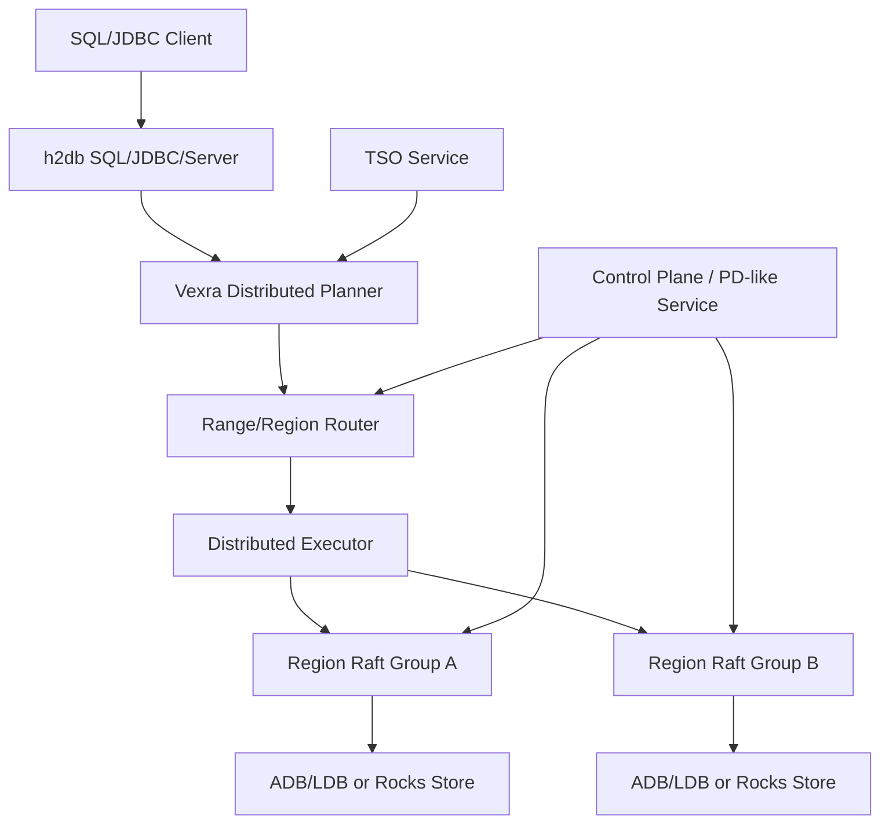

# Vexra 走向 TiDB 类分布式数据库规划

## 背景

当前 `vexra-adb` 已完成 H2 插件化迁移：SQL parser、JDBC、Server、tools 主路径回归 `h2db`，ADB 侧保留表、索引、事务可见性和底层 store 能力。这个状态解决的是“单机 SQL 引擎如何干净接入 ADB 存储”的问题，但距离 TiDB 类分布式 SQL 数据库仍有明显差距。

TiDB 类系统通常由 SQL 层、分布式事务层、分片存储层、Raft 副本层、调度控制面、Online DDL、备份恢复和运维观测面共同构成。Vexra 已有状态机、Raft、ADB/LDB、插件化 SQL 接入等基础，但还需要把这些能力组织成可扩展、可容错、可运维的数据库系统。

## 目标

- 明确从当前 ADB/H2 插件化数据库到 TiDB 类分布式数据库的剩余工作。
- 拆分可评审、可实现、可验证的阶段性里程碑。
- 明确 2 数据节点 + 轻量 witness 是推荐的两数据副本 HA 方向。
- 避免把“共享存储两节点”继续作为默认高可用路线。

## 非目标

- 本文不承诺完全兼容 TiDB、MySQL 或 PostgreSQL。
- 本文不直接定义新的磁盘格式、RPC 协议或 SQL 语法。
- 本文不要求一次性实现所有分布式数据库能力。
- 本文不支持纯 2 节点无 witness 的强一致自动故障切换。

## 现状/已有流程

| 模块 | 当前能力 | 差距 |
| --- | --- | --- |
| `h2db` | 提供 SQL parser、JDBC、Server、插件 SPI | 不理解 Vexra 分片、Raft region、分布式执行计划 |
| `vexra-adb` | ADB table provider、索引、事务可见性、LDB/Rocks 适配 | 仍偏单库/单节点执行模型，缺分片路由和分布式事务协议 |
| `vexra-ldb` | 本地 KV 存储和插件 hook | 不是分布式 region 存储，缺调度、副本和分片元数据 |
| Vexra 状态机/Raft | 有状态机与一致性复制基础 | 需要抽象成 region group、控制面和多 group 调度 |

## 核心约束

- 强一致写入必须获得多数派或等价 fencing/lease 保护。
- 2 数据节点无共享存储时，自动故障切换必须引入 witness 或外部仲裁。
- SQL 层不能假设所有数据都在本地，需要引入分片路由和远程执行。
- ADB key 编码、MVCC、checkpoint/restore 必须向后兼容。
- h2db 内部 table/index API 仍属于迁移期受管依赖，升级 h2db 小版本前必须跑契约测试。

## 总体架构目标

## 剩余工作总览

| 领域 | 必做能力 | 说明 |
| --- | --- | --- |
| SQL 层 | 分布式 planner、分布式 explain、统计信息 | h2db plan 需要映射到 Vexra region scan/task |
| 执行层 | scan/filter/limit/count 下推，后续扩展 agg/join/sort | 先做简单算子，避免一开始实现完整 MPP |
| 路由层 | table/index key range 到 region 的映射 | 所有读写先经过 region router |
| 存储层 | region split/merge、range scan、快照安装 | 从“一个 DB store”演进到“多个可迁移 region” |
| 复制层 | 每 region 一个 Raft group 或等价复制组 | 明确 leader、term、epoch、commit index |
| 事务层 | TSO、MVCC、2PC、lock resolve、GC safe point | 这是 TiDB 类系统的核心复杂度 |
| 控制面 | PD-like 元数据、调度、健康检查、placement rule | 管理 region、节点、leader、TSO 和调度策略 |
| Online DDL | schema version、backfill、失败恢复 | 支持 add/drop index 等长任务 |
| 运维面 | metrics、tracing、slow query、admin command | 没有观测和恢复工具就不能生产化 |
| 安全面 | 用户、角色、权限、TLS、审计 | 根据产品定位分阶段实现 |

## 关键设计任务

### SQL 与执行

- 定义 `DistributedPlan`，承载 region task、下推条件、返回 schema 和合并策略。
- 定义 `RegionScanTask`，包含 key range、projection、filter、limit、read timestamp。
- 实现最小下推：主键点查、主键范围扫、二级索引范围扫、count。
- 增加 `EXPLAIN DISTRIBUTED` 或等价诊断，输出 region 数、下推算子、leader 节点。
- 建立统计信息表，至少覆盖 row count、region size、索引 cardinality。

### 分片与复制

- 定义 region 元数据：`regionId`、`startKey`、`endKey`、`epoch`、`replicas`、`leader`。
- 支持 region split/merge，split 后必须更新路由 epoch。
- 明确每个 region 的复制组模型：data voter、witness voter、learner。
- 支持 snapshot install、leader transfer、成员变更和副本补齐。
- 读路径支持 leader read，后续评估 read index / follower read。

### 分布式事务

- 引入全局时间戳服务 TSO：`startTs`、`commitTs` 单调递增。
- 实现 MVCC write/default/lock 语义，或明确 ADB 现有结构如何映射。
- 实现 2PC：prewrite、commit、rollback、lock resolve。
- 支持事务超时、客户端断连后的锁清理。
- 定义 GC safe point，避免清理仍被长事务或备份使用的历史版本。
- 明确第一阶段隔离级别，建议先支持 Snapshot Isolation。

### 控制面

- 建立 PD-like 服务，负责集群成员、region 元数据、TSO、调度策略。
- 支持节点上下线、region 健康检查、leader 调度、热点检测。
- 提供系统表或 admin API 查询 nodes、regions、locks、transactions、plugins。
- 控制面自身必须高可用，建议复用 Vexra Raft 状态机。

### DDL 与运维

- DDL job 状态机：pending、running、backfilling、public、rollback、failed。
- schema version 与 SQL session 绑定，避免 DDL 与事务并发破坏一致性。
- 支持 index backfill 的断点续跑和限速。
- 建立备份恢复语义：全量、增量、时间点恢复、region checksum。

## 2 数据节点 + witness 结论

纯 2 数据节点、无共享存储、强一致自动故障切换不可安全实现。推荐方案是：

- 2 个 data node 保存完整数据副本。
- 1 个轻量 witness 只参与投票、term/epoch/lease 仲裁，不保存业务数据。
- 写入必须获得多数派，允许 `A+B`、`A+W` 或 `B+W`。
- 没有多数派时禁止写入，可降级只读或不可用。
- 共享存储方案保留但默认关闭，作为兼容/过渡模式。

独立设计见 `docs/two-data-node-witness-ha-design.md`。

## 里程碑规划

| 阶段 | 名称 | 交付物 | 验收 |
| --- | --- | --- | --- |
| ADB-Cluster-01 | 分片元数据与 range 路由 | region 元数据、router、系统表 | 单表主键范围能路由到 region |
| ADB-Cluster-02 | Region Raft 存储 | region group、leader、snapshot、成员变更 | 单 region 故障恢复和 snapshot install 通过 |
| ADB-Cluster-03 | 两数据节点 + witness HA | witness voter、fencing、多数派写入 | 任一 data node 宕机后剩余 data+witness 可写 |
| ADB-Cluster-04 | 分布式事务最小闭环 | TSO、MVCC、2PC、lock resolve | 跨 region 事务提交/回滚一致 |
| ADB-Cluster-05 | 分布式 SQL 执行 | region scan task、filter/count 下推 | SQL 查询可跨 region 合并结果 |
| ADB-Cluster-06 | Online DDL | schema version、index backfill | add index 不阻塞读写且可恢复 |
| ADB-Cluster-07 | 运维与发布 | metrics、admin、backup/restore、升级流程 | 可完成滚动升级和灾难恢复演练 |

## 里程碑状态

| 阶段 | 状态 | 交付物 |
| --- | --- | --- |
| ADB-Cluster-01 | 已完成 | `KeyRange`、`RegionMetadata` 和 `RegionRouter` 提供字节序 range 元数据、点查/范围路由、重叠校验和系统表行。 |
| ADB-Cluster-02 | 已完成 | `RegionRaftGroupFactory`、`RegionRaftGroupDescriptor`、`RegionMembershipChangePlan` 和 `RegionSnapshotInstallPlan` 将 region 元数据绑定到现有 RaftGroup、SetConfiguration、learner/listener、witness 元数据和 snapshot install 规划模型。 |
| ADB-Cluster-03 | 已完成 | `RegionWitnessBinding` 将 region 元数据绑定到多数派写入 fencing、故障切换规划和持久化 witness 投票状态。独立 witness HA 模型已完成 HA-01 到 HA-06。 |
| ADB-Cluster-04 | 已完成 | `TimestampOracle`、`InMemoryTimestampOracle`、`TwoPhaseCommitContext`、`TxnParticipant`、`TwoPhaseCommitState` 和 `TxnLock` 提供单调 TSO、2PC 状态迁移、primary participant 校验、commit timestamp 校验、rollback 约束和锁过期语义。 |
| ADB-Cluster-05 | 已完成 | `RegionScanTask`、`DistributedPlan`、`RegionQueryResult` 和 `DistributedResultMerger` 描述 region scan 下推、projection/filter/limit/readTs、count-only 计划、跨 region 行合并和 count 聚合。 |
| ADB-Cluster-06 | 已完成 | `DdlJob`、`DdlJobState`、`DdlJobStateMachine`、`SchemaVersion` 和 `IndexBackfillProgress` 提供 Online DDL 状态迁移、schema version 推进、rollback/failed 路径和可恢复索引回填进度。 |
| ADB-Cluster-07 | 已完成 | `ClusterOperationsSnapshot`、`ClusterHealthStatus`、`RollingUpgradePlan`、`BackupRestoreMode` 和 `BackupRestorePlan` 提供运维 metrics/system row、滚动升级顺序和备份恢复规划。 |

## 运行时接入点：ADB region 写入 gate

下一步把已完成的 region 路由与 witness 多数派写入约束接入 `vexra-adb` 的真实提交路径：

- `TxnManager.commit(...)` 在分配 `commitTs` 和持久化提交前调用可选的 `AdbRegionWriteGate`。
- 默认 gate 为 no-op，保持单机 ADB/H2 插件模式和旧 `jdbc:adb:*` 行为不变。
- 分布式模式可安装 region-aware gate，把 ADB write set 的 `DataKey` 映射到 `RegionRouter`，再通过 `RegionWitnessBinding` 执行多数派 fencing。
- gate 失败时事务不得进入 durable commit；回滚方式是移除 gate 或切回 no-op gate。
- 该接入点不改变 ADB key 编码、磁盘格式和旧 store API，后续可替换为真正的 region Raft write path。

## 运行时接入点：ADB region 读路由

写入 gate 之后，读路径需要先建立可插拔 region 路由入口，再逐步替换成本地/远程混合执行：

- `TxnManager.getVisible(...)`、`entryIterator(...)` 和 `indexScanIterator(...)` 在执行本地 store 读取前调用可选的 `AdbRegionReadRouter`。
- 默认 read router 为 no-op，保持当前单机读路径和 H2 table/index 行为不变。
- region-aware read router 只负责把点读、主表 range scan、索引 range scan 映射到 region，并可通知诊断/观测组件。
- 本阶段不改变 scan cursor、store API 和返回结果合并逻辑；后续由该入口替换为 `RegionScanTask` 与远程 executor。
- read router 失败时读操作失败；回滚方式是移除 router 或切回 no-op router。

## 后续实现阶段清单

截至当前状态，ADB-Cluster-01 到 ADB-Cluster-07 的公共模型已完成，`vexra-adb` 真实写路径的 region write gate 和真实读路径的 region read router 也已完成。剩余工作不再是“模型定义”，而是把这些模型接到可运行的分布式执行、复制、事务和运维闭环中。

剩余实现阶段共 4 个：

| 顺序 | 阶段 | 目标 | 主要交付物 | 验收 |
| --- | --- | --- | --- | --- |
| 1 | ADB-Runtime-08 | region split/merge 与 snapshot install | split/merge 状态机、路由 epoch 推进、snapshot install 到 ADB store | split 后新旧 route 正确，snapshot install 后数据可读 |
| 2 | ADB-Runtime-09 | h2db plan 到分布式执行计划 | plan adapter、`EXPLAIN DISTRIBUTED`、统计信息最小接入 | SQL 能输出 region task 计划并执行基础下推 |
| 3 | ADB-Runtime-10 | Online DDL 运行时接入 | schema version 绑定、index backfill 执行、失败恢复 | add index 不阻塞读写，backfill 可断点恢复 |
| 4 | ADB-Runtime-11 | 生产化运维与安全闭环 | metrics、admin/system table、backup/restore、滚动升级、权限/TLS 最小集 | 可完成多节点冒烟、备份恢复演练和滚动升级演练 |

下一组优先级最高的落地工作是实现 region split/merge 与 snapshot install。

### ADB-Runtime-03 实施口径

`ADB-Runtime-03` 已完成本地 `RegionScanTask` adapter：

- 输入为 `Transaction2` 和单个 `RegionScanTask`，输出为 `RegionQueryResult`。
- adapter 使用 `RegionScanTask.keyRange` 对 ADB version key 做范围扫描，并按逻辑 `DataKey` 去重。
- 主表 row scan 通过 `DefaultVisibleRowResolver` 读取可见行；索引 scan 先通过 `DefaultVisibleIndexResolver` 判断索引项可见，再回查主表行。
- 本阶段输出最小诊断字段：`row_id`、`payload`、`key_hex`，索引扫描额外输出 `index_id` 和 `index_hex`。
- 本阶段不做远程 RPC、不做 SQL planner 改造、不改变 store API 或磁盘格式。
- 实现类为 `AdbLocalRegionScanExecutor`，测试为 `AdbLocalRegionScanExecutorTest`。

### ADB-Runtime-04 实施口径

`ADB-Runtime-04` 已完成远程 region scan executor 的可替换边界：

- 定义 region scan 请求对象，携带 `RegionScanTask`、事务 ID、读时间戳、count-only 标记和超时时间。
- 定义异步 scan client，真实 RPC、进程内 fake、本地 bridge 都实现同一个接口。
- 分布式 executor 并发派发多个 region scan 请求，并使用 `DistributedResultMerger` 合并 rows 或 count。
- 远程异常、超时、中断必须映射为 `SQLException`，错误消息包含 regionId，方便 SQL 层诊断。
- 本阶段不实现真实网络协议，不改变 `RegionScanTask`/`RegionQueryResult` 的公共模型。
- 实现类包括 `AdbRegionScanRequest`、`AdbRegionScanClient`、`AdbLocalRegionScanClient` 和 `AdbDistributedRegionScanExecutor`，测试为 `AdbDistributedRegionScanExecutorTest`。

### ADB-Runtime-05 实施口径

`ADB-Runtime-05` 已将 ADB 提交路径接入可替换的 region commit client：

- `TxnManager.commit(...)` 在 write gate 通过并分配 `commitTs` 后，可选择调用 region commit coordinator，而不是直接调用本地 `DbStore.commitAsync`。
- coordinator 使用当前事务 write set 路由到 region，第一阶段只允许单 region 提交；跨 region 提交留给 ADB-Runtime-07 的 2PC。
- coordinator 校验 region leader、epoch 和路由结果，失败时事务不得保持在 `COMMITTING`。
- commit client 抽象真实 region Raft apply，本阶段提供本地 bridge client 复用现有 `DbStore.commitAsync`，后续可替换为真实 Raft/RPC client。
- 本阶段不改变 ADB intent/version 磁盘格式，不改变 `DbStore` 公共接口。
- 实现类包括 `AdbRegionCommitRequest`、`AdbRegionCommitClient`、`AdbLocalRegionCommitClient` 和 `AdbRegionCommitCoordinator`，测试为 `AdbRegionCommitCoordinatorTest`。

### ADB-Runtime-06 实施口径

`ADB-Runtime-06` 已接入控制面 region 元数据快照和全局 TSO：

- 定义 ADB 控制面客户端，提供 region route snapshot 和全局 timestamp 分配。
- 定义 session/runtime context，把控制面 route snapshot 安装到 `TxnManager` 的 read router、write commit coordinator 和后续可扩展组件。
- `TxnManager` 支持可选外部 timestamp provider；启用后 `startTs` 和 `commitTs` 来自控制面 TSO，未启用时保持现有单机计数器。
- route snapshot 需要携带 epoch，session 可显式刷新，刷新后新事务使用新的 region router。
- 本阶段不实现独立 PD 进程、不改变 JDBC URL 语义、不要求默认启用分布式模式。
- 实现类包括 `AdbControlPlaneClient`、`AdbControlPlaneSnapshot`、`InMemoryAdbControlPlaneClient`、`AdbControlPlaneTimestampProvider`、`AdbTimestampProvider` 和 `AdbRuntimeSessionContext`，测试为 `AdbRuntimeSessionContextTest`。

### ADB-Runtime-07 实施口径

`ADB-Runtime-07` 已将跨 region 写入从“单 region commit”扩展为最小 2PC 编排：

- `AdbRegionCommitClient` 已增加 `prewriteAsync`、`commitAsync` 和 `rollbackAsync` 三个阶段，真实 Raft/RPC client 后续在该边界实现 region 内锁写入、提交和回滚。
- `AdbRegionCommitCoordinator` 已按 write set 路由并分组 region。单 region 事务保持现有 fast path；跨 region 事务选择第一个写入 key 所在 region 作为 primary participant。
- 跨 region 事务会先对所有 participant 执行 prewrite；prewrite 全部成功后，按 primary 优先顺序执行 commit；prewrite 失败会回滚已 prewrite 的 participant。
- 如果 primary 已提交后 secondary commit 失败，coordinator 不伪装成已完全回滚，而是把失败暴露给上层；后续 lock resolve/后台清理需要基于 primary commit 结果补齐 secondary。
- 本阶段完成 coordinator 级别的 2PC 编排、primary participant 校验、失败回滚和故障注入测试；真实 MVCC lock column、后台 lock resolve worker、超时清理和幂等恢复在后续增量继续深化。
- 实现涉及 `AdbRegionCommitClient`、`AdbRegionCommitRequest`、`AdbLocalRegionCommitClient` 和 `AdbRegionCommitCoordinator`，测试为 `AdbRegionCommitCoordinatorTest`。

## 回滚策略

- 每个阶段必须保留单机 ADB/H2 插件模式作为回滚目标。
- region 元数据上线前不改旧数据格式；上线后需要版本号与迁移工具。
- witness 模式失败时回退到 `single` 或显式 `shared-storage` 模式。
- 分布式事务上线前应支持 feature flag，仅对测试库或指定 namespace 启用。

## 测试方案

- 单元测试：key 编码、region 路由、TSO、2PC 状态机、DDL job 状态机。
- 集成测试：单 region、多 region、跨节点 scan、leader transfer、snapshot install。
- 并发测试：事务冲突、锁清理、region split 与读写并发。
- 故障注入：节点宕机、网络分区、witness 丢失、磁盘错误、重复提交。
- 兼容测试：旧 `jdbc:adb:*`、旧数据目录、h2db 小版本升级。
- 长稳测试：region split/merge、GC、checkpoint、backup/restore 循环。

## 风险点

| 风险 | 等级 | 说明 | 缓解 |
| --- | --- | --- | --- |
| 分布式事务复杂度过高 | P0 | 2PC、lock resolve、GC 任一处错误都会破坏一致性 | 先实现最小 SI，增加故障注入和模型测试 |
| 纯 2 节点误配置 | P0 | 无 witness 自动切主会 split-brain | 配置层禁止该模式自动写入 |
| h2db planner 不适配分布式执行 | P1 | 本地执行计划无法表达 region 下推 | 增加 Vexra DistributedPlan 中间层 |
| region 元数据损坏 | P0 | 路由错误可能导致读写错分片 | 元数据版本、校验、Raft 复制和恢复工具 |
| 运维能力滞后 | P1 | 没有观测和恢复能力时难以生产使用 | 每阶段同步建设 metrics/admin/check 工具 |

## 开放问题

- 控制面是否独立进程，还是复用现有 Vexra server 角色。
- TSO 是否由控制面提供，还是由现有状态机插件提供。
- 第一阶段是否只支持单表事务，还是直接支持跨表事务。
- h2db plan 到分布式执行计划的转换边界需要进一步原型验证。
- `vexra-ldb` 是否需要新增 region snapshot、range split 和 learner 相关插件契约。
