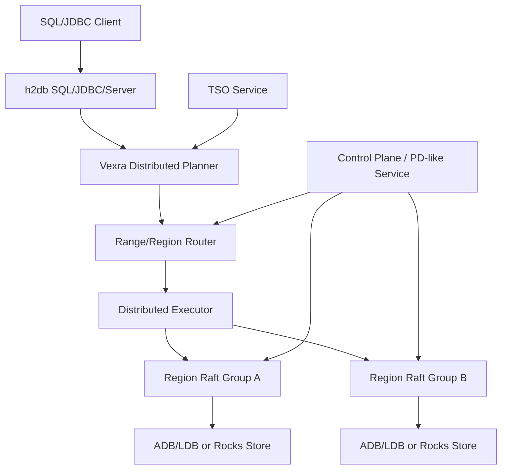

# Vexra 走向 TiDB 类分布式数据库规划

## 背景

当前 `vexra-adb` 已完成 H2 插件化迁移：SQL parser、JDBC、Server、tools 主路径回归 `h2db`，ADB 侧保留表、索引、事务可见性和底层 store 能力。这个状态解决的是“单机 SQL 引擎如何干净接入 ADB 存储”的问题，但距离 TiDB 类分布式 SQL 数据库仍有明显差距。

TiDB 类系统通常由 SQL 层、分布式事务层、分片存储层、Raft 副本层、调度控制面、Online DDL、备份恢复和运维观测面共同构成。Vexra 已有状态机、Raft、ADB/LDB、插件化 SQL 接入等基础，但还需要把这些能力组织成可扩展、可容错、可运维的数据库系统。

## 目标

- 明确从当前 ADB/H2 插件化数据库到 TiDB 类分布式数据库的剩余工作。
- 拆分可评审、可实现、可验证的阶段性里程碑。
- 明确 2 数据节点 + 轻量 witness 是推荐的两数据副本 HA 方向。
- 避免把“共享存储两节点”继续作为默认高可用路线。

## 非目标

- 本文不承诺完全兼容 TiDB、MySQL 或 PostgreSQL。
- 本文不直接定义新的磁盘格式、RPC 协议或 SQL 语法。
- 本文不要求一次性实现所有分布式数据库能力。
- 本文不支持纯 2 节点无 witness 的强一致自动故障切换。

## 现状/已有流程

| 模块 | 当前能力 | 差距 |
| --- | --- | --- |
| `h2db` | 提供 SQL parser、JDBC、Server、插件 SPI | 不理解 Vexra 分片、Raft region、分布式执行计划 |
| `vexra-adb` | ADB table provider、索引、事务可见性、LDB/Rocks 适配 | 仍偏单库/单节点执行模型，缺分片路由和分布式事务协议 |
| `vexra-ldb` | 本地 KV 存储和插件 hook | 不是分布式 region 存储，缺调度、副本和分片元数据 |
| Vexra 状态机/Raft | 有状态机与一致性复制基础 | 需要抽象成 region group、控制面和多 group 调度 |

## 核心约束

- 强一致写入必须获得多数派或等价 fencing/lease 保护。
- 2 数据节点无共享存储时，自动故障切换必须引入 witness 或外部仲裁。
- SQL 层不能假设所有数据都在本地，需要引入分片路由和远程执行。
- ADB key 编码、MVCC、checkpoint/restore 必须向后兼容。
- h2db 内部 table/index API 仍属于迁移期受管依赖，升级 h2db 小版本前必须跑契约测试。

## 总体架构目标

## 剩余工作总览

| 领域 | 必做能力 | 说明 |
| --- | --- | --- |
| SQL 层 | 分布式 planner、分布式 explain、统计信息 | h2db plan 需要映射到 Vexra region scan/task |
| 执行层 | scan/filter/limit/count 下推，后续扩展 agg/join/sort | 先做简单算子，避免一开始实现完整 MPP |
| 路由层 | table/index key range 到 region 的映射 | 所有读写先经过 region router |
| 存储层 | region split/merge、range scan、快照安装 | 从“一个 DB store”演进到“多个可迁移 region” |
| 复制层 | 每 region 一个 Raft group 或等价复制组 | 明确 leader、term、epoch、commit index |
| 事务层 | TSO、MVCC、2PC、lock resolve、GC safe point | 这是 TiDB 类系统的核心复杂度 |
| 控制面 | PD-like 元数据、调度、健康检查、placement rule | 管理 region、节点、leader、TSO 和调度策略 |
| Online DDL | schema version、backfill、失败恢复 | 支持 add/drop index 等长任务 |
| 运维面 | metrics、tracing、slow query、admin command | 没有观测和恢复工具就不能生产化 |
| 安全面 | 用户、角色、权限、TLS、审计 | 根据产品定位分阶段实现 |

## 关键设计任务

### SQL 与执行

- 定义 `DistributedPlan`，承载 region task、下推条件、返回 schema 和合并策略。
- 定义 `RegionScanTask`，包含 key range、projection、filter、limit、read timestamp。
- 实现最小下推：主键点查、主键范围扫、二级索引范围扫、count。
- 增加 `EXPLAIN DISTRIBUTED` 或等价诊断，输出 region 数、下推算子、leader 节点。
- 建立统计信息表，至少覆盖 row count、region size、索引 cardinality。

### 分片与复制

- 定义 region 元数据：`regionId`、`startKey`、`endKey`、`epoch`、`replicas`、`leader`。
- 支持 region split/merge，split 后必须更新路由 epoch。
- 明确每个 region 的复制组模型：data voter、witness voter、learner。
- 支持 snapshot install、leader transfer、成员变更和副本补齐。
- 读路径支持 leader read，后续评估 read index / follower read。

### 分布式事务

- 引入全局时间戳服务 TSO：`startTs`、`commitTs` 单调递增。
- 实现 MVCC write/default/lock 语义，或明确 ADB 现有结构如何映射。
- 实现 2PC：prewrite、commit、rollback、lock resolve。
- 支持事务超时、客户端断连后的锁清理。
- 定义 GC safe point，避免清理仍被长事务或备份使用的历史版本。
- 明确第一阶段隔离级别，建议先支持 Snapshot Isolation。

### 控制面

- 建立 PD-like 服务，负责集群成员、region 元数据、TSO、调度策略。
- 支持节点上下线、region 健康检查、leader 调度、热点检测。
- 提供系统表或 admin API 查询 nodes、regions、locks、transactions、plugins。
- 控制面自身必须高可用，建议复用 Vexra Raft 状态机。

### DDL 与运维

- DDL job 状态机：pending、running、backfilling、public、rollback、failed。
- schema version 与 SQL session 绑定，避免 DDL 与事务并发破坏一致性。
- 支持 index backfill 的断点续跑和限速。
- 建立备份恢复语义：全量、增量、时间点恢复、region checksum。

## 2 数据节点 + witness 结论

纯 2 数据节点、无共享存储、强一致自动故障切换不可安全实现。推荐方案是：

- 2 个 data node 保存完整数据副本。
- 1 个轻量 witness 只参与投票、term/epoch/lease 仲裁，不保存业务数据。
- 写入必须获得多数派，允许 `A+B`、`A+W` 或 `B+W`。
- 没有多数派时禁止写入，可降级只读或不可用。
- 共享存储方案保留但默认关闭，作为兼容/过渡模式。

独立设计见 `docs/two-data-node-witness-ha-design.md`。

## 里程碑规划

| 阶段 | 名称 | 交付物 | 验收 |
| --- | --- | --- | --- |
| ADB-Cluster-01 | 分片元数据与 range 路由 | region 元数据、router、系统表 | 单表主键范围能路由到 region |
| ADB-Cluster-02 | Region Raft 存储 | region group、leader、snapshot、成员变更 | 单 region 故障恢复和 snapshot install 通过 |
| ADB-Cluster-03 | 两数据节点 + witness HA | witness voter、fencing、多数派写入 | 任一 data node 宕机后剩余 data+witness 可写 |
| ADB-Cluster-04 | 分布式事务最小闭环 | TSO、MVCC、2PC、lock resolve | 跨 region 事务提交/回滚一致 |
| ADB-Cluster-05 | 分布式 SQL 执行 | region scan task、filter/count 下推 | SQL 查询可跨 region 合并结果 |
| ADB-Cluster-06 | Online DDL | schema version、index backfill | add index 不阻塞读写且可恢复 |
| ADB-Cluster-07 | 运维与发布 | metrics、admin、backup/restore、升级流程 | 可完成滚动升级和灾难恢复演练 |

## 里程碑状态

| 阶段 | 状态 | 交付物 |
| --- | --- | --- |
| ADB-Cluster-01 | 已完成 | `KeyRange`、`RegionMetadata` 和 `RegionRouter` 提供字节序 range 元数据、点查/范围路由、重叠校验和系统表行。 |
| ADB-Cluster-02 | 已完成 | `RegionRaftGroupFactory`、`RegionRaftGroupDescriptor`、`RegionMembershipChangePlan` 和 `RegionSnapshotInstallPlan` 将 region 元数据绑定到现有 RaftGroup、SetConfiguration、learner/listener、witness 元数据和 snapshot install 规划模型。 |
| ADB-Cluster-03 | 已完成 | `RegionWitnessBinding` 将 region 元数据绑定到多数派写入 fencing、故障切换规划和持久化 witness 投票状态。独立 witness HA 模型已完成 HA-01 到 HA-06。 |
| ADB-Cluster-04 | 已完成 | `TimestampOracle`、`InMemoryTimestampOracle`、`TwoPhaseCommitContext`、`TxnParticipant`、`TwoPhaseCommitState` 和 `TxnLock` 提供单调 TSO、2PC 状态迁移、primary participant 校验、commit timestamp 校验、rollback 约束和锁过期语义。 |
| ADB-Cluster-05 | 已完成 | `RegionScanTask`、`DistributedPlan`、`RegionQueryResult` 和 `DistributedResultMerger` 描述 region scan 下推、projection/filter/limit/readTs、count-only 计划、跨 region 行合并和 count 聚合。 |
| ADB-Cluster-06 | 已完成 | `DdlJob`、`DdlJobState`、`DdlJobStateMachine`、`SchemaVersion` 和 `IndexBackfillProgress` 提供 Online DDL 状态迁移、schema version 推进、rollback/failed 路径和可恢复索引回填进度。 |
| ADB-Cluster-07 | 已完成 | `ClusterOperationsSnapshot`、`ClusterHealthStatus`、`RollingUpgradePlan`、`BackupRestoreMode` 和 `BackupRestorePlan` 提供运维 metrics/system row、滚动升级顺序和备份恢复规划。 |

## 运行时接入点：ADB region 写入 gate

下一步把已完成的 region 路由与 witness 多数派写入约束接入 `vexra-adb` 的真实提交路径：

- `TxnManager.commit(...)` 在分配 `commitTs` 和持久化提交前调用可选的 `AdbRegionWriteGate`。
- 默认 gate 为 no-op，保持单机 ADB/H2 插件模式和旧 `jdbc:adb:*` 行为不变。
- 分布式模式可安装 region-aware gate，把 ADB write set 的 `DataKey` 映射到 `RegionRouter`，再通过 `RegionWitnessBinding` 执行多数派 fencing。
- gate 失败时事务不得进入 durable commit；回滚方式是移除 gate 或切回 no-op gate。
- 该接入点不改变 ADB key 编码、磁盘格式和旧 store API，后续可替换为真正的 region Raft write path。

## 运行时接入点：ADB region 读路由

写入 gate 之后，读路径需要先建立可插拔 region 路由入口，再逐步替换成本地/远程混合执行：

- `TxnManager.getVisible(...)`、`entryIterator(...)` 和 `indexScanIterator(...)` 在执行本地 store 读取前调用可选的 `AdbRegionReadRouter`。
- 默认 read router 为 no-op，保持当前单机读路径和 H2 table/index 行为不变。
- region-aware read router 只负责把点读、主表 range scan、索引 range scan 映射到 region，并可通知诊断/观测组件。
- 本阶段不改变 scan cursor、store API 和返回结果合并逻辑；后续由该入口替换为 `RegionScanTask` 与远程 executor。
- read router 失败时读操作失败；回滚方式是移除 router 或切回 no-op router。

## 后续实现阶段清单

截至当前状态，ADB-Cluster-01 到 ADB-Cluster-07 的公共模型已完成，`vexra-adb` 真实写路径的 region write gate 和真实读路径的 region read router 也已完成。剩余工作不再是“模型定义”，而是把这些模型接到可运行的分布式执行、复制、事务和运维闭环中。

当前路线图中的 ADB-Runtime-01 到 ADB-Runtime-11 已全部完成，剩余实现阶段共 0 个。

| 顺序 | 阶段 | 目标 | 主要交付物 | 验收 |
| --- | --- | --- | --- | --- |
| - | - | - | - | - |

下一组优先级最高的落地工作不再是当前 1-11 阶段内的功能补齐，而是把这些运行时边界接到真实多节点部署、真实 Raft/RPC、证书/权限系统和长稳压测中。

### ADB-Runtime-03 实施口径

`ADB-Runtime-03` 已完成本地 `RegionScanTask` adapter：

- 输入为 `Transaction2` 和单个 `RegionScanTask`，输出为 `RegionQueryResult`。
- adapter 使用 `RegionScanTask.keyRange` 对 ADB version key 做范围扫描，并按逻辑 `DataKey` 去重。
- 主表 row scan 通过 `DefaultVisibleRowResolver` 读取可见行；索引 scan 先通过 `DefaultVisibleIndexResolver` 判断索引项可见，再回查主表行。
- 本阶段输出最小诊断字段：`row_id`、`payload`、`key_hex`，索引扫描额外输出 `index_id` 和 `index_hex`。
- 本阶段不做远程 RPC、不做 SQL planner 改造、不改变 store API 或磁盘格式。
- 实现类为 `AdbLocalRegionScanExecutor`，测试为 `AdbLocalRegionScanExecutorTest`。

### ADB-Runtime-04 实施口径

`ADB-Runtime-04` 已完成远程 region scan executor 的可替换边界：

- 定义 region scan 请求对象，携带 `RegionScanTask`、事务 ID、读时间戳、count-only 标记和超时时间。
- 定义异步 scan client，真实 RPC、进程内 fake、本地 bridge 都实现同一个接口。
- 分布式 executor 并发派发多个 region scan 请求，并使用 `DistributedResultMerger` 合并 rows 或 count。
- 远程异常、超时、中断必须映射为 `SQLException`，错误消息包含 regionId，方便 SQL 层诊断。
- 本阶段不实现真实网络协议，不改变 `RegionScanTask`/`RegionQueryResult` 的公共模型。
- 实现类包括 `AdbRegionScanRequest`、`AdbRegionScanClient`、`AdbLocalRegionScanClient` 和 `AdbDistributedRegionScanExecutor`，测试为 `AdbDistributedRegionScanExecutorTest`。

### ADB-Runtime-05 实施口径

`ADB-Runtime-05` 已将 ADB 提交路径接入可替换的 region commit client：

- `TxnManager.commit(...)` 在 write gate 通过并分配 `commitTs` 后，可选择调用 region commit coordinator，而不是直接调用本地 `DbStore.commitAsync`。
- coordinator 使用当前事务 write set 路由到 region，第一阶段只允许单 region 提交；跨 region 提交留给 ADB-Runtime-07 的 2PC。
- coordinator 校验 region leader、epoch 和路由结果，失败时事务不得保持在 `COMMITTING`。
- commit client 抽象真实 region Raft apply，本阶段提供本地 bridge client 复用现有 `DbStore.commitAsync`，后续可替换为真实 Raft/RPC client。
- 本阶段不改变 ADB intent/version 磁盘格式，不改变 `DbStore` 公共接口。
- 实现类包括 `AdbRegionCommitRequest`、`AdbRegionCommitClient`、`AdbLocalRegionCommitClient` 和 `AdbRegionCommitCoordinator`，测试为 `AdbRegionCommitCoordinatorTest`。

### ADB-Runtime-06 实施口径

`ADB-Runtime-06` 已接入控制面 region 元数据快照和全局 TSO：

- 定义 ADB 控制面客户端，提供 region route snapshot 和全局 timestamp 分配。
- 定义 session/runtime context，把控制面 route snapshot 安装到 `TxnManager` 的 read router、write commit coordinator 和后续可扩展组件。
- `TxnManager` 支持可选外部 timestamp provider；启用后 `startTs` 和 `commitTs` 来自控制面 TSO，未启用时保持现有单机计数器。
- route snapshot 需要携带 epoch，session 可显式刷新，刷新后新事务使用新的 region router。
- 本阶段不实现独立 PD 进程、不改变 JDBC URL 语义、不要求默认启用分布式模式。
- 实现类包括 `AdbControlPlaneClient`、`AdbControlPlaneSnapshot`、`InMemoryAdbControlPlaneClient`、`AdbControlPlaneTimestampProvider`、`AdbTimestampProvider` 和 `AdbRuntimeSessionContext`，测试为 `AdbRuntimeSessionContextTest`。

### ADB-Runtime-07 实施口径

`ADB-Runtime-07` 已将跨 region 写入从“单 region commit”扩展为最小 2PC 编排：

- `AdbRegionCommitClient` 已增加 `prewriteAsync`、`commitAsync` 和 `rollbackAsync` 三个阶段，真实 Raft/RPC client 后续在该边界实现 region 内锁写入、提交和回滚。
- `AdbRegionCommitCoordinator` 已按 write set 路由并分组 region。单 region 事务保持现有 fast path；跨 region 事务选择第一个写入 key 所在 region 作为 primary participant。
- 跨 region 事务会先对所有 participant 执行 prewrite；prewrite 全部成功后，按 primary 优先顺序执行 commit；prewrite 失败会回滚已 prewrite 的 participant。
- 如果 primary 已提交后 secondary commit 失败，coordinator 不伪装成已完全回滚，而是把失败暴露给上层；后续 lock resolve/后台清理需要基于 primary commit 结果补齐 secondary。
- 本阶段完成 coordinator 级别的 2PC 编排、primary participant 校验、失败回滚和故障注入测试；真实 MVCC lock column、后台 lock resolve worker、超时清理和幂等恢复在后续增量继续深化。
- 实现涉及 `AdbRegionCommitClient`、`AdbRegionCommitRequest`、`AdbLocalRegionCommitClient` 和 `AdbRegionCommitCoordinator`，测试为 `AdbRegionCommitCoordinatorTest`。

### ADB-Runtime-08 实施口径

`ADB-Runtime-08` 已将 region split/merge 和 snapshot install 接到 ADB 运行时边界：

- 已定义可发布 route snapshot 的控制面接口，使 split/merge 可以在不依赖内存实现类型的情况下推进 route epoch。
- 已提供最小 region topology manager：根据父 region 和 split key 生成左右子 region，并发布新的 region 元数据快照；merge 先限定为相邻 region 的元数据合并，不移动数据文件。
- 已提供 ADB region snapshot installer bridge：接收 `RegionSnapshotInstallPlan`，校验目标副本后调用 `DbStore.restore(...)` 安装快照目录。
- 本阶段复用现有 `DbStore.checkpoint(...)`/`restore(...)` 能力，不改变 LDB/RocksDB 磁盘格式，不实现真实 Raft snapshot chunk 传输。
- 验证覆盖 split 后 route epoch 递增且新路由命中正确 region，以及从 checkpoint 安装 snapshot 后数据仍可读。
- 实现涉及 `AdbRouteSnapshotPublisher`、`AdbRegionTopologyManager`、`AdbRegionSnapshotInstaller` 和 `InMemoryAdbControlPlaneClient`，测试为 `AdbRegionTopologyManagerTest`。

### ADB-Runtime-09 实施口径

`ADB-Runtime-09` 已将 h2db/ADB 的本地扫描意图转换为分布式执行计划：

- 已提供 ADB distributed plan adapter，把 table row scan 的表 ID、rowId 范围、projection、filter、limit、read timestamp 转换为按 region 切分的 `DistributedPlan`。
- adapter 使用当前 route snapshot 的 `RegionRouter` 计算 scan range 与 region range 的交集，保证每个 `RegionScanTask` 只扫描自己负责的 key range。
- 已提供 `EXPLAIN DISTRIBUTED` 风格的计划文本，输出 regionId、key range、limit、read timestamp 和 count-only 标记，先作为内部诊断 API，不改 h2db SQL 语法。
- 本阶段复用 `AdbDistributedRegionScanExecutor` 和 `AdbLocalRegionScanClient` 验证基础 pushdown 执行；真实 h2db optimizer rule、统计信息代价选择和 SQL 语法扩展继续留在后续增量。
- 实现涉及 `AdbDistributedPlanAdapter`，测试为 `AdbDistributedPlanAdapterTest`。

### ADB-Runtime-10 实施口径

`ADB-Runtime-10` 已将 Online DDL 公共模型接入 ADB 运行时：

- 已提供 ADB Online DDL runtime controller，复用 `DdlJobStateMachine`、`SchemaVersion` 和 `IndexBackfillProgress` 管理 ADD_INDEX job 生命周期。
- controller 在 RUNNING 阶段把目标索引标记为 `BUILDING`，在 PUBLIC 阶段把索引标记为 `READY`，并通过 schema version 推进保护 session 读到一致元数据。
- backfill 已实现可恢复进度推进接口，记录 lastCompletedKey 和 completedRows，支持 controller 重建后继续从已有 job 进度恢复。
- 本阶段不直接实现真实索引 KV 回填扫描器，不改变 h2db DDL 语法；真实 backfill worker 和失败补偿继续在后续增量完善。
- 实现涉及 `AdbOnlineDdlRuntimeController`，测试为 `AdbOnlineDdlRuntimeControllerTest`。

### ADB-Runtime-11 实施口径

`ADB-Runtime-11` 已将生产化运维与安全闭环接到 ADB 运行时的最小可验证边界：

- 已提供 ADB runtime operations bridge，基于控制面 route snapshot 输出 `ClusterOperationsSnapshot`、system table row 和 metrics。
- 已提供 backup/restore drill bridge，复用 `BackupRestorePlan` 和 `DbStore.checkpoint(...)`/`restore(...)` 执行本地全量备份恢复演练。
- 已提供 distributed runtime options，默认关闭分布式模式；显式启用分布式模式时要求 TLS 和最小权限标记同时开启，避免测试配置误入生产。
- 本阶段不实现真实多节点部署脚本、证书签发、权限系统或滚动升级执行器；这些属于生产发行工程，但已有运行时门面可以承接后续集成。
- 实现涉及 `AdbDistributedRuntimeOptions` 和 `AdbRuntimeOperationsBridge`，测试为 `AdbRuntimeOperationsBridgeTest`。

## 当前路线图完成后的剩余生产化工作

当前 1-11 阶段已经把 TiDB-like 分布式数据库所需的关键运行时边界落到代码和测试中，但“生产可用”仍需要后续工程化工作验证：

- 将 region scan/commit client 替换为真实 Raft/RPC client，并通过多进程、多节点冒烟验证。
- 将 2PC 的 MVCC lock column、lock resolve worker、幂等恢复和 GC safe point 补到真实存储格式。
- 将 h2db optimizer rule、`EXPLAIN DISTRIBUTED` SQL 语法、统计信息和代价选择接到真实 SQL 路径。
- 将 Online DDL backfill worker 接到真实索引 KV 回填、失败补偿和长任务调度。
- 完成证书签发、权限系统、滚动升级执行器、备份介质集成和长稳压测。

## Post-Runtime 生产化阶段

当前 1-11 阶段之后继续按以下生产化阶段推进。截至 2026-06-13，按阶段验收口径统计，生产化阶段共 6 个；
已完成 0 个、进行中 2 个、未开始 4 个。因此，如果问题是“还有多少个阶段需要做到完成验收”，答案是还剩 6 个；
如果只统计“尚未启动”的阶段，则还剩 4 个。`ADB-Prod-01` 和 `ADB-Prod-02` 已完成部分子交付，但仍未达到阶段验收。

本计划后续执行继续以 6 个生产化阶段为追踪对象：先收敛 `ADB-Prod-01` 的 OS 级多进程多节点 smoke 与 `ADB-Prod-02` 的集群级 lock/GC 闭环，再进入 `ADB-Prod-03` 到 `ADB-Prod-06`。每个阶段完成后仍需本地提交。

| 口径 | 数量 | 说明 |
| --- | --- | --- |
| 已完成生产化阶段 | 0 | 尚无生产化阶段达到完整验收标准。 |
| 进行中生产化阶段 | 2 | `ADB-Prod-01` 已完成真实 RaftServer/GRPC JUnit smoke，但仍缺 OS 级多进程多节点 smoke；`ADB-Prod-02` 已推进 durable lock、批量 resolve、secondary 前滚、后台 lock resolve worker、primary 状态查询边界、primary-status read path、控制面路由 primary-status reader、RClient registry 刷新器、committed version GC cleaner、后台 committed version GC worker、集群级 GC 分片调度边界和 region-scoped cleaner，但仍缺真实部署层连接工厂接入、全局 safe point 推进和长事务/部分提交验收闭环。 |
| 未开始生产化阶段 | 4 | `ADB-Prod-03` 到 `ADB-Prod-06` 尚未开始。 |
| 剩余需完成生产化阶段 | 6 | 包含当前进行中的 `ADB-Prod-01`、`ADB-Prod-02` 和后续 4 个未开始阶段。 |

| 顺序 | 阶段 | 状态 | 目标 | 主要交付物 | 验收 |
| --- | --- | --- | --- | --- | --- |
| 1 | ADB-Prod-01 | 进行中 | region Raft/RPC client 接入 | commit/scan transport、请求响应模型、超时和错误映射 | 2PC coordinator 可替换为 RPC client，故障和超时测试通过 |
| 2 | ADB-Prod-02 | 进行中 | 真实 MVCC lock resolve 与 GC | lock column、primary/secondary resolve、safe point、committed version GC cleaner、后台 committed version GC worker | 部分提交、锁过期、GC 保护长事务和集群级后台清理测试通过 |
| 3 | ADB-Prod-03 | 未开始 | SQL 路径真实接入 | h2db optimizer adapter、`EXPLAIN DISTRIBUTED` SQL、统计信息 | JDBC SQL 可输出并执行分布式计划 |
| 4 | ADB-Prod-04 | 未开始 | Online DDL backfill worker | index KV 回填、断点续跑、失败补偿 | add index 长任务可恢复并最终 READY |
| 5 | ADB-Prod-05 | 未开始 | 多节点部署与安全 | 启动脚本、TLS/权限、系统表、滚动升级 | 多进程冒烟、备份恢复、滚动升级演练通过 |
| 6 | ADB-Prod-06 | 未开始 | 长稳与故障注入 | 网络分区、leader 切换、磁盘错误、压测报告 | 长稳和故障注入报告达标 |

### ADB-Prod-01 当前进展

`ADB-Prod-01` 已完成 region commit RPC client 和 region scan RPC transport
的第一组真实接入边界：

- `AdbRpcRegionCommitClient` 将 2PC prewrite/commit/rollback 阶段映射到可替换 `AdbRegionCommitTransport`，并统一处理失败响应、transport 异常和 client 侧超时。
- `AdbRaftRegionCommitTransport` 已接到现有 `RClient`/`RaftRClient` 写请求能力：`PREWRITE` 映射为 ADB proto `Prewrite`，`COMMIT` 映射为 `Commit`，`ROLLBACK` 映射为 `Rollback`。
- `AdbSMPlugin` 已补齐 `Rollback` 写请求处理，避免 `RaftStore.rollbackAsync(...)` 发送到状态机后无效。
- `AdbRaftRegionScanClient` 已通过现有 `RClient`/`ReadRequest.RegionScan` 读取 region key range，支持分页、count-only 结果和失败响应到 `SQLException` 的映射；raw `Scan` 仍保留为底层 KV 能力。
- `Prewrite`/`PrewriteMutation` proto 已补齐，`AdbRaftRegionCommitTransport` 的 PREWRITE 阶段已发送真实 prewrite 请求，`AdbSMPlugin` 会将 prewrite mutation 落成现有 ADB 未提交 `VersionKey` intent 和 `TxnRefKey`。
- `RegionScan`/`RegionScanResult` proto 已补齐，`AdbRegionScanReader` 在 region 状态机侧完成最小 MVCC 可见性归并，`AdbRaftRegionScanClient` 已改为发送专用 region scan 请求。
- `LocalRClient` 已补齐 `Prewrite`、`Commit`、`Rollback`、`RegionScan` 和 async 方法，`AdbRegionRpcSmokeTest` 已覆盖 commit/scan 的 RClient 协议闭环。
- `AdbRealRaftRegionRpcSmokeTest` 已启动 3 个真实 `RaftServer` + GRPC 节点，通过 `RaftRClient` 覆盖 prewrite、commit 和 region scan 的多节点 Raft/RPC 协议链路。
- 当前仍未实现多进程多节点 Raft/RPC 冒烟；它继续属于 `ADB-Prod-01` 后续工作。

本轮 `ADB-Prod-01` 的 prewrite 落地口径：

- 在 ADB proto 中新增向后兼容的 `Prewrite` oneof 分支，携带 txnId、startTs、primary lock 信息、TTL 和当前 region 的 mutation 列表。
- `AdbRaftRegionCommitTransport` 的 PREWRITE 阶段不再发送空 batch，而是发送 `Prewrite` 请求。
- 状态机收到 `Prewrite` 后复用现有 ADB intent/ref 磁盘语义：写入未提交 `VersionKey` 和 `TxnRefKey`，后续 `Commit`/`Rollback` 继续复用现有 `DbStore.commitAsync`/`rollbackAsync`。
- 本增量只解决真实 prewrite 请求和 durable intent 写入；锁超时解析、primary/secondary resolve、GC safe point 和后台清理仍归入 `ADB-Prod-02`。

本轮 `ADB-Prod-01` 的 region scan proto 下沉口径：

- 在 ADB proto 中新增 `RegionScan` / `RegionScanResult`，让 region 状态机直接接收 read timestamp、limit、count-only 和 key range。
- 状态机在 region 内完成最小 MVCC 可见性归并，只返回可见行 payload/count，而不是把原始版本 KV 暴露给 client。
- `AdbRaftRegionScanClient` 改为发送专用 `RegionScan`，保留 raw `Scan` 作为底层 KV 能力和回滚路径。
- 本增量不引入完整 filter/projection proto，复杂 SQL pushdown 和代价选择继续留给 `ADB-Prod-03`。

本轮 `ADB-Prod-01` 的 smoke 基线口径：

- 补齐 `LocalRClient` 对 `Prewrite`、`Commit`、`Rollback`、`RegionScan` 和 async 方法的支持，让单进程 smoke 与 Raft/RPC 使用同一 ADB proto。
- 增加 ADB region RPC smoke 测试，覆盖通过 `AdbRpcRegionCommitClient` + `AdbRaftRegionCommitTransport` 预写、提交，再通过 `AdbRaftRegionScanClient` 读取可见行。
- 该 smoke 基线只证明 RClient 协议闭环；真正的多进程多节点启动、leader 发现、端口分配、日志目录隔离和进程清理仍需要后续脚本化验证。

本轮 `ADB-Prod-01` 的真实 RaftServer/GRPC smoke 口径：

- 在 JUnit 内启动 3 个真实 `RaftServer`，每个 server 使用独立 GRPC 端口、storage 目录和 cache 目录，并加载 `AdbStateMachine`。
- 通过 `RaftRClient` 走真实 GRPC Raft client 路径发送 ADB proto，覆盖 prewrite、commit 和 region scan。
- 该基线验证多节点 Raft/RPC 协议链路和 ADB 状态机接入，不等同于 OS 多进程部署验收；独立进程启动脚本、日志目录隔离、端口回收和异常进程清理仍留在 `ADB-Prod-01` 的最后收尾。

### ADB-Prod-02 当前进展

`ADB-Prod-02` 的第一步已补齐真实 lock resolve 和 GC safe point 的运行时入口：

- `AdbTxnLock` 新增 ADB 专用 lock record，除 common `TxnLock` 的 key、primary key、startTs、region 和 TTL 外，补充 rollback 必需的 txnId。
- `AdbLockResolver` 新增 lock resolver，先支持对已过期 lock 调用现有 `DbStore.rollbackAsync(txnId)` 清理 durable intent 和 `TxnRefKey`。
- `AdbGcSafePointManager` 新增 GC safe point manager，保证 safe point 单调推进，并在存在活跃长事务时阻止推进到可能破坏快照读的时间戳。
- `AdbLockResolverTest` 和 `AdbGcSafePointManagerTest` 已覆盖过期锁 rollback、未过期锁等待、safe point 单调推进、长事务保护和可回收判断。

本轮 `ADB-Prod-02` 的 durable lock record 口径：

- 在 ADB proto 中新增 `PrewriteLock`，由 PREWRITE 请求显式携带 txnId、lock key、primary key、startTs、regionId 和 TTL。
- 在 TXN CF 中新增 `TxnKeyType.LOCK` 记录，key 使用 txnId + LOCK + cfId + logical key，value 使用 `AdbTxnLock` 编码，作为后续 primary/secondary resolve 和后台 worker 的扫描入口。
- `AdbPrewriteApplicator` 在写 durable intent / `TxnRefKey` 的同一 write batch 内写入 lock record，保持 prewrite 原子性。
- `LdbStore` 和 `RocksStore` 的 commit/rollback 会同步删除同一 txnId 下的 lock record，避免已结束事务留下可被 resolver 误判的陈旧锁。
- 本增量仍不启动后台 lock resolve/GC worker，也不删除历史 committed version；primary/secondary resolve 和 GC worker 继续留在 `ADB-Prod-02` 后续增量。

本轮 `ADB-Prod-02` 的 lock 扫描与批量 resolve 口径：

- 新增 store-agnostic 的 TXN CF lock scanner，直接扫描 `TxnKeyType.LOCK` 记录并解码为 `AdbTxnLock`，供后台 worker、诊断工具和手动恢复命令复用。
- `AdbLockResolver` 在单 lock resolve 之外新增批量扫描入口，按 TTL 判断过期 lock，并复用 `DbStore.rollbackAsync(txnId)` 清理对应 durable intent、`TxnRefKey` 和 lock record。
- 本增量仍只处理过期 rollback 路径；primary lock 已提交时的 secondary 前滚、跨 region primary 查询和后台周期调度继续留在后续增量。

本轮 `ADB-Prod-02` 的 primary committed secondary 前滚口径：

- `AdbLockResolver` 在处理过期 lock 时先检查 primary key 是否存在同一 txnId 的 committed version；如果 primary 已提交，则复用 `DbStore.commitAsync(txnId, primaryCommitTs, emptyMetas)` 将当前 store 中同一事务的 remaining secondary intent 前滚。
- 批量 resolve 结果新增前滚计数，便于后台 worker 和手动恢复命令区分 rollback 与 roll-forward 效果。
- 本增量只处理 primary committed version 已在当前 resolver 可访问 store 中的场景；跨 region primary 查询、primary 状态缓存和周期调度继续留在后续增量。

本轮 `ADB-Prod-02` 的后台 lock resolve worker 口径：

- 新增可启动、可关闭的 `AdbLockResolveWorker`，周期调用 `AdbLockResolver.resolveExpiredLocks(...)`，并保留 `resolveOnce()` 作为测试、诊断和手动恢复入口。
- worker 记录最近一次批处理结果和最近一次失败，调用方可以通过运行时 operations bridge 或后续 admin/system table 暴露这些状态。
- 本增量只调度当前 store 可处理的过期 lock；跨 region primary 查询、GC 历史版本删除和集群级 worker 分片继续留在后续增量。

本轮 `ADB-Prod-02` 的 primary 状态查询边界口径：

- 新增可插拔 `AdbPrimaryLockStatusReader`，由 `AdbLockResolver` 通过该接口查询 primary lock 是否已经提交。
- 默认实现仍读取当前 store 的 committed version，保持现有单机和同 region 行为；后续真实跨 region/RPC 查询只需要替换该接口实现。
- 本增量不复用现有 `RegionScan` 可见行结果作为 primary 状态，因为当前 region scan proto 不返回 source txnId/commitTs；专用 primary-status RPC 或扩展字段继续留在后续增量。

本轮 `ADB-Prod-02` 的 primary-status read path 口径：

- 在 ADB read proto 中新增 `PrimaryLockStatusRequest` / `PrimaryLockStatusResult`，让 primary 所在 region 可以按 txnId 和 primary logical key 返回 committed/unknown 与 commitTs。
- `AdbSMPlugin` 和 `LocalRClient` 复用同一 `AdbPrimaryLockStatusProto` 适配逻辑，服务端判断仍由 `LocalAdbPrimaryLockStatusReader` 完成，避免 region scan 可见行语义与 primary 状态语义混用。
- 新增 `AdbRaftPrimaryLockStatusReader`，把 resolver 的 `AdbPrimaryLockStatusReader` 接口映射到现有 `RClient` read path；后续只需要由控制面选择 primary region 对应的 `RClient`。
- 本增量不实现控制面路由、leader 定位、primary-status 缓存或失败重试策略；这些继续留在集群级 primary 查询收口阶段。

本轮 `ADB-Prod-02` 的控制面路由 primary-status reader 口径：

- 新增 `AdbRClientRegistry`，保存 replica/leader id 到 `RClient` 的映射；该 registry 不拥有 client 生命周期，部署层仍负责创建和关闭真实连接。
- 新增 `AdbRoutedPrimaryLockStatusReader`，按当前 `AdbControlPlaneSnapshot` 的 `RegionRouter` 将 primary logical key 路由到 region，再按 region leaderId 从 registry 取出对应 `RClient`，并复用 `AdbRaftPrimaryLockStatusReader` 发起 primary-status read。
- 当 primary key 无法路由、region 无 leader 或 leader client 未注册时，reader 返回 `SQLException`，避免 resolver 把不确定状态误判成 unknown 并回滚 secondary。
- 本增量仍不实现部署层自动注册、leader 变化订阅、primary-status 缓存、重试/退避或旧 leader 转发；这些继续留在 `ADB-Prod-01` 多进程部署和 `ADB-Prod-02` 验收闭环里。

本轮 `ADB-Prod-02` 的 RClient registry 刷新器口径：

- 新增 `AdbRClientFactory` 和 `AdbRClientRegistryRefresher`，由部署层提供 `replicaId -> RClient` 工厂，刷新器读取 `AdbControlPlaneSnapshot` 中当前 region leader，并自动注册到 `AdbRClientRegistry`。
- 刷新器只管理自己注册过的 leader id：新 leader 会调用 factory 创建/获取 client，仍存在的 leader 会保留，已不再出现在当前快照中的旧 leader 会从 registry 移除。
- 刷新器不拥有 client 生命周期，不关闭旧 client；真实连接池、认证、TLS、地址发现和重试策略仍由部署层负责。
- 本增量只打通控制面快照到 primary-status reader 的注册闭环，不实现多进程启动脚本或真实地址服务发现。

本轮 `ADB-Prod-02` 的 committed version GC 口径：

- 新增保守的 committed version GC cleaner，扫描 DEFAULT CF 下的 committed version，并删除 GC safe point 之前的旧历史版本。
- cleaner 必须保留每个 logical key 的最新 committed version，即使该版本早于 safe point，也不能把当前可见数据清空。
- 本增量不删除 intent、lock record 或跨 region 历史版本，也不接入长期调度；集群级 GC worker 和 region 分片继续留在后续增量。

本轮 `ADB-Prod-02` 的后台 committed version GC worker 口径：

- 新增可启动、可关闭的 `AdbCommittedVersionGcWorker`，周期调用 `AdbCommittedVersionGcCleaner.cleanOnce(...)`，并保留 `cleanOnce()` 作为测试、诊断和手动恢复入口。
- worker 记录最近一次成功 GC 结果和最近一次失败，后续可通过 runtime operations bridge、admin API 或 system table 暴露。
- 本增量只调度当前 store 的 committed version GC，不负责跨 region 分片、safe point 全局推进、leader 选举或 worker 租约；集群级 GC worker 调度继续留在后续增量。

本轮 `ADB-Prod-02` 的集群级 GC 分片调度口径：

- 新增 `AdbClusterCommittedVersionGcScheduler`，按当前 `AdbControlPlaneSnapshot` 为每个 region 生成 GC 请求，并把 `regionId`、`regionEpoch`、`leaderId`、`routeEpoch`、`KeyRange`、`safePoint`、`limit` 和 `timeoutMillis` 交给异步 `AdbRegionCommittedVersionGcClient`。
- 调度器只负责分片派发、无 leader 跳过、超时/失败映射和结果聚合；具体远程传输、worker 租约、leader fencing、连接池和鉴权仍由部署层或后续 RPC client 实现。
- 本增量不改变 `AdbCommittedVersionGcCleaner` 的本地扫描语义，暂不实现真正按 region key range 限定的历史版本删除；region-scoped cleaner、全局 safe point 推进和多 worker lease 仍是后续验收项。

本轮 `ADB-Prod-02` 的 region-scoped cleaner 口径：

- `AdbCommittedVersionGcCleaner` 新增按 `KeyRange` 清理的重载，并支持直接执行 `AdbRegionCommittedVersionGcRequest`；清理范围只覆盖 region 的 logical key range。
- `AdbLocalRegionCommittedVersionGcClient` 将集群调度器派发的 region GC 请求桥接到本地 cleaner，用于单进程、测试和后续真实 RPC server 侧复用。
- 范围清理仍保持每个 logical key 至少保留最新 committed version 的安全语义，不删除 intent 或 lock record；全局 safe point 推进、多 worker lease、真实远程传输和长事务/部分提交验收仍是后续工作。

## 回滚策略

- 每个阶段必须保留单机 ADB/H2 插件模式作为回滚目标。
- region 元数据上线前不改旧数据格式；上线后需要版本号与迁移工具。
- witness 模式失败时回退到 `single` 或显式 `shared-storage` 模式。
- 分布式事务上线前应支持 feature flag，仅对测试库或指定 namespace 启用。

## 测试方案

- 单元测试：key 编码、region 路由、TSO、2PC 状态机、DDL job 状态机。
- 集成测试：单 region、多 region、跨节点 scan、leader transfer、snapshot install。
- 并发测试：事务冲突、锁清理、region split 与读写并发。
- 故障注入：节点宕机、网络分区、witness 丢失、磁盘错误、重复提交。
- 兼容测试：旧 `jdbc:adb:*`、旧数据目录、h2db 小版本升级。
- 长稳测试：region split/merge、GC、checkpoint、backup/restore 循环。

## 风险点

| 风险 | 等级 | 说明 | 缓解 |
| --- | --- | --- | --- |
| 分布式事务复杂度过高 | P0 | 2PC、lock resolve、GC 任一处错误都会破坏一致性 | 先实现最小 SI，增加故障注入和模型测试 |
| 纯 2 节点误配置 | P0 | 无 witness 自动切主会 split-brain | 配置层禁止该模式自动写入 |
| h2db planner 不适配分布式执行 | P1 | 本地执行计划无法表达 region 下推 | 增加 Vexra DistributedPlan 中间层 |
| region 元数据损坏 | P0 | 路由错误可能导致读写错分片 | 元数据版本、校验、Raft 复制和恢复工具 |
| 运维能力滞后 | P1 | 没有观测和恢复能力时难以生产使用 | 每阶段同步建设 metrics/admin/check 工具 |

## 开放问题

- 控制面是否独立进程，还是复用现有 Vexra server 角色。
- TSO 是否由控制面提供，还是由现有状态机插件提供。
- 第一阶段是否只支持单表事务，还是直接支持跨表事务。
- h2db plan 到分布式执行计划的转换边界需要进一步原型验证。
- `vexra-ldb` 是否需要新增 region snapshot、range split 和 learner 相关插件契约。
