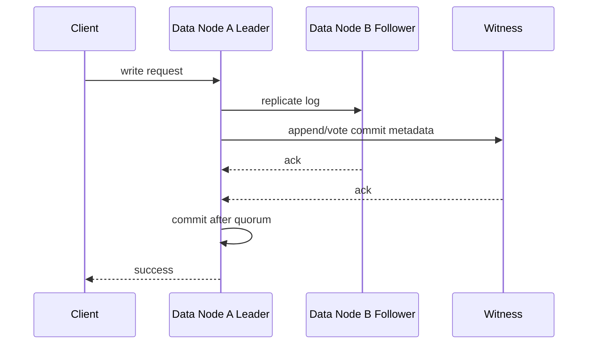
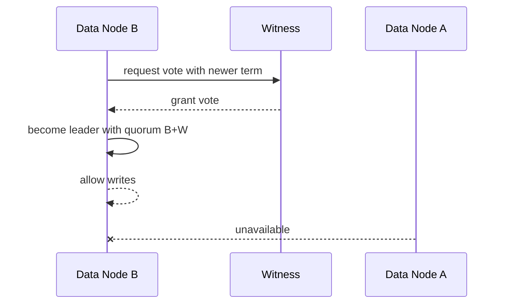

# Two Data Nodes + Lightweight Witness HA Design

## Background

The current design has a virtual-node concept, and some two-node deployments require shared storage. The desired direction is to make two data nodes work without shared storage. The key consistency constraint is that pure 2 data nodes, no shared storage, and strong-consistency automatic failover cannot be made safe. During a network partition, each side cannot distinguish peer failure from link failure, and automatic promotion can cause split brain.

The recommended design is 2 data nodes + 1 lightweight witness. The witness does not store business data. It only participates in voting, term/epoch/lease arbitration, and failover decisions.

## Goals

- Support strong-consistency HA with 2 data nodes and no shared storage.
- Keep witness lightweight: no SQL, table data, index data, or scan.
- Keep shared-storage mode but disable it by default as compatibility/transition mode.
- Forbid pure 2-node automatic strong-consistency writes at the configuration layer.

## Non-Goals

- No recovery guarantee when both data nodes fail.
- Witness does not store business data.
- No writes without quorum.
- This document does not define the full region Raft protocol.

## Deployment Mode Matrix

| Mode | Default | Write Consistency | Failover | Notes |
| --- | --- | --- | --- | --- |
| `single` | Can remain current default | single node | no automatic HA | development, single-node, compatibility |
| `witness` | new recommended target | quorum | automatic | 2 data + 1 witness, no shared storage |
| `shared-storage` | disabled | depends on shared storage and fencing | cautious | legacy/compatibility/experimental |
| `two-node-auto` | forbidden | unsafe | unsupported | pure 2-node automatic promotion can split brain |

## Core Constraints

- Writes must get quorum.
- Leaders can only be data nodes.
- Witness only votes and keeps minimal arbitration state.
- Witness should be in an independent failure domain.
- Without quorum, writes must be forbidden.

## Interface Design

### Configuration

| Config | Example | Description |
| --- | --- | --- |
| `raft.ha.mode` | `single` / `witness` / `shared-storage` | HA mode |
| `raft.ha.node.role` | `data` / `witness` | current node role |
| `raft.ha.replica.id` | `node-a` | replica identifier |
| `raft.ha.witness.address` | `host:port` | witness endpoint |
| `raft.ha.shared-storage.enabled` | `false` | explicit shared-storage switch |
| `raft.ha.quorum.write-required` | `true` | must be true in witness mode |

### Replica Roles

| Role | Stores Data | Votes | Can Lead | Purpose |
| --- | --- | --- | --- | --- |
| `DATA_VOTER` | yes | yes | yes | normal business replica |
| `WITNESS_VOTER` | no | yes | no | arbitration, election, lease/epoch |
| `LEARNER` | yes | no | no | catch-up, scale-out, migration |

### Virtual Node Metadata

| Field | Description |
| --- | --- |
| `virtualNodeId` | virtual node / region / shard id |
| `epoch` | metadata version, increased on membership change or split/merge |
| `leaderId` | current data leader |
| `replicas` | `DATA_VOTER` / `WITNESS_VOTER` / `LEARNER` list |
| `commitIndex` | committed log position |
| `term` | current term |
| `leaseUntil` | optional leader lease deadline |

## Data Structures

### Witness Persistent State

Witness does not store business data, but it needs minimal arbitration state:

| Field | Description |
| --- | --- |
| `virtualNodeId` | owning virtual node |
| `currentTerm` | current term |
| `votedFor` | vote target in current term |
| `acceptedEpoch` | accepted metadata epoch |
| `commitIndex` | observed commit position |
| `leaseOwner` | optional lease owner |
| `leaseExpireAt` | optional lease expiration |

## State Machine

| State | Description | Writable |
| --- | --- | --- |
| `INIT` | node starting, not joined | no |
| `FOLLOWER` | data follower or witness voter | no |
| `CANDIDATE` | starts election | no |
| `LEADER` | data node is leader and has quorum | yes |
| `DEGRADED_READONLY` | no quorum but local data can be read | no |
| `UNAVAILABLE` | consistency cannot be confirmed | no |

Illegal transitions:

- `WITNESS_VOTER` cannot enter `LEADER`.
- Without quorum, a node cannot become writable `LEADER`.
- A stale-epoch node cannot accept writes.

## Sequence Flows

### Normal Write

### B Takes Over After A Fails

### A/B Network Partition

Only the side that can reach witness may obtain quorum. The data node that cannot reach witness must stop writes to prevent split brain.

## Failure Handling

| Scenario | Behavior |
| --- | --- |
| one data node fails | remaining data node + witness can continue writes |
| witness fails | two data nodes can still form quorum, but losing one data node after that prevents automatic promotion |
| data-data network split | witness side may continue; other side is read-only or unavailable |
| data-witness network split | that data node cannot write unless it can form quorum with the other data node |
| witness state corruption | reject votes and rebuild from quorum data nodes |

## Idempotency

- Write requests need transaction id or request id to avoid duplicate commit after leader change.
- Witness votes are idempotent by `(virtualNodeId, term)`.
- Membership changes are idempotent by `(virtualNodeId, epoch)`.
- Retried append/commit must not re-apply business data.

## Rollback Strategy

- Witness mode is enabled explicitly by `raft.ha.mode=witness`; before maturity, `single` can remain default.
- Rollback to `single` requires confirming only one data node is writable.
- Rollback to `shared-storage` requires explicit shared storage and fencing.
- If witness has compatibility problems, never auto-downgrade to pure 2-node automatic writes.

## Compatibility

- `shared-storage` remains but is disabled by default.
- Existing virtual-node concepts can map to `virtualNodeId`, then gradually add `replicas`, `epoch`, and `leader`.
- Single-node deployment does not need witness.
- `jdbc:adb:*` URL compatibility is not affected by HA mode.

## Rollout

| Phase | Action | Acceptance |
| --- | --- | --- |
| HA-01 | add configuration model and mode validation | pure 2-node automatic writes are forbidden |
| HA-02 | define replica roles and virtual-node metadata | data/witness/learner are visible |
| HA-03 | implement witness voting and minimal durable state | witness restart keeps term/vote |
| HA-04 | add quorum write gate | writes fail without quorum |
| HA-05 | implement failover and recovery | either data node can fail and data+witness can write |
| HA-06 | add observability | system tables/metrics show quorum, leader, epoch |

### Rollout Status

| Phase | Status | Deliverables |
| --- | --- | --- |
| HA-01 | Done | `RaftConfigKeys.Ha`, `HaConfig`, `HaMode`, and `HaNodeRole` provide HA mode parsing and topology validation. Pure two-data-node automatic writes are rejected unless `shared-storage` mode is explicitly enabled with `raft.ha.shared-storage.enabled=true`. |
| HA-02 | Done | `ReplicaRole`, `VirtualNodeReplica`, and `VirtualNodeMetadata` describe data voter, witness voter, learner, leader, epoch, term, commit index, and optional lease metadata. |
| HA-03 | Done | `WitnessState`, `WitnessStateStore`, `FileWitnessStateStore`, and `WitnessStateManager` provide term/vote/epoch/commitIndex/lease state, idempotent vote checks, monotonic epoch/commit updates, and local durable storage. |
| HA-04 | Done | `QuorumWriteGate` and `WriteGateDecision` evaluate writable quorum from virtual-node metadata, current leader, and acknowledged voter replicas. Writes are denied when quorum is missing or the leader does not match metadata. |
| HA-05 | Done | `FailoverPlanner`, `FailoverDecision`, and `FailoverStatus` plan deterministic failover from reachable voter sets. A reachable data voter plus witness quorum can be promoted; witness-only or no-quorum cases are rejected as unavailable or read-only. |
| HA-06 | Planned | The remaining phase still needs observability implementation. |

## Test Plan

- Unit tests: configuration validation, role transitions, vote idempotency, epoch validation.
- Integration tests: A/B/W normal write, leader switch, witness restart.
- Fault injection: A failure, B failure, W failure, A/B partition, A/W partition, B/W partition.
- Long-running tests: repeated leader switch, log catch-up, snapshot, checkpoint/restore.
- Compatibility tests: mutual exclusion of `single`, `shared-storage`, and `witness` modes.

## Risks

| Risk | Severity | Description | Mitigation |
| --- | --- | --- | --- |
| witness and data in same failure domain | P1 | losing both lowers availability | require independent failure domain in docs and validation |
| pure 2-node automatic writes enabled by mistake | P0 | split brain | forbid at config layer |
| witness state not durable | P0 | restart may cause duplicate voting | persist term/vote/epoch |
| shared storage still treated as recommended | P1 | operations may keep relying on fragile mode | mark disabled by default and legacy/compatibility |
| leader lease clock skew | P1 | can break fencing | first phase should use quorum, not local-clock lease |

## Conclusion

The recommended direction is: keep `shared-storage` but disable it by default, make `witness` the new two-data-node HA direction, and explicitly forbid pure 2-node automatic strong-consistency writes. This preserves old deployment compatibility while moving the system toward quorum-based arbitration and shared-nothing replication.
