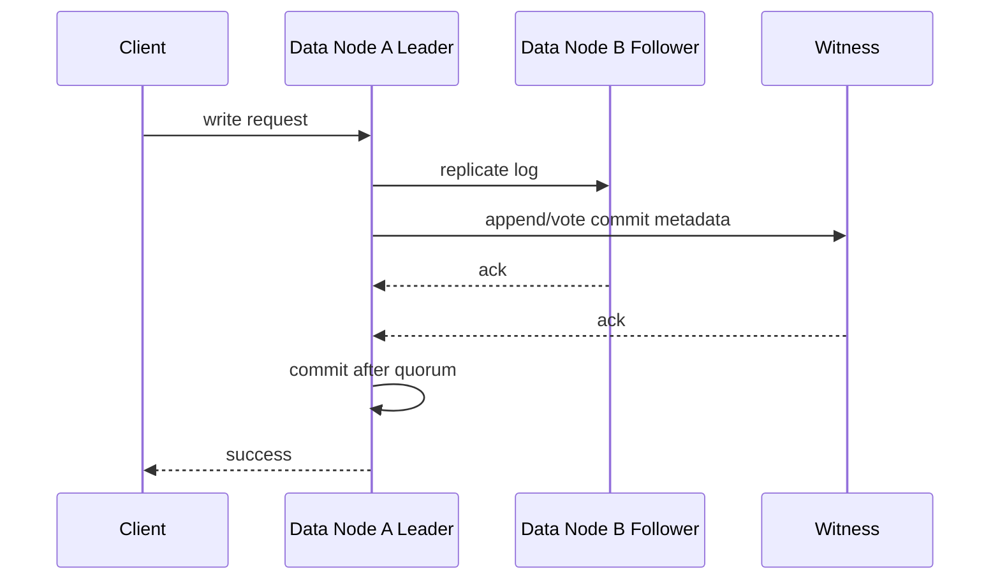
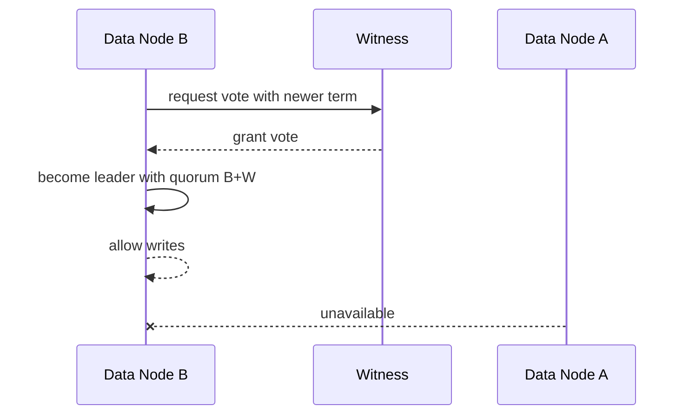

# 两数据节点 + 轻量 Witness 高可用方案

## 背景

当前设计中存在虚节点概念，2 节点部署在部分场景下需要共享存储才能工作。用户希望 2 个数据节点也能在无共享存储的情况下工作。这里需要先明确一致性约束：纯 2 数据节点、无共享存储、强一致自动故障切换不可安全实现。网络分区时，双方无法区分对方宕机还是链路断开，自动升主会导致 split-brain。

推荐方案是 2 个数据节点 + 1 个轻量 witness。witness 不保存业务数据，只参与投票、term/epoch/lease 仲裁和故障切换判定。

## 目标

- 支持 2 个数据节点在无共享存储时实现强一致高可用。
- witness 轻量化，不承载 SQL、表数据、索引数据或 scan。
- 保留共享存储方案，但默认关闭，作为兼容/过渡模式。
- 配置层禁止纯 2 节点自动强一致写入模式。

## 非目标

- 不支持 2 数据节点同时失效后的数据恢复。
- 不支持 witness 存储业务数据。
- 不支持没有多数派时继续写入。
- 不在本文中定义完整 region Raft 协议细节。

## 部署模式矩阵

| 模式 | 默认 | 写入一致性 | 故障切换 | 说明 |
| --- | --- | --- | --- | --- |
| `single` | 当前可作为默认 | 单节点 | 无自动 HA | 开发、单机、兼容部署 |
| `witness` | 新推荐目标 | 多数派 | 自动 | 2 data + 1 witness，无共享存储 |
| `shared-storage` | 关闭 | 依赖共享存储和 fencing | 需谨慎 | legacy/compatibility/experimental |
| `two-node-auto` | 禁止 | 不安全 | 不支持 | 纯 2 节点自动切主会 split-brain |

## 核心约束

- 写入必须拿到多数派。
- leader 只能在 data node 上产生。
- witness 只能投票和保存最小仲裁状态，不能承载业务读写。
- witness 必须尽量位于独立故障域，避免和某个 data node 同时失效。
- 无多数派时必须禁止写入。

## 接口设计

### 配置

| 配置项 | 示例 | 说明 |
| --- | --- | --- |
| `raft.ha.mode` | `single` / `witness` / `shared-storage` | HA 模式 |
| `raft.ha.node.role` | `data` / `witness` | 当前节点角色 |
| `raft.ha.replica.id` | `node-a` | 副本节点标识 |
| `raft.ha.witness.address` | `host:port` | witness 访问地址 |
| `raft.ha.shared-storage.enabled` | `false` | 共享存储显式开关 |
| `raft.ha.quorum.write-required` | `true` | witness 模式必须为 true |

### 副本角色

| 角色 | 是否存数据 | 是否投票 | 是否可成为 leader | 用途 |
| --- | --- | --- | --- | --- |
| `DATA_VOTER` | 是 | 是 | 是 | 正常业务副本 |
| `WITNESS_VOTER` | 否 | 是 | 否 | 仲裁、选主、lease/epoch |
| `LEARNER` | 是 | 否 | 否 | 追赶、扩容、迁移 |

### 虚节点元数据

| 字段 | 说明 |
| --- | --- |
| `virtualNodeId` | 虚节点/region/shard 标识 |
| `epoch` | 元数据版本，成员变更或 split/merge 时递增 |
| `leaderId` | 当前 data leader |
| `replicas` | `DATA_VOTER` / `WITNESS_VOTER` / `LEARNER` 列表 |
| `commitIndex` | 已提交日志位置 |
| `term` | 当前任期 |
| `leaseUntil` | 可选 leader lease 截止时间 |

## 数据结构

### Witness 持久状态

witness 不保存业务数据，但需要保存最小仲裁状态：

| 字段 | 说明 |
| --- | --- |
| `virtualNodeId` | 所属虚节点 |
| `currentTerm` | 当前任期 |
| `votedFor` | 当前任期投票对象 |
| `acceptedEpoch` | 已接受的元数据 epoch |
| `commitIndex` | 已观察到的提交位置 |
| `leaseOwner` | 可选 lease 持有者 |
| `leaseExpireAt` | 可选 lease 过期时间 |

## 状态机

| 状态 | 说明 | 可写 |
| --- | --- | --- |
| `INIT` | 节点启动，未加入副本组 | 否 |
| `FOLLOWER` | data follower 或 witness voter | 否 |
| `CANDIDATE` | 发起选举 | 否 |
| `LEADER` | data node 成为 leader 且有多数派 | 是 |
| `DEGRADED_READONLY` | 无多数派但本地数据可读 | 否 |
| `UNAVAILABLE` | 无法确认一致性 | 否 |

非法转换：

- `WITNESS_VOTER` 不能进入 `LEADER`。
- 无多数派不能从 `FOLLOWER` 或 `CANDIDATE` 进入可写 `LEADER`。
- epoch 落后节点不能接受写入。

## 时序流程

### 正常写入

### A 宕机后 B 接管

### A/B 网络分区

只有能联系 witness 的一侧可能获得多数派。无法联系 witness 的 data node 必须停止写入，避免 split-brain。

## 异常处理

| 场景 | 行为 |
| --- | --- |
| 一个 data node 宕机 | 另一个 data node + witness 获得多数派后继续写 |
| witness 宕机 | 两个 data node 仍可组成多数派继续写，但失去任一 data 后不可自动切主 |
| data-data 网络断开 | witness 所在一侧可继续，另一侧只读或不可用 |
| data-witness 网络断开 | 该 data 如果不能与另一个 data 组成多数派则不可写 |
| witness 状态损坏 | 拒绝投票，需要从多数派 data 节点重建 |

## 幂等性

- 写请求必须携带事务 id 或请求 id，避免 leader 切换后重复提交。
- witness 投票按 `(virtualNodeId, term)` 幂等。
- 成员变更按 `(virtualNodeId, epoch)` 幂等。
- 重试 append/commit 不得重复应用业务数据。

## 回滚策略

- witness 模式通过 `raft.ha.mode=witness` 显式启用；未成熟前默认仍可为 `single`。
- 回滚到 `single` 时必须确认只有一个 data node 对外写入。
- 回滚到 `shared-storage` 时必须显式启用共享存储和 fencing。
- 如果 witness 出现兼容问题，禁止自动降级成纯 2 节点自动写入。

## 兼容性

- `shared-storage` 保留但默认关闭。
- 旧虚节点模型可以映射为 `virtualNodeId`，后续逐步补齐 `replicas`、`epoch`、`leader`。
- 单节点部署不需要 witness。
- `jdbc:adb:*` URL 兼容性不受 HA 模式影响。

## 灰度/迁移

| 阶段 | 动作 | 验收 |
| --- | --- | --- |
| HA-01 | 增加配置模型和模式校验 | 禁止纯 2 节点自动写入 |
| HA-02 | 定义 replica role 和虚节点元数据 | 能展示 data/witness/learner |
| HA-03 | 实现 witness 投票和最小持久状态 | witness 重启后不丢 term/vote |
| HA-04 | 接入多数派写入 gate | 无多数派写入失败 |
| HA-05 | 故障切换与恢复 | data A/B 任一宕机后剩余 data+witness 可写 |
| HA-06 | 运维观测 | 系统表/metrics 可展示 quorum、leader、epoch |

### 实施状态

| 阶段 | 状态 | 交付物 |
| --- | --- | --- |
| HA-01 | 已完成 | `RaftConfigKeys.Ha`、`HaConfig`、`HaMode` 和 `HaNodeRole` 提供 HA 模式解析和拓扑校验。纯 2 数据节点自动写入会被拒绝，除非显式启用 `shared-storage` 模式且配置 `raft.ha.shared-storage.enabled=true`。 |
| HA-02 - HA-06 | 规划中 | 仍需实现副本元数据、witness 持久化、多数派写入 gate、故障切换/恢复和观测能力。 |

## 测试方案

- 单元测试：配置校验、角色转换、投票幂等、epoch 校验。
- 集成测试：A/B/W 三节点正常写入、leader 切换、witness 重启。
- 故障注入：A 宕机、B 宕机、W 宕机、A/B 分区、A/W 分区、B/W 分区。
- 长稳测试：leader 反复切换、日志追赶、snapshot、checkpoint/restore。
- 兼容测试：`single`、`shared-storage`、`witness` 模式配置互斥。

## 风险点

| 风险 | 等级 | 说明 | 缓解 |
| --- | --- | --- | --- |
| witness 与 data 同故障域 | P1 | data+witness 同时失效会降低可用性 | 文档和部署校验要求独立故障域 |
| 误开启纯 2 节点自动写 | P0 | 会导致 split-brain | 配置层禁止 |
| witness 状态不持久 | P0 | 重启后可能重复投票 | 持久化 term/vote/epoch |
| 共享存储继续被误认为推荐 | P1 | 运维可能继续依赖脆弱模式 | 标注默认关闭和 legacy/compatibility |
| leader lease 时钟偏差 | P1 | 可能破坏 fencing | 第一阶段优先用 quorum，不依赖本地时钟 lease |

## 结论

推荐路线是：`shared-storage` 保留但默认关闭，`witness` 成为新的 2 数据节点高可用方向，纯 2 节点自动强一致写入明确禁止。这样既保留旧部署兼容性，又能把项目演进方向从共享存储转向多数派仲裁和无共享存储复制。
